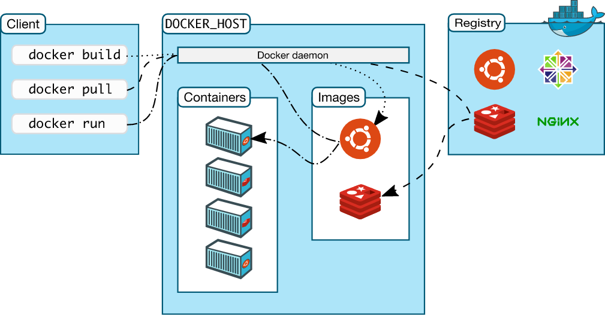

## 容器技术
简单来说容器技术的实质就是：**通过各种手段，修改、约束一个"容器”进程的运行状态，按照用户的意图“误导”它能看到的资源，控制它的边界，从而达到环境隔离，或者说虚拟化的目的。**

1. 不要把 Docker 的概念与容器技术概念混淆，他们并不是等价的；
2. 容器的本质是一个进程。

## 容器的核心技术
- **Namespace**: 可以为容器提供系统资源隔离能力。
- **Cgroup(Control Groups)**: 限制、记录和隔离进程组（process groups）使用的物理资源（CPU、Memory、IO 等）。
- **rootfs**: 通过下载过程，可以看到，一个镜像一般是由多个层（ layer） 组成，类似 f7e2b70d04ae这样的串表示层的唯一 ID（实际上完整的 ID 包括了 256 个 bit, 64 个十六进制字符组成）。
您可能会想，如果多个不同的镜像中，同时包含了同一个层（ layer）,这样重复下载，岂不是导致了存储空间的浪费么?
实际上，Docker 并不会这么傻会去下载重复的层（ layer）,Docker 在下载之前，会去检测本地是否会有同样 ID 的层，如果本地已经存在了，就直接使用本地的就好了
- **UFS(Union file systems)**: Container和image的分层。联合文件系统（UnionFS ）是一种轻量级的高性能分层文件系统，它支持将文件系统中的
修改信息作为一次提交，并层层叠加，同时可以将不同目录挂载到同一个虚拟文件系统下，
应用看到的是挂载的最终结果 联合文件系统是实现 Docker 镜像的技术基础。
- 网络虚拟化


## Docker是什么
容器技术一直存在，Docker能这么火的原因在于易用性。Docker首次创造了一种简单易行并且覆盖应用全生命周期的工作流。用户可以通过简单的指令或Restful API来拉取，打包，运行和维护容器。降低了使用难度，提高了效率。

Docker 把 Cgroups、Namespace 和 UnionFS 等一系列技术整合起来，极大地降低了容器技术的复杂度，提升了开发者的用户体验。Docker 公司定义了以容器镜像为标准的应用打包格式，并且建立 Docker Hub 服务进行镜像分发和协作。这些举措迅速创建了一个良好的社区和合作伙伴生态圈

## 优点

- 高效的利用系统资源
- 持续交付与部署
- 多平台的迁移更容易
- 容易的沙箱机制：各个服务互相不影响
- 更快的启动时间：相当于启动一个进程
- 一致的运行环境

## Docker Vs 虚拟机
- 容器启动和停止都是秒级，传统的虚拟机是分钟级
- Docker容器对系统资源需求很少，一台主机可以运行的容器数量要远多于虚拟机。


## Docker不适合做什么
并不是所有服务都适合容器化。传统数据库或有状态的应用、对网络吞吐性能有高要求的服务，都不适合容器化。

## Docker为什么会成功
Docker 实现所依赖的各种基础技术（ cgroups namespace 、分层文件系统等）在 Docker
之前已经存在 多年 并且，其前身的 LXC 也在诸多企业的生产环境中得到了大量的应用
实践，并得到了极为明显的性能优势 Google 大规模容器集群的性能比传统虚拟机要高很多，
接近于 Bare Meta 与传统虚拟机相比，容器集群让这些公司拥有秒级而非分钟级的弹性计
伸缩能力，同时使用更少的机器运行更多实例。

Docker能这么火的原因在于易用性。Docker首次创造了一种简单易行并且覆盖应用全生命周期的工作流。用户可以通过简单的指令或Restful API来拉取，打包，运行和维护容器。降低了使用难度，提高了效率。

## 架构


## 相关的概念
- Docker deamon：核心守护程序，负责构建、运行和分发 Docker 容器。
- 镜像：下载过程中可以看出 ，镜像文件一般由若干层(layer)组成 ，6c953ac5d795这样的串是层的唯一id(实际上完整的id包括256比特，64个十六进制字符组成）。使用docker pull命令下载中会获取并输出镜像的各层信息。当不同的镜像包括相同的层时，本地仅存储了层的 一份内容，减小了存储空间。
- 容器：
- 仓库：

## 常用操作
- docker pull
- docker ls
- docker run
- docker ps
- Docker stop/kill
- Docker rm
- Docker rmi
- Docker build
- Docker logs
- Docker exec
- docker inspect

## 端口映射和容器互联
容器之间互相访问，除了通过网络访间外，还提供了两个很方便的功能来满足服务访问的基本需求：一个是允许映射容器内应用的服务端口到本地宿主主机；另一个是互联机制实现多个容器间通过容器名来快速访问。

**端口映射：**
`-p 本机端口:容器端口`

**互联机制：**
使用－－link参数可以让容器之间安全地进行交互。


## 网络
单机的常用网络模式有4种
1. bridge 模式；
2. host 模式；
3. container 模式；
4. none 模式。

## Dockerfile
> 对于开发人员来说，除了使用docker可以快速安装一些工具外，最重要的就是为自己的项目写好Dockerfile，push的云平台上，然后部署

- FROM：FROM 是构建镜像的基础源镜像，该 Image 文件继承官方的 node image
- RUN：后面跟的是在容器中执行的命令.每一个 RUN 命令都会生成一个新的镜像层
- WORKDIR：容器的工作目录
- COPY：拷贝文件至容器的工作目录下，和RUN ADD一样 每个命令都会生成一个新的镜像层。 .dockerignore 指定的文件不会拷贝
- EXPOSE：将容器内的某个端口导出供外部访问，只起到声明的作用，并不会自动完成端口映射。
- CMD：Dockerfile 执行写一个 CMD 否则后面的会被覆盖，CMD 后面的命令是容器每次启动执行的命令，多个命令之间可以使用 && 链接，例如 CMD git pull && npm start
- ENV: 环境变量
- VOLUME: 会为镜像生成一个新的挂载点。但是我们也可以不使用 VOLUME，而是在 docker run 的时候通过 -v 参数指定。
- ARG: 用来在 docker build 的时候传参，` --build-arg NODE_ENV=production`

**COPY vs ADD**

类似 COPY，可以认为是增强版的 COPY。区别主要体现在两个地方：

1. 当 ADD 后面跟压缩文件时，拷贝的时候会将压缩文件进行解压。
2. ADD 可以用来下载网上的文件

```
ADD html.tar.gz /var/www/html
ADD https://xxx.com/html.tar.gz /var/www/html
```

**ENTRYPOINT vs CMD**
- CMD 用来为镜像指定一个默认的启动命令，所谓默认是说我们可以通过 docker run 命令行参数通过其他的命令来覆盖 CMD.我们可以通过如下的方式通过 docker run 指定 docker 的启动命令为 /bin/bash 覆盖 CMD。 `docker run <params> <image> /bin/bash`
- ENTRYPOINT 类似 CMD，也是指定镜像的默认启动命令，但是不能像上面那样 docker run 的方式来覆盖。我们可以用如下命令覆盖`docker run --entrypoint /bin/bash`

**.dockerignore**

 避免将你本地的调试文件、.git, node_modules 等一些文件放入 Docker 容器中，和.gitignore差不多

 **最佳实践**
- 精简镜像用途。避免构造一个大而复杂，多功能的镜像。
- 选用合适的基础镜像。防止构造出来的镜像过大
- 提供注释和维护者信息。
- 正确的使用版本号
- 减少镜像层数。多个RUN命令可以合并
- 恰当使用多步骤创建。保证最终生成的镜像只包括提供运行镜像的最小化环境
- 使用.dockerignore文件。避免发送不必要的内容，加快镜像的构建。
- 及时删除临时文件和缓存文件。特别是执行apt-get后，/var/cache/apt下面会缓存一些安装包
- 提高生成速度。合理使用cache，减少目录下的文件，或者使用.dockerignore等。
- 调整合理的指令顺序。在开启cache的情况下，内容不变的指令尽量放到前面，这样尽量可以复用。
- 减少外部源的地址。如果必须使用，需要保证该指令长久有效，方便他人复用

 **推荐阅读**

 - [dockerfile参考](https://docs.docker.com/engine/reference/builder/)
 - [dockerfile最佳实践](https://docs.docker.com/develop/develop-images/dockerfile_best-practices/)


 ### Docker 镜像体积与构建时间优化

 如果一个镜像在不经过优化的情况下体积通常都是会很大的

 #### 多步骤构建
 对于需要编译的应用，至少需要两个环境的Docker镜像（比如：Java，Go）。编译依赖环境，运行依赖环境。编译依赖环境往往较大。使用多步骤构建，可以使最终的镜像精简。

 #### RUN/COPY 分层
 Dockerfile 中的每条指令都会创建一个镜像层，Dockerfile 指令或复制的项目文件在没有修改变动的情况下，每个镜像层是可以被复用和缓存的。

一般来说我们在dockerfile里都会这么写
 ```Dockerfile
 # ...

WORKDIR /app
COPY . /app

RUN npm install

# ...
 ```
这样写会有个问题，源码改变之后，不管 package.json 有没有改变的情况下都会重新安装 NPM 模块，这样显然是不好的，我们可以改成下面这样
```Dockerfile
# ...

WORKDIR /app

# add npm package
COPY package.json /app/package.json
RUN cd /app/
RUN npm i

# copy code
COPY . /app/

# ...
```
我们让 package.json 提前，在 package.json 没有修改的情况下是不会重新安装 NPM 包的，也会减少部署的时间。

#### Node.js Alpine 镜像优化
我们在选择基础镜像的时候，最好选择Alpine镜像
Alpine 是一个很小的 Linux 发行版，想要大幅度减小镜像体积选择 Node.js 的 Alpine 版本也是最简单的，另外 -alpine 的时区默认不是国内的，需要 Dockerfile 配置时区。

```Dockerfile
# FROM node:10
FROM node:10.0-alpine
```

#### 生产环境不要打包devDependencies包

有些测试环境用的包，在进行生产环境打镜像时不要包含进去，也就是 package.json 文件 devDependencies 对象，通过在 npm i 之后指定 --production 参数过滤

```Dockerfile
# RUN npm i 
RUN npm i --production
```

## 数据管理
在生产环境中使用 Docker ，往往需要对数据进行持久化，或者需要在多个容器之间进行数据共享，这必然涉及容器的数据管理操作

容器中的管理数据主要有两种方式
- 数据卷 Data Volumes 容器内数据直接映射到本地主机环境；使用-v参数可以
- 数据卷容器（Data Volume Containers 使用特定容器维护数据卷，方便在多个容器之间共享一些持续更新的数据


## Docker-compose
Compose 是 Docker 官方开源的一个项目，可以管理多个 Docker 容器组成一个应用，例如 Web 服务，除了服务本身还有数据库、Redis、Nginx 等一系列相关联服务需要安装。

有个 Compose 的支持，我们只需要定义一个 YAML 格式的配置文件（docker-compose.yml），来编写一个项目所需要的多个容器配置及调用关系，通过简单的命令即可同时开始或者关闭这些容器

## 部署Nodejs服务的最佳实践

### 也许你并不需要PM2!
[一次环境变量引发的血案](https://anata.me/2019/11/01/%E4%B8%80%E6%AC%A1%E7%8E%AF%E5%A2%83%E5%8F%98%E9%87%8F%E5%BC%95%E5%8F%91%E7%9A%84%E8%A1%80%E6%A1%88/)

pm2可以充分利用计算机的多核性能，但是在k8s集群下，我们给每个服务限制CPU为一核，可以进行横向扩展。重启应用和集群调度，全都交给k8s来做。

这样我们启动项目只要使用 `node app.js`

### 启动项目不要使用npm
启动项目的时候我们直接使用`node app.js`，不需要使用`npm run start`

这样服务可以在容器停止时接收到退出信号，实现优雅退出。
```javascript
process.on('SIGTERM', close.bind(this, 'SIGTERM'));
process.on('SIGINT', close.bind(this, 'SIGINT'));

function close(signal) {
    console.log(`收到 ${signal} 信号开始处理`);

    server.close(() => {
        console.log(`服务停止 ${signal} 处理完毕`);
        process.exit(0);
    });
}
```
