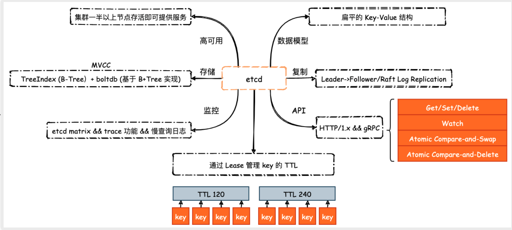

## 简介
Etcd是由Go语言编写的分布式键值对数据库，可以用于分布式系统中的配 信息管理和服务发现。

分布式系统中会要求各个节点之间的数据的一致性，在此基础上才能实现对服务配置信息的管理、服务的发现、更新、同步，等等。

Etcd也是一致性的，采用了更为简洁的 Raft 共识算法，相比大名鼎鼎 Paxos 算法，它的算法
过程相对容易理解，同样可以实现数据强一
致性，并支持集群节点状态管理和服务自动发现等

## 设计理念
- 简单：支持 RESTful API 和 gRPC API;
- 安全： 基于 TLS 式实 安全连接访
- 快速： 支持每 一万次 并发写操作，超时控制在毫秒量级
- 可靠： 支持分布式结构 基于 Raft 算法实现一致性

<!-- ## 相关操作 -->

## Feature

- ⾼可⽤: etcd 基于 Raft 共识算法实现，因此只要集群中有超过半数以上节点存活，Leader 选举、⽇志复制等功能就可正常运⾏
- 强⼀致性: etcd 不仅仅能保证集群的⾼可⽤，并且能够保证数据的读写强⼀致性，这同样是基于 Raft ⼀致性协议实现的。正因如此，etcd 的读写性能本⾝不会特别⾼
- 存储与查询: etcd v3 采⽤了 IndexTree（B-Tree） 和 boltdb（B+Tree存储）实现了⼀个 MVCC 数据库，数据模型从原来的基于⽬录的层次结构转变为扁平的 key-value 结构，同时⽀持多个 key 的事务
- TTL: etcd v3 使⽤ Lease 优化了原有的 TTL 机制，每⼀个 Lease 具有⼀个 TTL，相同 TTL 的 key 关联⾄同⼀个 Lease。当 Lease 到期后，删除掉与该 Lease 所有相关联的 key，⽆需为每⼀个 key 单独设置 TTL
- **Watch API**: Watch API 简单的来说就是当某⼀条数据发⽣变化时，etcd 将会通过 HTTP 请求将变化告知外界. etcd 能作为 k8s 最核⼼的部件之⼀的原因就在于 etcd ⽀持 Watch API。k8s 的声明式 API 可以说就是依靠 etcd 的 WatchAPI 实现的: k8s controller 通过 Watch API 监视 Deployment、Service 等资源的变化，对⽐实际状态与期望状态是否保持⼀致，并根据条件进⾏“调谐”
- 低容量存储: etcd 在设计之初只是需要⼀个协调服务来存储服务配置信息、提供分布式锁以及 Watch API 等功能，也就是说，它存储的是“元数据”，⽽⾮应⽤数据。因此，etcd 并不适合⽤于存储海量数据，社区建议 etcd 存储数据⼤⼩不超过 8G

## vs Redis

| 纬度        | redis                                                        | etcd                                                         |
| ----------- | ------------------------------------------------------------ | ------------------------------------------------------------ |
| 支持的value | string，list，set，hash，bitmap, 等等                           | String                                                       |
| 数据复制    | 主从异步复制，可能会丢数据                                   | etcd 则需要将⽇志发送给超过半数的 Follower，并且接收到了它们的确认才能够真正的复制⼀条数据，保证了强⼀致性 |
| 性能        | 十万级，完全基于内存实现                                     | 万级，需要将数据持久化⾄底层 DB 中                           |
| API         | Redis 对外仅提供了 socket API，我们要么使⽤ redis-client 客户端⼯具，要么使⽤语⾔所实现的第三⽅库来连接和使⽤其 API，并没有提供诸如 HTTP 或者是 gRPC 接⼝ | 提供了 HTTP/1.x 以及 gRPC 接⼝，⽅便开发⼈员调试以及降低开发⼈员的使⽤成本。k8s 内部就是⽤ gRPC 的⽅式和 etcd 进 ⾏通信，利⽤ gRPC 多路复⽤、Header 压缩等特性降低通信成本 |
