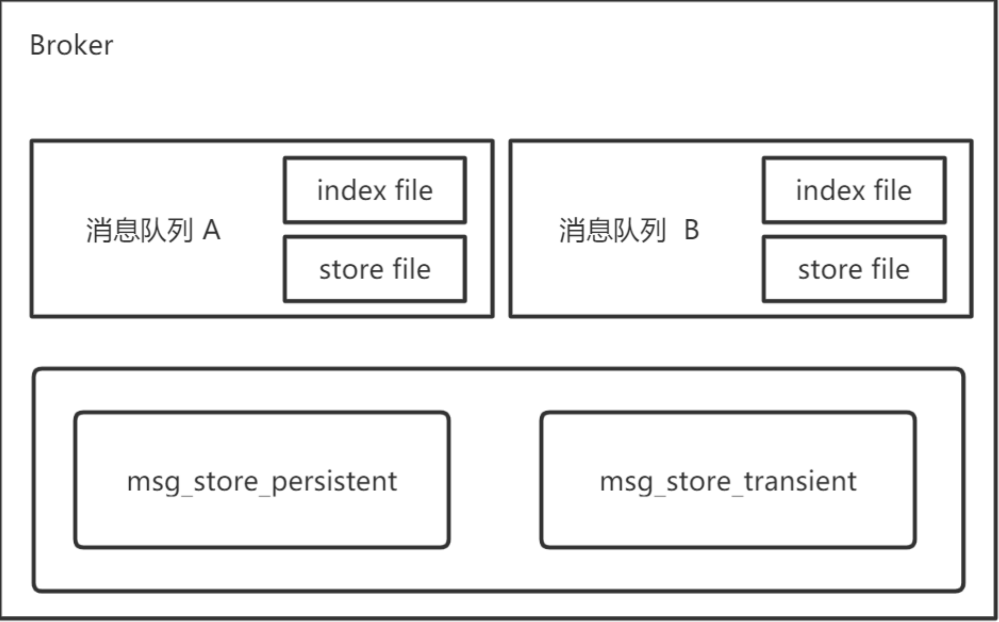
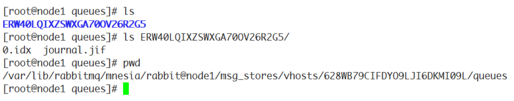
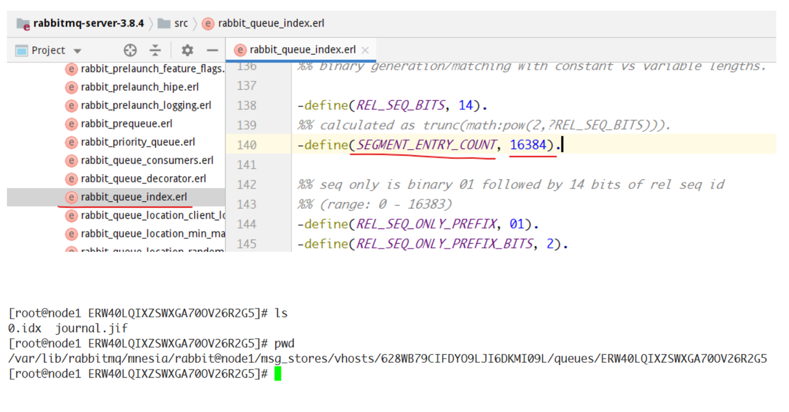
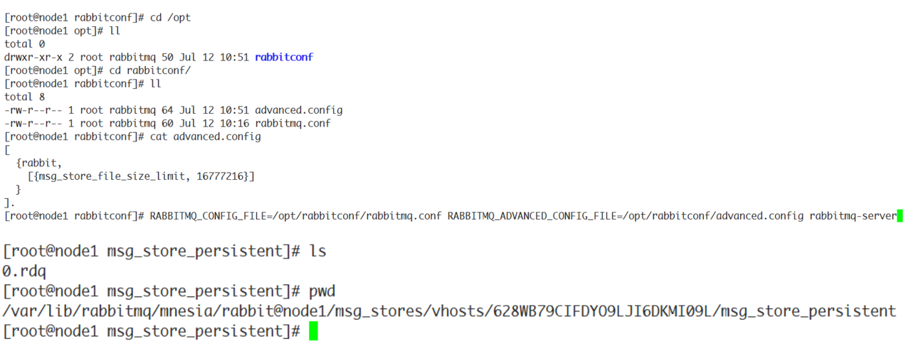
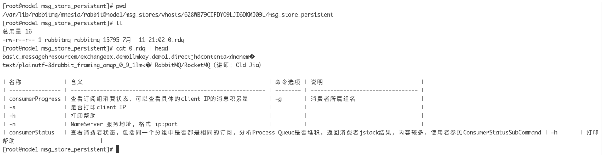
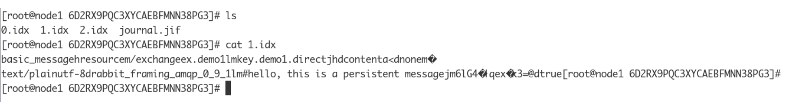
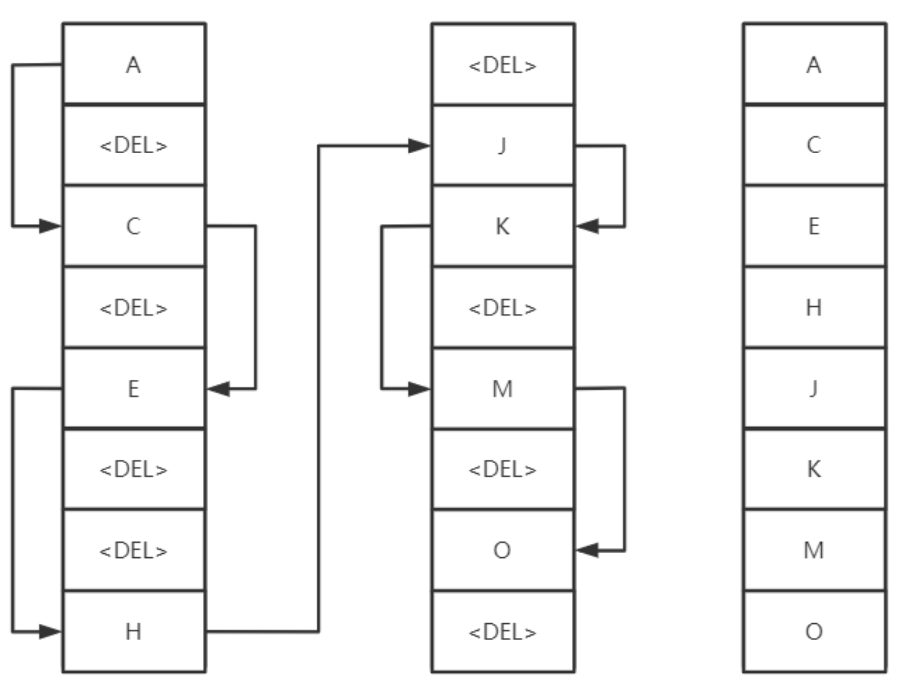
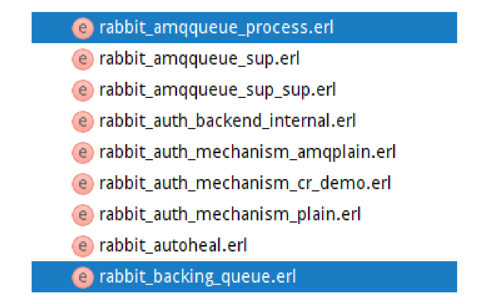
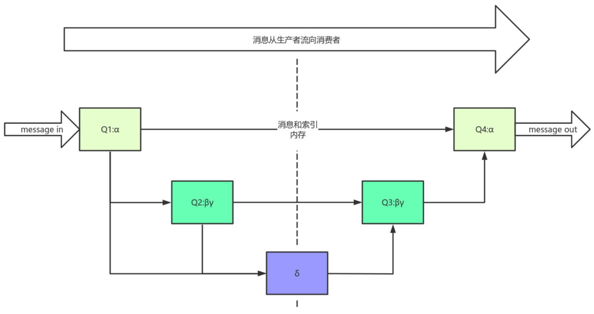
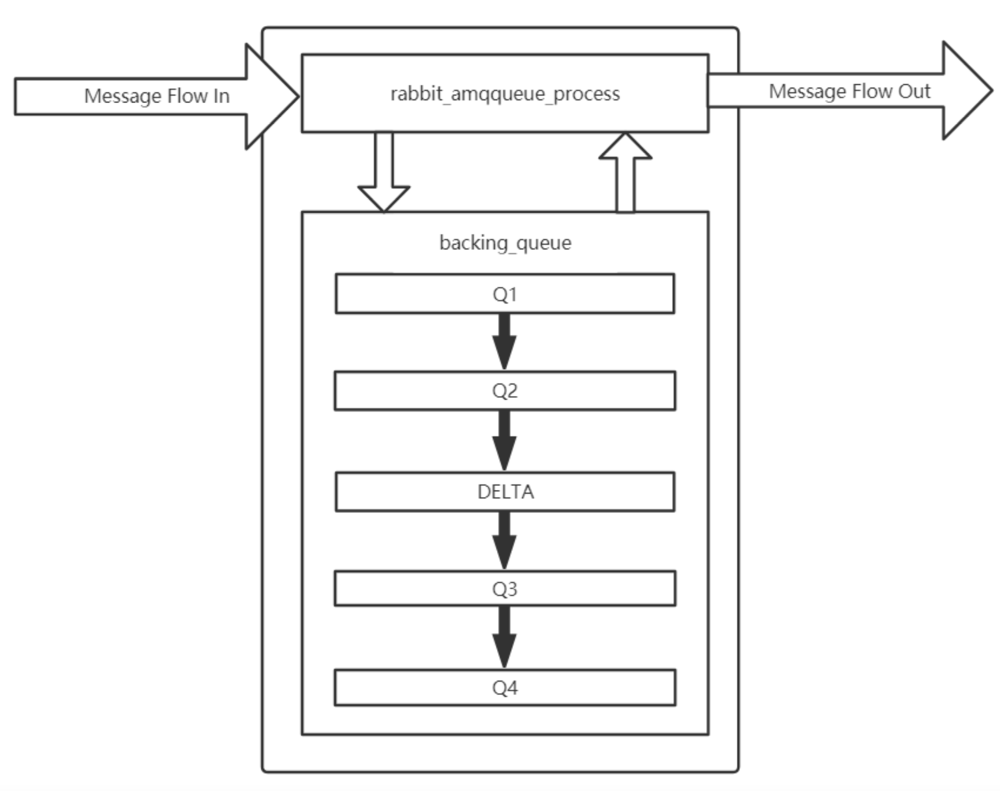

## 存储机制
RabbitMQ消息有两种类型：
1. 持久化消息和非持久化消息。
2. 这两种消息都会被写入磁盘。

持久化消息在到达队列时写入磁盘，同时会内存中保存一份备份，当内存吃紧时，消息从内存中清除。这会提高一定的性能。

非持久化消息一般只存于内存中，当内存压力大时数据刷盘处理，以节省内存空间。

RabbitMQ存储层包含两个部分：队列索引和消息存储。



## 队列索引：rabbit_queue_index
索引维护队列的落盘消息的信息，如存储地点、是否已被给消费者接收、是否已被消费者ack等。

每个队列都有相对应的索引。



- msg_store_persistent: 持久化的消息
- msg_store_transient: 非持久化的消息

索引使用顺序的段文件来存储，后缀为.idx，文件名从0开始累加，每个段文件中包含固定的
segment_entry_count 条记录，默认值是16384。每个index从磁盘中读取消息的时候，至少要在内存
中维护一个段文件，所以设置 queue_index_embed_msgs_below 值得时候要格外谨慎，一点点增大也
可能会引起内存爆炸式增长。



## 消息存储：rabbit_msg_store

消息以键值对的形式存储到文件中，一个虚拟主机上的所有队列使用同一块存储，每个节点只有一
个。存储分为持久化存储（msg_store_persistent）和短暂存储（msg_store_transient）。持久化存
储的内容在broker重启后不会丢失，短暂存储的内容在broker重启后丢失。

store使用文件来存储，后缀为.rdq，经过store处理的所有消息都会以追加的方式写入到该文件
中，当该文件的大小超过指定的限制（file_size_limit）后，将会关闭该文件并创建一个新的文件以供新
的消息写入。文件名从0开始进行累加。在进行消息的存储时，RabbitMQ会在ETS（Erlang Term
Storage）表中记录消息在文件中的位置映射和文件的相关信息。



消息（包括消息头、消息体、属性）可以直接存储在index中，也可以存储在store中。最佳的方式
是较小的消息存在index中，而较大的消息存在store中。这个消息大小的界定可以通过
queue_index_embed_msgs_below 来配置，默认值为4096B。当一个消息小于设定的大小阈值时，就
可以存储在index中，这样性能上可以得到优化。一个完整的消息大小小于这个值，就放到索引中，否
则放到持久化消息文件中。

rabbitmq.conf中的配置信息：

```
## Size in bytes below which to embed messages in the queue index.
## Related doc guide: https://rabbitmq.com/persistence-conf.html
##
# queue_index_embed_msgs_below = 4096
## You can also set this size in memory units
##
# queue_index_embed_msgs_below = 4kb
```

如果消息小于这个值，就在索引中存储，如果消息大于这个值就在store中存储：

大于这个值的消息存储于msg_store_persistent目录中的\<num\>.rdq文件中：



小于这个值的消息存储于\<num\>.idx索引文件中：



读取消息时，先根据消息的ID（msg_id）找到对应存储的文件，如果文件存在并且未被锁住，则直接打开文件，从指定位置读取消息内容。如果文件不存在或者被锁住了，则发送请求由store进行处理。

删除消息时，只是从ETS表删除指定消息的相关信息，同时更新消息对应的存储文件和相关信息。在执行消息删除操作时，并不立即对文件中的消息进行删除，也就是说消息依然在文件中，仅仅是标记为垃圾数据而已。当一个文件中都是垃圾数据时可以将这个文件删除。当检测到前后两个文件中的有效数据可以合并成一个文件，并且所有的垃圾数据的大小和所有文件（至少有3个文件存在的情况下）的
数据大小的比值超过设置的阈值garbage_fraction（默认值0.5）时，才会触发垃圾回收，将这两个文件合并，执行合并的两个文件一定是逻辑上相邻的两个文件。合并逻辑：
1. 锁定这两个文件
2. 先整理前面的文件的有效数据，再整理后面的文件的有效数据
3. 将后面文件的有效数据写入到前面的文件中
4. 更新消息在ETS表中的记录
5. 删除后面文件



## 队列结构
通常队列由rabbit_amqqueue_process和backing_queue这两部分组成，
rabbit_amqqueue_process负责协议相关的消息处理，即接收生产者发布的消息、向消费者交付消
息、处理消息的确认（包括生产端的confirm和消费端的ack）等。backing_queue是消息存储的具体形
式和引擎，并向rabbit_amqqueue_process提供相关的接口以供调用。



如果消息投递的目的队列是空的，并且有消费者订阅了这个队列，那么该消息会直接发送给消费者，不会经过队列这一步。当消息无法直接投递给消费者时，需要暂时将消息存入队列，以便重新投递。

`rabbit_variable_queue.erl` 源码中定义了RabbitMQ队列的4种状态：
1. alpha：消息索引和消息内容都存内存，最耗内存，很少消耗CPU
2. beta：消息索引存内存，消息内存存磁盘
3. gama：消息索引内存和磁盘都有，消息内容存磁盘
4. delta：消息索引和内容都存磁盘，基本不消耗内存，消耗更多CPU和I/O操作

消息存入队列后，不是固定不变的，它会随着系统的负载在队列中不断流动，消息的状态会不断发送变化。

持久化的消息，索引和内容都必须先保存在磁盘上，才会处于上述状态中的一种

gama状态只有持久化消息才会有的状态。

在运行时，RabbitMQ会根据消息传递的速度定期计算一个当前内存中能够保存的最大消息数量
（target_ram_count），如果alpha状态的消息数量大于此值，则会引起消息的状态转换，多余的消息
可能会转换到beta、gama或者delta状态。区分这4种状态的主要作用是满足不同的内存和CPU需求。

对于普通没有设置优先级和镜像的队列来说，backing_queue的默认实现是
rabbit_variable_queue，其内部通过5个子队列Q1、Q2、delta、Q3、Q4来体现消息的各个状态。





消费者获取消息也会引起消息的状态转换。

当消费者获取消息时

1. 首先会从Q4中获取消息，如果获取成功则返回。
2. 如果Q4为空，则尝试从Q3中获取消息，系统首先会判断Q3是否为空，如果为空则返回队列
为空，即此时队列中无消息。
3. 如果Q3不为空，则取出Q3中的消息；进而再判断此时Q3和Delta中的长度，如果都为空，则
可以认为 Q2、Delta、 Q3、Q4 全部为空，此时将Q1中的消息直接转移至Q4，下次直接从
Q4 中获取消息。
4. 如果Q3为空，Delta不为空，则将Delta的消息转移至Q3中，下次可以直接从Q3中获取消息。
在将消息从Delta转移到Q3的过程中，是按照索引分段读取的，首先读取某一段，然后判断读
取的消息的个数与Delta中消息的个数是否相等，如果相等，则可以判定此时Delta中己无消
息，则直接将Q2和刚读取到的消息一并放入到Q3中，如果不相等，仅将此次读取到的消息转移到Q3。

这里就有两处疑问，第一个疑问是：为什么Q3为空则可以认定整个队列为空？

1. 试想一下，如果Q3为空，Delta不为空，那么在Q3取出最后一条消息的时候，Delta 上的消息
就会被转移到Q3这样与 Q3 为空矛盾；
2. 如果Delta 为空且Q2不为空，则在Q3取出最后一条消息时会将Q2的消息并入到Q3中，这样
也与Q3为空矛盾；
3. 在Q3取出最后一条消息之后，如果Q2、Delta、Q3都为空，且Q1不为空时，则Q1的消息会被转移到Q4，这与Q4为空矛盾。

其实这一番论述也解释了另一个问题：为什么Q3和Delta都为空时，则可以认为 Q2、Delta、Q3、Q4全部为空？

通常在负载正常时，如果消费速度大于生产速度，对于不需要保证可靠不丢失的消息来说，极有可能只会处于alpha状态。

对于持久化消息，它一定会进入gamma状态，在开启publisher confirm机制时，只有到了gamma 状态时才会确认该消息己被接收，若消息消费速度足够快、内存也充足，这些消息也不会继续走到下一个状态。

## Q: 为什么消息的堆积导致性能下降？

在系统负载较高时，消息若不能很快被消费掉，这些消息就会进入到很深的队列中去，这样会增加
处理每个消息的平均开销。因为要花更多的时间和资源处理“堆积”的消息，如此用来处理新流入的消息
的能力就会降低，使得后流入的消息又被积压到很深的队列中，继续增大处理每个消息的平均开销，继
而情况变得越来越恶化，使得系统的处理能力大大降低。

应对这一问题一般有3种措施：

1. 增加prefetch_count的值，即一次发送多条消息给消费者，加快消息被消费的速度。
2. 采用multiple ack，降低处理 ack 带来的开销
3. 流量控制