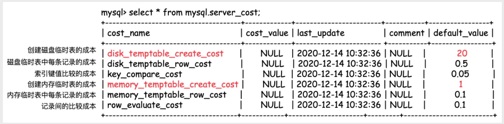
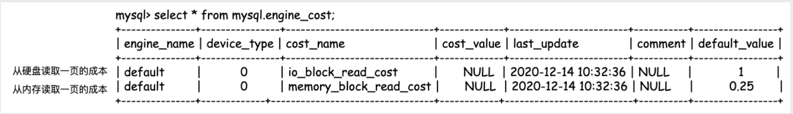

## 基于成本的优化器

**优化器在做出选择时，⽐如使⽤哪⼀个索引、是全表扫描还是⾛索引，都是基于成本来进⾏的。所谓的成本，包括从存储引擎取出数据的成本，创建临时表的成本，索引键值⽐较的成本，排序的成本等等**

SQL 优化器会分析所有可能的执行计划，选择成本最低的执行，这种优化器称之为：**CBO（Cost-based Optimizer，基于成本的优化器）**

一条 SQL 的计算成本计算如下所示：
```
Cost  = Server Cost + Engine Cost
      = CPU Cost + IO Cost
```
- CPU Cost 表示计算的开销，比如索引键值的比较、记录值的比较、结果集的排序……这些操作都在 Server 层完成；
- IO Cost 表示引擎层 IO 的开销，MySQL 8.0 可以通过区分一张表的数据是否在内存中，分别计算读取内存 IO 开销以及读取磁盘 IO 的开销。


**Server层**



- disk_temptable_create_cost：创建磁盘临时表的成本，默认为20。
- disk_temptable_row_cost：磁盘临时表中每条记录的成本，默认为0.5。
- key_compare_cost：索引键值比较的成本，默认为0.05，成本最小。
- memory_temptable_create_cost：创建内存临时表的成本：默认为1。
- memory_temptable_row_cost：内存临时表中每条记录的成本，默认为0.1。
- row_evaluate_cost：记录间的比较成本，默认为0.1。

MySQL 认为创建临时表的开销最⼤，因为当我们进⾏ SQL 查询时，需要尽可能地避免使⽤临时表。同时，虽然索引键值⽐较的成本和记录间⽐较的成本⾮常低，但是我们查询时可能会涉及到多条数据，那么此时⽐较成本将以线性进⾏增⻓

**存储引擎层**



- io_block_read_cost：从磁盘读取一个页的成本，默认值为1。
- memory_block_read_cost：从内存读取一个页的成本，默认值为0.25。

也就是说，MySQL 认为读取硬盘的速度要⽐读取内存的速度慢 4 倍。4 倍的差异对于 SSD 来说是正常的，但是对于 HDD 来说，这个值就需要⼈为地调整到更⼤的值

---

不过，上述所有的成本都是可以修改的，比如如果数据库使用是传统的 HDD 盘，性能较差，其随机读取性能要比内存读取慢 50 倍，那你可以通过下面的 SQL 修改成本：
```
INSERT INTO 
engine_cost(engine_name,device_type,cost_name,cost_value,last_update,comment) 
VALUES ('InnoDB',0,'io_block_read_cost',12.5,CURRENT_TIMESTAMP,'Using HDD for InnoDB');

FLUSH OPTIMIZER_COSTS;
```

---

例子：我们可以通过命令 EXPLAIN的FORMAT=json 来查看各成本的值

```
EXPLAIN FORMAT=json 
SELECT o_custkey,SUM(o_totalprice) 
FROM orders GROUP BY o_custkey
*************************** 1. row ***************************
 EXPLAIN: {
   "query_block": {
     "select_id": 1,
     "cost_info": {
       "query_cost": "626899.50" # 总成本
     },
     "grouping_operation": {
       "using_filesort": false,
       "table": {
         "table_name": "orders",
         "access_type": "index",
         "possible_keys": [
           "idx_custkey_orderdate",
           "ORDERS_FK1",
           "idx_custkey_orderdate_totalprice"
         ],
         "key": "idx_custkey_orderdate_totalprice",
         "used_key_parts": [
           "O_CUSTKEY",
           "O_ORDERDATE",
           "O_TOTALPRICE"
         ],
         "key_length": "14",
         "rows_examined_per_scan": 5778755,
         "rows_produced_per_join": 5778755,
         "filtered": "100.00",
         "using_index": true,
         "cost_info": {
           "read_cost": "49024.00", # IO Cost(Engine Cost)
           "eval_cost": "577875.50", # CPU Cost(Server Cost)
           "prefix_cost": "626899.50", # 总成本
           "data_read_per_join": "2G" # 总的读取记录字节数
         },
         "used_columns": [
           "O_ORDERKEY",
           "O_CUSTKEY",
           "O_TOTALPRICE"
         ]
       }
     }
    }
```
- read_cost 表示就是从 InnoDB 存储引擎读取的开销；
- eval_cost 表示 Server 层的 CPU 成本；
- prefix_cost 表示这条 SQL 的总成本；
- data_read_per_join 表示总的读取记录的字节数。

## 为什么 MySQL会“选错”索引

在使⽤ MySQL 的时候，我们可能会碰到这样的例⼦: 明明对应的字段上存在索引，但是 MySQL 依然使⽤全表扫描的⽅式来执⾏该 SQL 语句，是不是优化器有 Bug?

**MySQL 不使⽤索引的原因只有⼀个，那么就是 MySQL 认为不使⽤索引的成本相较于使⽤索引的成本更低，主要原因就在于回表**

举两个例子：
1. 在`created_at`字段上创建索引：根据时间范围查询的时候，如果时间范围太大，会进行全表扫描，如果时间范围太小，则会使用索引。
2. 在`status`字段上创建索引：假如 status 的枚举值包括 10、20、30、40、50 这 5 个的话，那么 MySQL 就会认为对应状态的数据是均匀分布的，也就是状态为 10 的数据占有 1/5，状态为 50的数据同样占⽤ 1/5。但是，如果 50 表⽰异常订单的话，那么其占⽐可能是⾮常之⼩的，也就是 select * from orders where status = 50; 使⽤索引可能会更快。

关于上面举的第二个例子，我们需要主动地告知 MySQL 我们的数据分布，让优化器更好的进⾏⼯作。很简单，只需要在 status 上建⽴⼀个直⽅图即可。但是需要注意的是：直⽅图为 8.0 的新特性，5.7 版本并不⽀持。
`ANALYZE TABLE orders UPDATE HISTOGRAM ON status;`

⼀般来说我们只会对⾼选择度的字段添加索引，诸如性别、状态这样的字段不添加索引。但是，如果我们⼀定要根据低选择性的字段进⾏查询，并且存在数据倾斜
时（比如电商系统中的未付款订单，相比已经付款的订单来说，占比是非常少的），可通过建⽴索引+直⽅图的⽅式帮助优化器进⼀步地校准执⾏计划

## 参考
- [姜承尧的MySQL实战宝典](https://kaiwu.lagou.com/course/courseInfo.htm?courseId=869)
- [SmartKeyerror/Psyduck 仓库的博客](https://smartkeyerror.oss-cn-shenzhen.aliyuncs.com/Phyduck/database/%E4%B8%BB%E9%94%AE%E7%9A%84%E9%80%89%E6%8B%A9.pdf)
