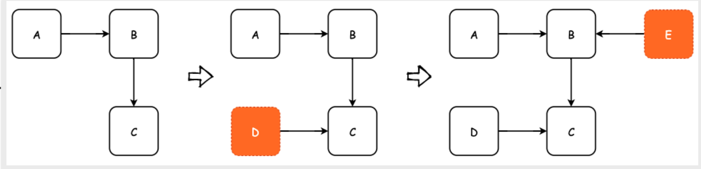
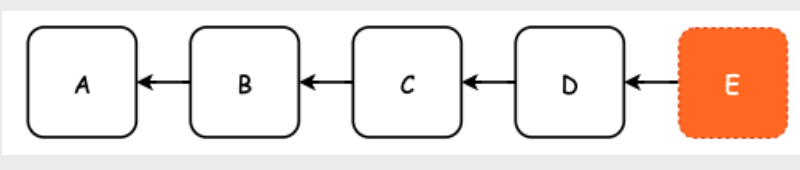

死锁这个概念最早出现于操作系统中，指的是两个进程持有对方想要的资源，但是又都不会释放这些资源，那么，就只能无止境的等待。

在 MySQL 中，我们说的死锁是事务相关的，所以，不同的存储引擎死锁的产生条件和解决办法也是不相同的。由于我们基本只使用InnoDB存储引擎，所以我们也只关注在 InnoDB 中，死锁是怎么出现的，又怎样去避免和解决它。

## 死锁产生的必要条件
操作系统中死锁产生的必要条件是以下四个
- 互斥条件：某个资源在同一时刻只能被一个进程占有
- 不可剥夺条件：一个进程占有的资源，在没有使用完之前，不能被其他的进程抢占
- 请求与保持条件：一个进程因请求资源阻塞时，对自己占据的资源不释放
- 循环等待条件：若干个进程之间形成了一种头尾相接的循环等待资源关系

**我们可以相应得出InnoDB 中，死锁产生的比较条件**
- 至少存在两个并发事务
- 每个事务都持有锁资源，但是都不会释放
- 每个事务都在申请新的锁资源
- 事务之间形成了锁资源的循环等待

所谓必要条件，就是要同时满足，那么，我们也可以得到启发：打破死锁的关系，只需要让以上的四个条件不同时满足就可以了。

数据库死锁的影响是非常大的，在生产环境中，几乎是致命的，随时可能会导致系统崩溃。例如，某张表由于各种原因出现了死锁，那么，所有涉及这张表的操作都会被阻塞，不论读写。这就会使很多操作在队列里排队，占用宝贵的数据库连接。最终会导致数据库连接耗尽、各种操作超时等等，致使系统各项指标异常，进而引发系统崩溃。

我们在工作中遇到的死锁，绝大多数都是 “唯一键”（列值唯一）引起的。

## 使用行锁模拟死锁产生的情况


这时候，事务A在等待事务B释放id=2的行锁，而事务B在等待事务A释放id=1的行锁。 事务A和事务B在互相等待对方的资源释放，就是进入了死锁状态。当出现死锁以后，有两种策略：

- 一种策略是，直接进入等待，直到超时。这个超时时间可以通过参数innodb_lock_wait_timeout来设置。
- 另一种策略是，发起死锁检测，发现死锁后，主动回滚死锁链条中的某一个事务，让其他事务得以继续执行。将参数innodb_deadlock_detect设置为on，表示开启这个逻辑。

innodb_lock_wait_timeout的值设置的太长和太短都不合适，太长的话我们需要等待太久，太短的话容易把普通的锁等待当成死锁处理。所以我们一般采用第二种方法：主动死锁检测，而且innodb_deadlock_detect的默认值本身就是on。主动死锁检测在发生死锁的时候，是能够快速发现并进行处理的，但是它也是有额外负担的。

每个新来的被堵住的线程，都要判断会不会由于自己的加入导致了死锁，这是一个时间复杂度是O(n^2)的操作。假设有1000个并发线程要同时更新同一行，那么死锁检测操作就是100万这个量级的。虽然最终检测的结果是没有死锁，但是这期间要消耗大量的CPU资源。

## 死锁检测的时间复杂度

**这里我们着重的对死锁检测的时间复杂度进行一个基本的分析**



如上图所示，假设每一个该 DAG 中每一个节点都表示一个事务，方向则表示依赖，也就是等待该事务 commit。当我们每新增一个事务时，都需要去该图
中判断是否因为自身的加入而形成的环，有向图环检测的时间复杂度为 O(V+E)，即必须遍历所有节点才能得知是否有环。因此，死锁检测的整体时间复杂
度为 O(E*V*V)

当然，并不是所有新加入的事务都需要进行死锁检测，而是只在当前事务被阻塞时才会进行 deadlock detect，并且也并不需要扫描全部的事务，只需要
在一个链路上进行扫描即可

但是存在一个极端情况，就是所有的事务都去更新同一行
数据，那么此时 DAG 就可能变成了一个链表



此时环检测的平均时间复杂度就变成了 O(n^2)，n 为并发执行的事务数量

也就是说，假如有 100 个事务同时更新同一行数据，死锁检测需要遍历
1 + 2 + 3 + 4 + ... + 100 = 5050 次才能结束

## 减少死锁检测带来的代价

**那么该如何减少死锁检测带来的代价呢？**
- 降低并发
    - 最实用的方式还是降低修改同一条语句的事务的并发执行度，也就是原本有100 个事务并发执行，通过业务层的处理，将其降低成5个或者10个事务并发执行
    - 此时只能通过数据库中间件来完成，也就是对更新同一行数据的事务进行排队处理
- 拆分逻辑
    - 对热点数据进行拆分，比如将一行拆成多行数据，业务在更新数据时随机地选择一条数据进行更新，读取数据时再进行汇总
    - 这种方式其实也是减少对同一条数据的并发更新数量

其实乐观锁也可以避免死锁的发生，只不过乐观锁适用于读多写少、并且事务执行比较简短的情况。同时，也需要对原有的业务代码进行修改


## 共享锁与排他锁
之前学习的全局锁，表锁以及行锁是按照锁粒度大小划分的。我们还可以从数据库管理的角度对锁进行划分成共享锁和排他锁。
### 共享锁
共享锁也叫读锁或 S 锁，共享锁锁定的资源可以被其他用户读取，但不能修改。在进行SELECT的时候，会将对象进行共享锁锁定，当数据读取完毕之后，就会释放共享锁，这样就可以保证数据在读取时不被修改。
```sql
LOCK TABLE product_comment READ; // 给表加共享锁
UNLOCK TABLE; // 解锁表的共享锁
SELECT * FROM product_comment WHERE user_id = 912178 LOCK IN SHARE MODE; // 给某一行加上共享锁
```

### 排他锁
排它锁也叫独占锁、写锁或 X 锁。排它锁锁定的数据只允许进行锁定操作的事务使用，其他事务无法对已锁定的数据进行查询或修改。
```sql
LOCK TABLE product_comment WRITE; // 给表加排他锁

```