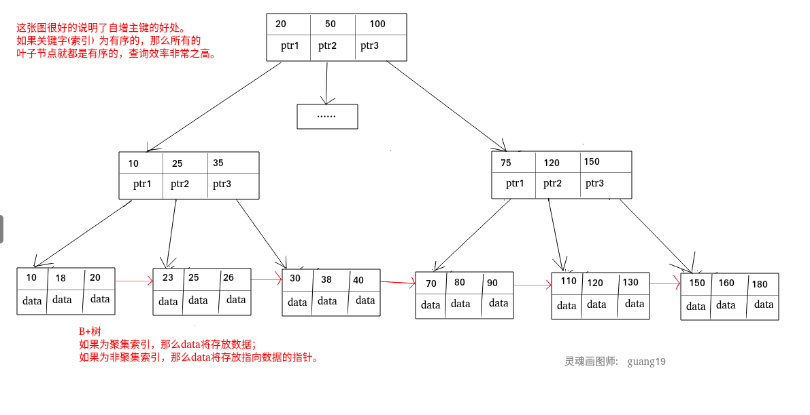
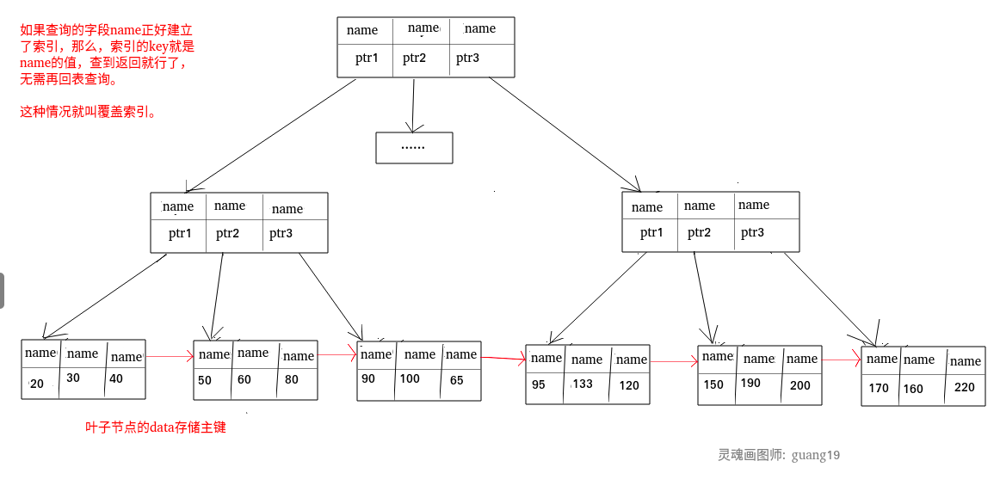
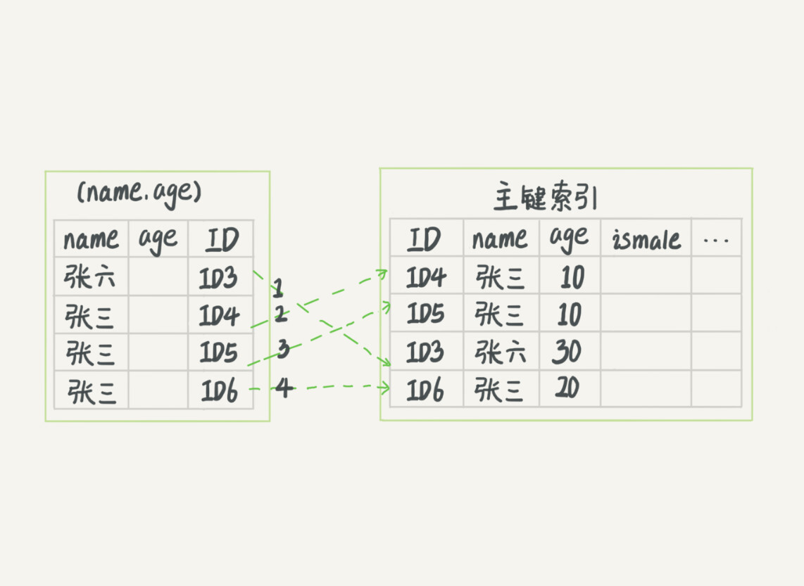
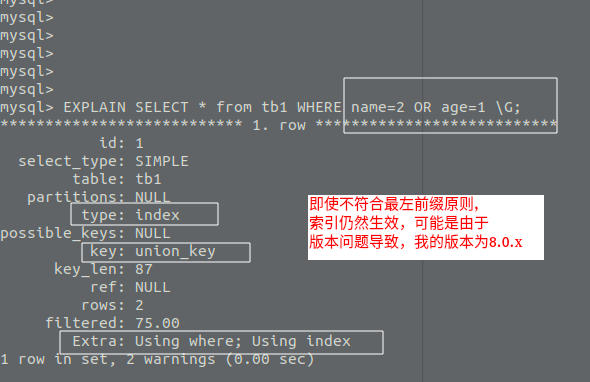

## 索引的优点

1. 通过创建唯一性索引，可以保证数据库表中每一行数据的唯一性。
2. 可以大大加快 数据的检索速度（大大减少的检索的数据量）
3. 帮助服务器避免排序和临时表。
4. 将随机IO变为顺序IO
5. 可以加速表和表之间的连接，特别是在实现数据的参考完整性方面特别有意义。

## 索引的缺点
1. **创建索引和维护索引需要耗费许多时间**：当对表中的数据进行增删改的时候，如果数据有索引，那么索引也需要动态的修改，会降低SQL执行效率。
2. **占用物理存储空间** ：索引需要使用物理文件存储，也会耗费一定空间。

所以索引并不是越多越好,但是也不是像别人说的一个表只能添加5个，按需添加
## B树和B+树的区别

* B树的所有节点既存放 键(key) 也存放 数据(data);而B+树只有叶子节点存放 key 和 data，其他内节点只存放key。
* B树的叶子节点都是独立的;B+树的叶子节点有一条引用链指向与它相邻的叶子节点。
* B树的检索的过程相当于对范围内的每个节点的关键字做二分查找，可能还没有到达叶子节点，检索就结束了。而B+树的检索效率就很稳定了，任何查找都是从根节点到叶子节点的过程，叶子节点的顺序检索很明显。


## MyISAM和InnoDB实现BTree索引方式的区别

### MyISAM

B+Tree叶节点的data域存放的是数据记录的地址。在索引检索的时候，首先按照B+Tree搜索算法搜索索引，如果指定的Key存在，则取出其 data 域的值，然后以 data 域的值为地址读取相应的数据记录。这被称为“非聚簇索引”。

### InnoDB

其数据文件本身就是索引文件。相比MyISAM，索引文件和数据文件是分离的，其表数据文件本身就是按B+Tree组织的一个索引结构，树的叶节点data域保存了完整的数据记录。这个索引的key是数据表的主键，因此InnoDB表数据文件本身就是主索引。这被称为“聚簇索引（或聚集索引）”，而其余的索引都作为辅助索引，辅助索引的data域存储相应记录主键的值而不是地址，这也是和MyISAM不同的地方。在根据主索引搜索时，直接找到key所在的节点即可取出数据；在根据辅助索引查找时，则需要先取出主键的值，在走一遍主索引。 因此，在设计表的时候，不建议使用过长的字段作为主键，也不建议使用非单调的字段作为主键，这样会造成主索引频繁分裂。 PS：整理自《Java工程师修炼之道》
## 聚集索引与非聚集索引

### 聚集索引

**聚集索引即索引结构和数据一起存放的索引。主键索引属于聚集索引。**

在 Mysql 中，InnoDB引擎的表的 `.ibd`文件就包含了该表的索引和数据，对于 InnoDB 引擎表来说，该表的索引(B+树)的每个非叶子节点存储索引，叶子节点存储索引和索引对应的数据。

首先 对于InnoDB存储引擎的一张表来说，我们可以在创建table时不指定主键，但是这并不代表生成的表结构中没有聚集索引。

聚集索引组织方式的选择
1. 若table中指定了主键，那么主键将作为聚集索引的组织方式
2. 若table中未指定主键，那么InnoDB会选择一个UNIQUE NOT NULL的非空唯一索引作为聚集索引的组织方式
3. 若即没有主见也没有唯一的非空索引，InnoDB会生成一个6Byte的隐藏的自增主键
总之，InnoDB一定会找一个东西来组织聚集索引，这是InnoDB运行的根本。

#### 聚集索引的优点

聚集索引的查询速度非常的快，因为整个B+树本身就是一颗多叉平衡树，叶子节点也都是有序的，定位到索引的节点，就相当于定位到了数据。

#### 聚集索引的缺点

1. **依赖于有序的数据** ：因为B+树是多路平衡树，如果索引的数据不是有序的，那么就需要在插入时排序，如果数据是整型还好，否则类似于字符串或UUID这种又长又难比较的数据，插入或查找的速度肯定比较慢。
2. **更新代价大** ： 如果对索引列的数据被修改时，那么对应的索引也将会被修改，
   而且况聚集索引的叶子节点还存放着数据，修改代价肯定是较大的，
   所以对于主键索引来说，主键一般都是不可被修改的。

### 非聚集索引

**非聚集索引即索引结构和数据分开存放的索引。**

**二级索引属于非聚集索引。**也叫辅助索引。

>MYISAM引擎的表的.MYI文件包含了表的索引，
>该表的索引(B+树)的每个叶子非叶子节点存储索引，
>叶子节点存储索引和索引对应数据的指针，指向.MYD文件的数据。
>
>**非聚集索引的叶子节点并不一定存放数据的指针，
>因为二级索引的叶子节点就存放的是主键，根据主键再回表查数据。**

唯一索引，普通索引，前缀索引等索引属于二级索引。

1. **唯一索引(Unique Key)** ：唯一索引也是一种约束。**唯一索引的属性列不能出现重复的数据，但是允许数据为NULL，一张表允许创建多个唯一索引。**建立唯一索引的目的大部分时候都是为了该属性列的数据的唯一性，而不是为了查询效率。
2. **普通索引(Index)** ：**普通索引的唯一作用就是为了快速查询数据，一张表允许创建多个普通索引，并允许数据重复和NULL。**
3. **前缀索引(Prefix)** ：前缀索引只适用于字符串类型的数据。前缀索引是对文本的前几个字符创建索引，相比普通索引建立的数据更小，
   因为只取前几个字符。
4. **全文索引(Full Text)** ：全文索引主要是为了检索大文本数据中的关键字的信息，是目前搜索引擎数据库使用的一种技术。Mysql5.6之前只有MYISAM引擎支持全文索引，5.6之后InnoDB也支持了全文索引。 

#### 非聚集索引的优点

**更新代价比聚集索引要小** 。非聚集索引的更新代价就没有聚集索引那么大了，非聚集索引的叶子节点是不存放数据的

#### 非聚集索引的缺点

1. 跟聚集索引一样，非聚集索引也依赖于有序的数据
2. **可能会二次查询(回表)** :这应该是非聚集索引最大的缺点了。 当查到索引对应的指针或主键后，可能还需要根据指针或主键再到数据文件或表中查询。

这是Mysql的表的文件截图:


聚集索引和非聚集索引:



### 非聚集索引一定回表查询吗(覆盖索引)

**非聚集索引不一定回表查询。**

>试想一种情况，用户准备使用SQL查询用户名，而用户名字段正好建立了索引。

````text
 SELECT name FROM table WHERE username='guang19';
````

>那么这个索引的key本身就是name，查到对应的name直接返回就行了，无需回表查询。

**即使是MYISAM也是这样，虽然MYISAM的主键索引确实需要回表，
因为它的主键索引的叶子节点存放的是指针。但是如果SQL查的就是主键呢?**

```text
SELECT id FROM table WHERE id=1;
```

主键索引本身的key就是主键，查到返回就行了。这种情况就称之为覆盖索引了。

## 覆盖索引介绍

### 什么是覆盖索引

如果一个索引包含（或者说覆盖）所有需要查询的字段的值，我们就称之为“覆盖索引”。我们知道InnoDB存储引擎中，如果不是主键索引，叶子节点存储的是主键+列值。最终还是要“回表”，也就是要通过主键再查找一次。这样就会比较慢覆盖索引就是把要查询出的列和索引是对应的，不做回表操作！

**覆盖索引即需要查询的字段正好是索引的字段，那么直接根据该索引，就可以查到数据了，
而无需回表查询。**

>如主键索引，如果一条SQL需要查询主键，那么正好根据主键索引就可以查到主键。
>
>再如普通索引，如果一条SQL需要查询name，name字段正好有索引，
>那么直接根据这个索引就可以查到数据，也无需回表。

覆盖索引:



### 覆盖索引使用实例 

现在我创建了索引(username,age)，我们执行下面的 sql 语句

```sql
select username , age from user where username = 'Java' and age = 22
```

在查询数据的时候：要查询出的列在叶子节点都存在！所以，就不用回表。

## 索引下堆
我们以市民表的联合索引（name, age）为例。如果现在有一个需求：检索出表中“名字第一个字是张，而且年龄是10岁的所有男孩”。那么，SQL语句是这么写的：
```sql
select * from tuser where name like '张%' and age=10 and ismale=1;
```
你已经知道了前缀索引规则，所以这个语句在搜索索引树的时候，只能用 “张”，找到第一个满足条件的记录ID3。当然，这还不错，总比全表扫描要好。

然后呢？当然是判断其他条件是否满足。

在MySQL 5.6之前，只能从ID3开始一个个回表。到主键索引上找出数据行，再对比字段值。

而MySQL 5.6 引入的索引下推优化（index condition pushdown)， 可以在索引遍历过程中，对索引中包含的字段先做判断，直接过滤掉不满足条件的记录，减少回表次数。

图3和图4，是这两个过程的执行流程图。



在图3和4这两个图里面，每一个虚线箭头表示回表一次。

图3中，在(name,age)索引里面我特意去掉了age的值，这个过程InnoDB并不会去看age的值，只是按顺序把“name第一个字是’张’”的记录一条条取出来回表。因此，需要回表4次。

图4跟图3的区别是，InnoDB在(name,age)索引内部就判断了age是否等于10，对于不等于10的记录，直接判断并跳过。在我们的这个例子中，只需要对ID4、ID5这两条记录回表取数据判断，就只需要回表2次。

## 选择索引和编写利用这些索引的查询的3个原则

1. 单行访问是很慢的。特别是在机械硬盘存储中(SSD的随机I/O要快很多，不过这一点仍然成立）。如果服务器从存储中读取一个数据块只是为了获取其中一行，那么就浪费了很多工作。最好读取的块中能包含尽可能多所需要的行。使用索引可以创建位置引，用以提升效率。
2. 按顺序访问范围数据是很快的，这有两个原因。第一，顺序1/0不需要多次磁盘寻道，所以比随机I/O要快很多（特别是对机械硬盘）。第二，如果服务器能够按需要顺序读取数据，那么就不再需要额外的排序操作，并且GROUPBY查询也无须再做排序和将行按组进行聚合计算了。
3. 索引覆盖查询是很快的。如果一个索引包含了查询需要的所有列，那么存储引擎就
   不需要再回表查找行。这避免了大量的单行访问，而上面的第1点已经写明单行访
   问是很慢的。

## 为什么索引能提高查询速度

### 先从 MySQL 的基本存储结构说起

MySQL的基本存储结构是页(记录都存在页里边)：


 - **各个数据页可以组成一个双向链表**
 - **每个数据页中的记录又可以组成一个单向链表**
     - 每个数据页都会为存储在它里边儿的记录生成一个页目录，在通过主键查找某条记录的时候可以在页目录中使用二分法快速定位到对应的槽，然后再遍历该槽对应分组中的记录即可快速找到指定的记录
     - 以其他列(非主键)作为搜索条件：只能从最小记录开始依次遍历单链表中的每条记录。

所以说，如果我们写select * from user where indexname = 'xxx'这样没有进行任何优化的sql语句，默认会这样做：

1. **定位到记录所在的页：需要遍历双向链表，找到所在的页**
2. **从所在的页内中查找相应的记录：由于不是根据主键查询，只能遍历所在页的单链表了**

很明显，在数据量很大的情况下这样查找会很慢！这样的时间复杂度为O（n）。


### 使用索引之后

索引做了些什么可以让我们查询加快速度呢？其实就是将无序的数据变成有序(相对)：


要找到id为8的记录简要步骤：


很明显的是：没有用索引我们是需要遍历双向链表来定位对应的页，现在通过 **“目录”** 就可以很快地定位到对应的页上了！（二分查找，时间复杂度近似为O(logn)）

其实底层结构就是B+树，B+树作为树的一种实现，能够让我们很快地查找出对应的记录。

## 索引创建原则

### 单列索引

单列索引即由一列属性组成的索引。

### 联合索引(多列索引)

联合索引即由多列属性组成索引。

### 最左前缀原则

假设创建的联合索引由三个字段组成: 

```text
ALTER TABLE table ADD INDEX index_name (num,name,age)
```

那么当查询的条件有为:num / (num AND name) / (num AND name AND age)时，索引才生效。所以在创建联合索引时，尽量把查询最频繁的那个字段作为最左(第一个)字段。查询的时候也尽量以这个字段为第一条件。

> 但可能由于版本原因(我的mysql版本为8.0.x),我创建的联合索引，相当于在联合索引的每个字段上都创建了相同的索引:

.png)

无论是否符合最左前缀原则，每个字段的索引都生效:



## 索引创建注意点

### 最左前缀原则

虽然我目前的Mysql版本较高，好像不遵守最左前缀原则，索引也会生效。
但是我们仍应遵守最左前缀原则，以免版本更迭带来的麻烦。

### 选择合适的字段

#### 1.不为NULL的字段

索引字段的数据应该尽量不为NULL，因为对于数据为NULL的字段，数据库较难优化。如果字段频繁被查询，但又避免不了为NULL，建议使用0,1,true,false这样语义较为清晰的短值或短字符作为替代。将某一列设置为default null，where 是可以走索引，另外索引列是否设置 null 是不影响性能的。 但是，还是不建议列上允许为空。最好限制not null，因为null需要更多的存储空间并且null值无法参与某些运算。

#### 2.被频繁查询的字段

我们创建索引的字段应该是查询操作非常频繁的字段。

####  3.被作为条件查询的字段 

被作为WHERE条件查询的字段，应该被考虑建立索引。

#### 4.被经常频繁用于连接的字段

经常用于连接的字段可能是一些外键列，对于外键列并不一定要建立外键，只是说该列涉及到表与表的关系。对于频繁被连接查询的字段，可以考虑建立索引，提高多表连接查询的效率。

#### 5.经常需要排序的列上

因为索引已经排序，这样查询可以利用索引的排序，加快排序查询时间；

### 不合适创建索引的字段

#### 1.被频繁更新的字段应该慎重建立索引

虽然索引能带来查询上的效率，但是维护索引的成本也是不小的。
如果一个字段不被经常查询，反而被经常修改，那么就更不应该在这种字段上建立索引了。

#### 2.不被经常查询的字段没有必要建立索引

#### 3.尽可能的考虑建立联合索引而不是单列索引

因为索引是需要占用磁盘空间的，可以简单理解为每个索引都对应着一颗B+树。如果一个表的字段过多，索引过多，那么当这个表的数据达到一个体量后，索引占用的空间也是很多的，且修改索引时，耗费的时间也是较多的。如果是联合索引，多个字段在一个索引上，那么将会节约很大磁盘空间，且修改数据的操作效率也会提升。

#### 4.注意避免冗余索引

冗余索引指的是索引的功能相同，能够命中 就肯定能命中 ，那么 就是冗余索引如（name,city ）和（name ）这两个索引就是冗余索引，能够命中后者的查询肯定是能够命中前者的 在大多数情况下，都应该尽量扩展已有的索引而不是创建新索引。

#### 5.考虑在字符串类型的字段上使用前缀索引代替普通索引

前缀索引仅限于字符串类型，较普通索引会占用更小的空间，所以可以考虑使用前缀索引带替普通索引。

## 使用索引一定能提高查询性能吗

大多数情况下，索引查询都是比全表扫描要快的。但是如果数据库的数据量不大，那么使用索引也不一定能够带来很大提升。

## 关于索引其他重要的内容补充

### 最左前缀原则

MySQL中的索引可以以一定顺序引用多列，这种索引叫作联合索引。如User表的name和city加联合索引就是(name,city)，而最左前缀原则指的是，如果查询的时候查询条件精确匹配索引的左边连续一列或几列，则此列就可以被用到。如下：        

```                                                                                       
select * from user where name=xx and city=xx ; ／／可以命中索引
select * from user where name=xx ; // 可以命中索引
select * from user where city=xx ; // 无法命中索引            
```

这里需要注意的是，查询的时候如果两个条件都用上了，但是顺序不同，如 `city= xx and name ＝xx`，那么现在的查询引擎会自动优化为匹配联合索引的顺序，这样是能够命中索引的。

由于最左前缀原则，在创建联合索引时，索引字段的顺序需要考虑字段值去重之后的个数，较多的放前面。ORDER BY子句也遵循此规则。

**扩展**
- [怎么给字符串字段加索引](docs/database/MySQL/怎么给字符串字段加索引.md)

### 注意避免冗余索引

冗余索引指的是索引的功能相同，能够命中 就肯定能命中 ，那么 就是冗余索引如（name,city ）和（name ）这两个索引就是冗余索引，能够命中后者的查询肯定是能够命中前者的 在大多数情况下，都应该尽量扩展已有的索引而不是创建新索引。

MySQL 5.7 版本后，可以通过查询 sys 库的 `schema_redundant_indexes` 表来查看冗余索引    

## 普通索引和唯一索引的区别
**查询**
- 普通索引：顺着k 索引树查找主键ID，当找到k=12 这一条数据时，还需要向后查找，判断是否有其他数据也为12
- 唯一索引：顺着k 索引树查找主键ID，当找到k=12 这一条数据时直接返回，因为k 是unique的，不可能出现重复

两者效率几乎相同，因为B+Tree叶子节点是page，所以会有相邻的特性，即使向后多找几条数据，大概率也是纯内存操作

**更新**

> ChangeBuffer
> 
> 当我们更新一条数据时，如果该数据的page 在内存中则直接进行更新。若该数据页不在内存中，且不会影响数据一致性的前提下，InnoDB 会将这个修改写入至change buffer 中（change buffer 随redo log 持久化），后续再读取该行数据时，将数据读入内存，然后执行page 和change buffer 的merge 操作
> 
> 使用change buffer 明显可以加快update语句的执行，不需要将page从硬盘中读取至内存中

**什么条件下可以使用change buffer？**

- 普通索引：在更新数据时，如果更新的页不在内存中的话，由于不需要进行唯一性检查，所以直接写入到change buffer 中，持久化交给redo log 来做
- 唯一索引：在更新数据时，如果更新的页不在内存中的话，由于需要进行唯一性检查，所以必须把page读到内存中，判断后进行操作
在page不在内存中的情况，普通索引的更新效率要高于唯一索引的更新效率

**change buffer的使用场景**
通过上面的分析，你已经清楚了使用change buffer对更新过程的加速作用，也清楚了change buffer只限于用在普通索引的场景下，而不适用于唯一索引。那么，现在有一个问题就是：普通索引的所有场景，使用change buffer都可以起到加速作用吗？

因为merge的时候是真正进行数据更新的时刻，而change buffer的主要目的就是将记录的变更动作缓存下来，所以在一个数据页做merge之前，change buffer记录的变更越多（也就是这个页面上要更新的次数越多），收益就越大。

因此，对于写多读少的业务来说，页面在写完以后马上被访问到的概率比较小，此时change buffer的使用效果最好。这种业务模型常见的就是账单类、日志类的系统。

反过来，假设一个业务的更新模式是写入之后马上会做查询，那么即使满足了条件，将更新先记录在change buffer，但之后由于马上要访问这个数据页，会立即触发merge过程。这样随机访问IO的次数不会减少，反而增加了change buffer的维护代价。所以，对于这种业务模式来说，change buffer反而起到了副作用。

**新增**

在新增数据时，由于主键是唯一的，因此对聚簇索引的写入必然需要将页面读入内存中。但是如果还存在其它索引写入的话，那么非唯一索引也可以使用change buffer 来优化

**该如何选择**
- 如果业务要求某个字段唯一，但是代码不能完全保证写入唯一值，则添加唯一索引，让这个字段唯一。
- 如果代码确定某个字段不会有重复的数据写入，则可以选择添加普通索引。 因为普通索引可以使用 Change Buffer，并且出现死锁的概率比唯一索引低。

**change buffer 和 redo log**


**总结**

如果业务端能够保证数据的唯一性，并且是写多读少，那么使用普通索引比唯一索引会有更高的性能