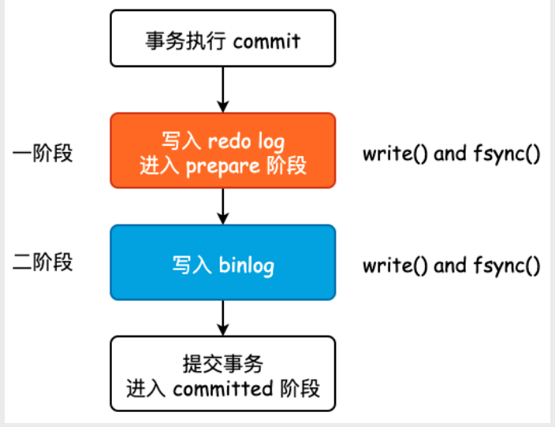
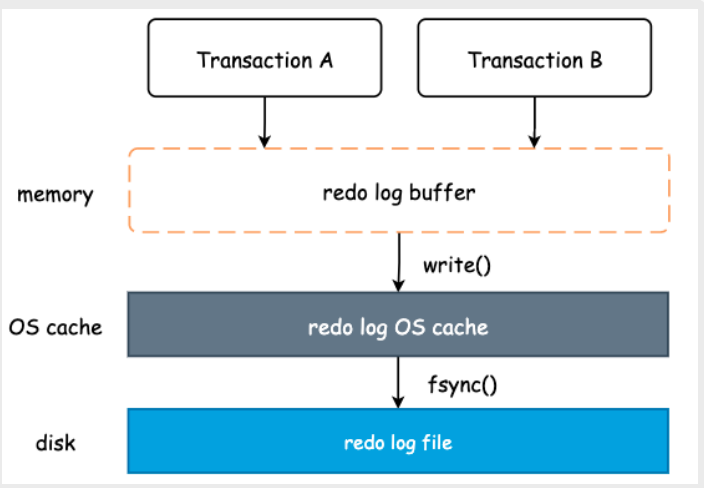
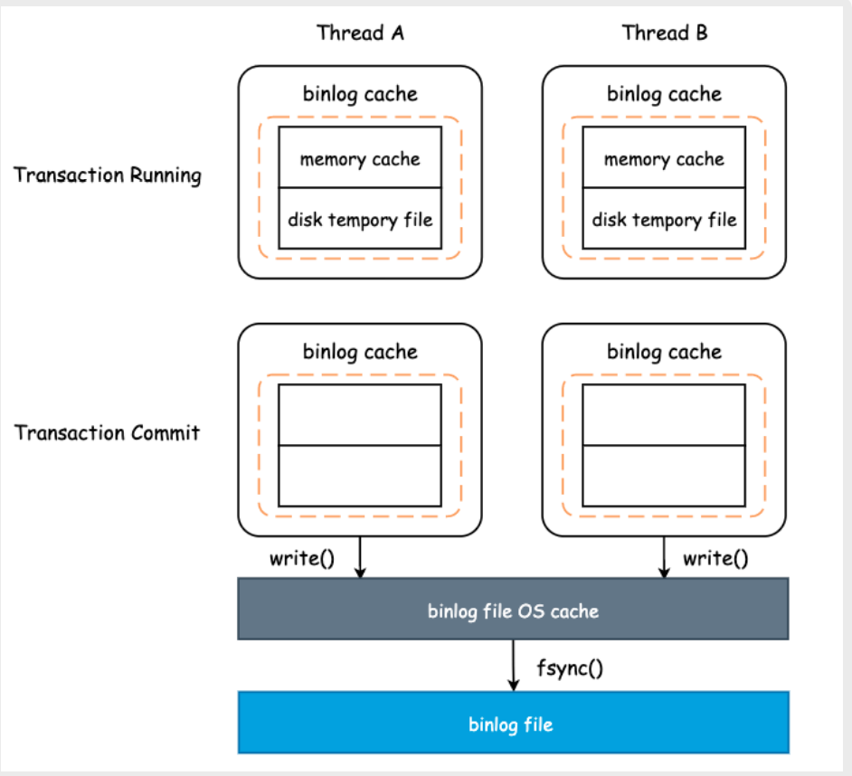
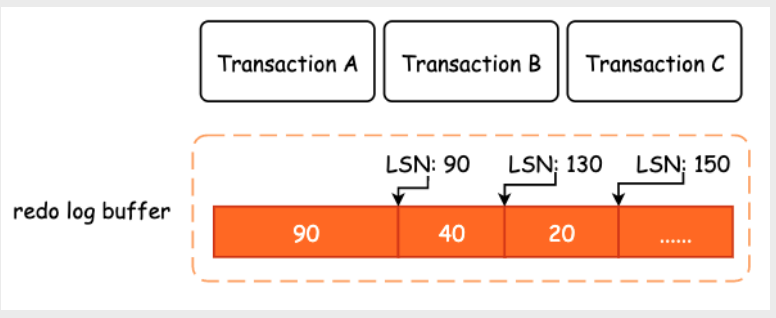
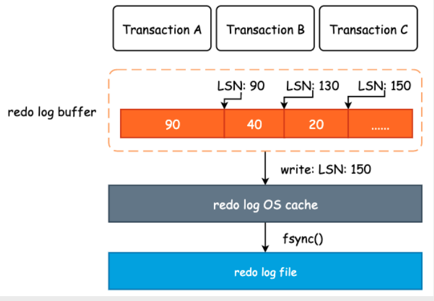
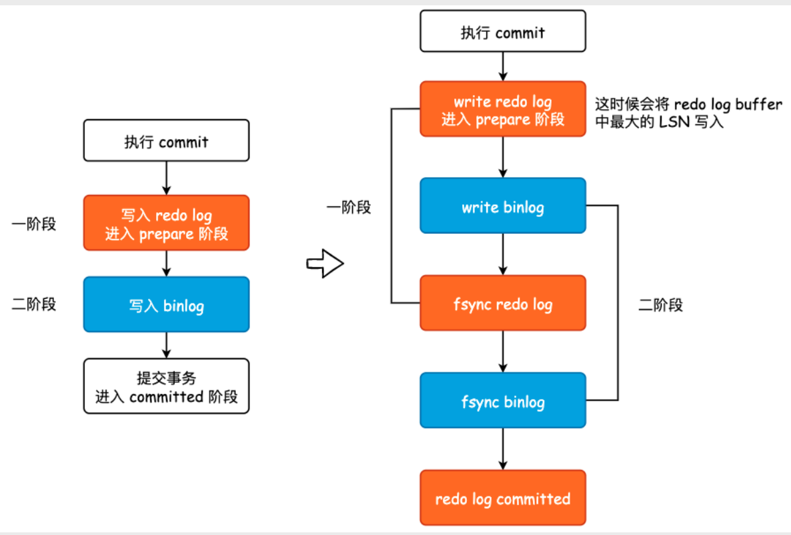

## 2PC

在InnoDB 的两阶段提交中，不管是redolog 还是binlog，都需要确切地将数据写入硬盘中，而不是OS cache

### redo log 写入机制

redo log buffer 为全局共有

前面我们已经提到了Linux 中的文件I/O 分为两部分: 调用write() 写入内核高速缓存，以及调用fsync() 将其持久化至硬盘。wirte() 调用速度非常快，因为仅仅是将数据从用户空间拷贝至内核空间而已，而fsync() 相对来说则慢很多

**redo log buffer 刷新时机**

1. InnoDB 后台线程定期扫描，将redo log buffer 中的redo log 持久化至硬盘
2. redo log buffer 所占用的空间达到了innodb_log_buffer_size 的一半，此时后台线程会将buffer中的内容调用write() 写入至内核高速缓冲区中，但是由于事务没有提交，所以不会调用fsync()
3. 当事务提交时，InnoDB 不仅仅会将相应的redo log 写入至内核缓冲区，同时也会调用fsync() 进行持久化

也就是说，redo log file中会存在尚未提交的事务，但是这并不影响InnoDB 数据的准确性，因为这些page页并没有进入prepare阶段

### binlog写入机制

binlog 的写入机制要稍微复杂一些，原因在于binlog 中的binlog cache是每个线程一个

当执行的事务比较大并且memory cache 无法容纳的话，会将这部分的数据暂存至硬盘中。为什么不能直接调用write() 将数据写入高速缓冲区呢? 其原因就在于binlog 必须有序且完整，如果进行分批写入的话，就会出现同一个事务的binlog 出现在文件的不同区域

当事务提交时，redolog 写入完毕后会将 binlog cache中的内容（内存+硬盘临时数据）一起调用write() 写入OS cache，并调用fsync()
进行持久化，同时清空binlog cache中的全部内容

---
可以看到，在上述的2PC 提交中，一个事务的提交一共涉及到了2 次fsync() 的调用。如果MySQL 的TPS 是2000 的话，那么使用磁盘工具检测的结果
应为4000，但实际上MySQL 在提交一个事务时只进行了一次fsync() 系统调用

## Group Commit

### LSN
LSN 是Log Sequence Number 的缩写，特指redolog 的写入点。LSN 单调递增，每次写入长度为N 的redo log，LSN 的值就会增加N

如上图所示，假设有3 个事务并发执行，其中A写入长度为90 的redo log，B 事务写入长度为40 的redo log，C 事务写入长度为20 的redo log，LSN 则按照redo log 的长度进行增长

在没有Group Commit 的情况下，当A事务commit 时，只会将LSN 为90 的redo log fsync至硬盘

### redo log group commit
redo log 的组提交其实就是将redo log buffer 中的那个最大的LSN 之前的所有redo log 都持久化至硬盘中。事务到底有没有真正的提交，redo log 并不关心，反正最后是通过事务的commit 标志位来决定当前数据是否真正被提交

和Raft 协议中的日志复制有些类似。Leader 节点在写入数据时，会将日志发送给所有的Follower，Follower 进行日志的追加，但是并不更新该数据的标志位，只有Leader 收到大多数Follower 的ACK 以后，才会告诉FollowerAppend 刚才那条日志

---
既然redo log 中的内容和事务提不提交没有任何关系，就算事务没有提交依然可以将修改持久化至硬盘中，那么InnoDB 就利用了该特性进行了一个有趣的优化

1. MySQL 将redo log 和binlog 的write()、fsync() 这两个系统调用拆开，其目的就是为了让binlog 能够累积到更多，从而一次fsync() 能够将更多的binlog 持久化至硬盘
2. 同时我们也可以看到，这种两阶段提交的方式与系统并发度有关，能够并发执行的事务越多，那么调用fsync() 的次数就会越少。相反，如果锁争抢非常严重的话，每次都只能有一个事务进入redo log buffer 中，那么这时候组提交的效率就会回到最原始的版本中

---
提升bin log GroupCommit 的效果
1. 设置binlog_group_commit_sync_delay，表示延迟多少微秒以后才调用binlog 的fsync()
2. 设置binlog_group_commit_sync_no_delay_count ，表示累积多少次以后才调用binlog 的fsync()

## 5.7 版本的并行复制
MySQL 主从复制中的多线程复制一直是备受业界关注的问题，从库是否可以使用多线程执行binlog 中的内容将决定了主库和从库之间的延迟量

在MySQL5.7 中，当slave-parallel-type配置项为LOGICAL_CLOCK 时，就选用了基于GroupCommit 的并行复制方式

LOGICAL_CLOCK 利用了这样的一个事实: 多个事务如果能够同时进入prepare 阶段，那么这些事务一定已经经过了锁校验，它们所更新、修改或者删除的数据一
定是不会发生冲突的，换而言之，它们是可以并发执行的

同时，处于prepare和committed 状态之间的事务，其实也是可以并发执行的。因此，从库将会对这些事务进行并发执行，这些事务全部处理完毕后，再转而并发
地执行下一批事务