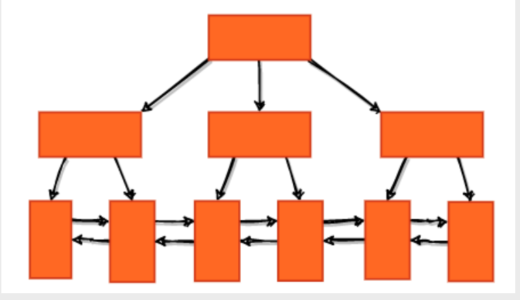

## Fil Header
即File Header，是对InnoDB Page的一个总体描述，包含了前驱指针、后继指针以及当前Page的类型等等

从Fil Header 中内容就可以看出，InnoDB 聚簇索引的叶子节点使用双向链表链接的

也就是说，聚簇索引应该长这样儿。InnoDB聚簇索引的叶子节点用双链表连接，那么问题来了，为什么要用双向链表? 单链表省空间不香吗?

原因主要有两个：
1. 首先，Page大部分的时间是待在硬盘里面儿的，只有在需要的时候才会被载入内存，并且，也只有少部分的Page会被载入。因此，使用单链表也不会节省多少内存，而至于硬盘空间，就更没有必要了
2. 其次，使用双向链表的一个重要原因就是使范围查询更快。例如select * from table where id<100 这条范围查询语句，当我们找到id=100 的叶子节点之后，通过前驱指针一直往前即可找到所有需要的数据，而无需再回到根节点进行查询

## User Records
InnoDB 规定，User Records 中至少要包含两条记录。如果允许只包含一条记录的话，那么B+Tree完全有可能变成链表

行记录格式:
1. 对于不同版本的InnoDB 引擎而言，行记录格式是不一样的
2. 不过在5.7 版本之后，我们查看某一个table的Row_format 的话，将会返回Dynamic。简单的来说，Row_format 就是InnoDB 如何确定其物理存储方式，也就是一行记录在硬盘和内存中的具体格式

下图为Compact 行记录格式，Dynamic行格式和该格式类似

User Records 中的用户数据是以单向链表排列的

## Page Directory
todo

## 记录检索

有了这些基础之后，我们就可以大致地给出InnoDB 检索数据的方式了
1. 首先从B+Tree 的根节点开始，逐层检索，每一层的检索都需要一次逻辑I/O，然后找到对应的叶子节点，也就是对应的数据页，将其载入内存
2. 根据Page Directory 中的slot 进行粗略的二分搜索，找到数据所在的记录分组，然后通过链表遍历的方式找到具体的那一条记录

## 参考
- [SmartKeyerror/Psyduck 仓库的博客](https://smartkeyerror.oss-cn-shenzhen.aliyuncs.com/Phyduck/database/InnoDB-Page.pdf)

