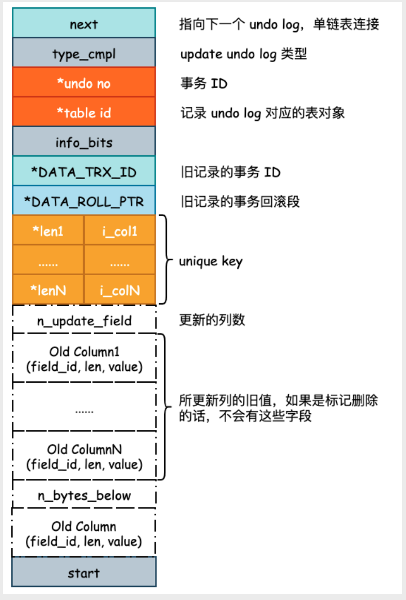
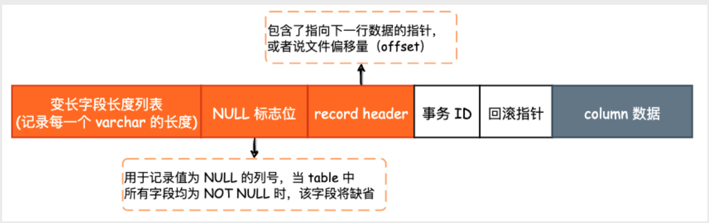

## 基本概念
undo log和binlog一样，同属于逻辑日志，其作用主要是用来实现事务回滚和MVCC，undo log 通常保存在共享表空间内。

当我们对数据进行修改时，除了会产生redo log 以外，还会产生undo log。当事务执行失败或者是客户端要求回滚事务时，InnoDB 就可以通过undo log 逻辑性地将数据回滚到事务开始时的样子

当事务进行回滚时，每一个INSERT会对应一个DELETE，对于每一个DELETE 会对应一个INSERT。而对于每一个UPDATE，InnoDB 会执行一个相反的UPDATE，把修改的数据再逻辑地回复回去

另外，InnoDB 通过undo log来实现MVCC，也就是把数据的历史版本也记录下来。只不过这些数据的历史版本是服务于InnoDB 自身事务执行需要的，并不会永久的持久化
> 这里可以对比etcd来看，etcd同样实现了MVCC，并且我们可以随时查看某一个数据的历史版本
>
> 另一个题外话，etcd的设计和MySQL 的设计有太多相似和不同之处了，强烈建议把它们放到一起分析

## undo log 格式
一般会有两种格式的undo log，一种是insert undo log，另一种则是update undo log。我们通常会更关注update undo log，因为insert undo log 只会在插入数据时产生，我们不会有获取“插入的这条数据的历史版本” 这种需求

通过next 字段可知，undo log 是通过单向链表串起来的，当版本链很长的时候，获取数据的历史版本将成为一个耗时操作

type_cmpl: 对于update undo log 的type_cmpl 来说，通常会有3 种枚举
1. TRX_UNDO_UPD_EXIST_REC: 也就是update exist record 的简写，表示当前undo log 修改是未被标记为删除的记录
2. TRX_UNDO_UPD_DEL_REC: 将delete的记录标记为not delete
3. TRX_UNDO_UPD_DEL_MARK_REC: 将记录标记为delete

总之，undo log 中记录了非常详细的信息，其中与MVCC 有关的几个字段就是事务ID、旧记录的事务ID以及原有的数据列

## MVCC
通过undo log 中记录的信息，我们就可以实现MVCC 了。在MySQL 中，MVCC 的主要作用就是实现事务的隔离性，这里尤指RepeatedRead(RR) 事务隔离级别，同时也给一致性非锁定读提供了实现的可能

**基本概念：**MVCC，Multiversion Concurrency Control，即多版本并发控制，主要用来实现事务的隔离性（RR）以及一致性非锁定读，后者又常常被称为快照读。通过一致性非锁定读，可以极大地提高数据库的并发性能

**实现：** InnoDB Compact 行记录格式如下图所示，与 MVCC 相关的字段就是事务 ID 和回滚指针，回滚指针指向 undo log 中的记
录

当我们进行数据读取时，也会有一个事务 ID 产生，若某一行数据存在多个版本，那么当前事务只会去读取小于该事务 ID 的最新数据

---
MVCC 解决幻读也是同样的原理，在 RR 隔离级别下，读取范围数据时需要对事务 ID 进行比较，只要是超过了当前事务ID 的数据行，就不在返回结果中进行记录

## 参考
- [SmartKeyerror/Psyduck 仓库的博客](https://smartkeyerror.oss-cn-shenzhen.aliyuncs.com/Phyduck/database/InnoDB-undo-log%E4%B8%8EMVCC.pdf)
