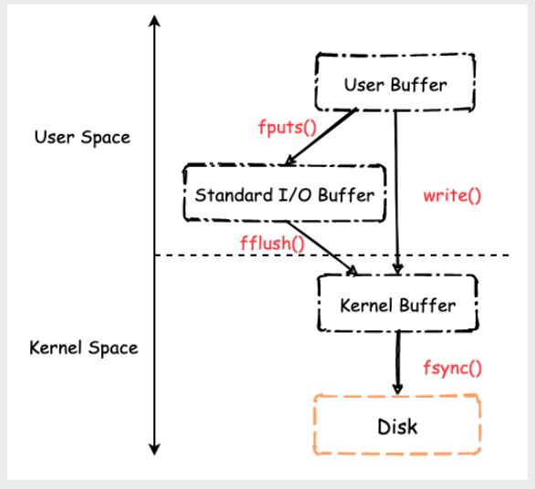
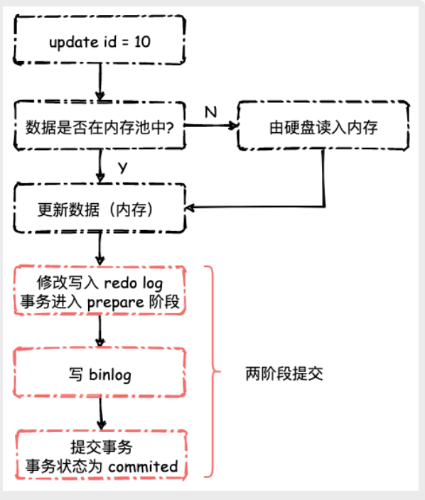

## linux 文件 I/O

在Linux 系统下，对文件内容的写入均会首先首先写入至KernelBuffer，也就是内核高速缓冲区。应用程序要么主动调用fsync() 将文件元数据和内容数据一起强制刷新至硬盘中，要么由内核I/O 线程定时地将缓冲区内容刷新至硬盘

前者由进程主动控制，能够保证数据的持久性，但是由于每次写数据都需要进行硬盘 I/O 操作，所以整体性能不会很高。后者由内核定时任务定期执行，能够提高进程的I/O 效率，但是当系统崩溃时，可能会丢失部分KernelBuffer 中的所有数据

困境
1. 每次写入数据均调用fsync() ———— 数据能确保落入硬盘，但是效率很低
2. 将fsync() 的调用交给OS 定时任务 ———— 效率很高，但是数据不能保证一定落入硬盘

## wal
WAL 是Write Ahead Log 的缩写，也就是当我们更新数据库数据时，首先将数据写入日志，然后再写入至真正的DB 文件中，其目的是为了解决数据库写入效率问题

**前因**

MySQL 聚簇索引大致上如上图所示，B+Tree节点与节点的指针使用文件偏移量表示

由于B+Tree 的特性，所有的行数据均保存在其叶子节点中，那么当我们创建、更新一条数据时，就需要从根节点出发，沿着B+Tree 的路径一步一步的到达叶子节点，然后进行插入、更新操作。在最坏情况下，每一层都需要进行一次随机的硬盘I/O

而对于插入新数据而言，还可能会涉及到B+Tree节点的页分裂问题，原因在于InnoDB 的Page大小固定为16KB

因此，插入和更新一条数据并不像Linux 文件I/O 图所绘制的那样，简单的执行下fsync() 就可以了，内部其实是一个非常复杂并且相对于直接内存操作而言是一个很耗时的动作

所以，如果我们每次插入、更新数据都把数据写入至.ibd 文件的话，然后磁盘也要找到对应的那条记录，然后再更新，整个过程IO成本、查找成本都很高，数据库的性能和效率都会大打折扣

**后果**

为了解决写入性能问题，以及保证数据的持久性，InnoDB 引入了WAL 机制，更确切的说，就是redo log。

## Redo Log
**InnoDB redo log 是一个顺序写入的、大小固定的环形日志**

主要作用有两个：
1. 提高InnoDB 存储引擎写入数据的效率
2. 保证crash-safe能力

说明：
1. InnoDB的redo log是固定大小的。假设我们配置了4个redo log 文件，每个文件大小为1GB，那么我们总计可以写入4GB 的内容
2. 数据写入时首先往logfile-0 写入，当写到logfile-3 并且没有空间时，又回到logfile-0 开始写入
3. 因此需要维护两个指针。一个是write-pos，表示当前redo log 的写入位置， 另一个是check-pos，用于当前要擦除的位置，同样是往后推移且循环的（类似用数组实现的循环队列，需要两个指针），擦除记录的话就需要把数据持久化至 .ibd 文件中。由于是顺序IO，速度很快。
4. write-pos 到check-pos 中间的位置就是我们当前能够写入的空间。如果write-pos 追上了check-pos 的话，就需要把check-pos 往后挪挪，也就是把一部分数据给持久化到DB 文件中

我们可以不用太关心redo log 文件中记录的具体格式，只需要知道它记录了对物理数据页的修改即可

**日志与数据写入：**

1. 从上面redo log 的格式我们可以看出，red olog 的写入是顺序写入的，不需要找到某一个具体的索引位置，而是简单的从write-pos 位置追加
2. innodb_flush_log_at_trx_commit这个参数设置成1的时候（一般情况下都是设置成1），那么也就是说，当一个写事务或者更新事务执行时，InnoDB 首先取出对应的Page，然后进行修改。当事务提交时，将位于内存中的redo log buffer 强制刷新至硬盘中，如果不考虑binlog 的话，我们可以认为事务执行可以返回成功了，写入DB的操作由另外的线程异步进行。
3. 再然后，可由InnoDB 的Master Thread 定时地将缓冲池中的脏页，也就是上面儿我们修改的页，刷新至磁盘，此时被修改数据真正的写入至.ibd 文件

因为顺序I/O 很快，所以使用redo log 既能够提高系统运行效率，同时也能够保证数据的准确性，即使数据库发生异常重启，之前提交的记录都不会丢失，因为事务提交时，redo log 必须被刷新至硬盘中

虽然fsync() redo log buffer 的时机可以通过配置项进行修改，当时强烈建议不要对其进行改动

## binlog

binlog 的作用主要有两个
1. 记录MySQL Table中的逻辑操作，比如更新了哪条数据，对这条数据做了哪些更新，可用于恢复因误删库导致的数据丢失
2. 用于主从复制，主库和从库之间利用binlog 进行数据复制，主库执行什么语句、进行何种更新，从库跟着执行

**因此，当我们执行一个事务时，还需要写入binlog，并且我们需要保证redo log 和 binlog 之间的一致性**

> binlog 的日志格式主要有两种，Statement 和Row
> 
> **Statement:**
> 1. 仅记录执行的SQL 语句，例如UPDATEtablesetname="smart"WHEREid=1，占用硬盘空间较少
> 2. 在主从复制中如果SQL 语句调用了系统函数的话，很容易出现主从不一致的情况，因此很少使用
> 
> **Row:**
> 1. Row 格式的binlog 会记录两条数据，更新前的更新后的，非常详细，便于日志的恢复。但是占用硬盘空间较多，主从复制时的网络传输开销也会更多一些
> 2. 实际上Row 格式的binlog 也有3 中子格式，分别为FULL、MINIMAL 和NOBLOB。FULL 记录数据修改的全部上下文，MINIMAL 则仅记录被修改字段的前后值
> 
> **到底使用哪种格式的binlog，需要视情况而定**

至于如何保证一致性，那就是两阶段提交。

有了两阶段提交以后，MySQL 在崩溃重启时可根据redolog 和binlog 之间的差异进行按需恢复/回滚事务。开发运维人员可以根据binlog + 定时备份将InnoDB 中的数据恢复至任意时刻

### QA

**1. 为什么需要两阶段提交?**

没有两阶段提交的情况

1. 先写 redo log 直接提交，然后写 binlog，假设写完 redo log 后，机器挂了，binlog 日志没有被写入，那么机器重启后，这台机器会通过 redo log 恢复数据，但是这个时候 bingog 并没有记录该数据，后续进行机器备份的时候，就会丢失这一条数据，同时主从同步也会丢失这一条数据。
2. 先写 binlog，然后写 redo log，假设写完了 binlog，机器异常重启了，由于没有 redo log，本机是无法恢复这一条记录的，但是 binlog 又有记录，那么和上面同样的道理，就会产生数据不一致的情况。

有两阶段提交的情况
1. 判断 redo log 是否完整，如果判断是完整的，就立即提交。
2. 如果 redo log 只是预提交但不是 commit 状态，这个时候就会去判断 binlog 是否完整，如果完整就提交 redo log, 不完整就回滚事务。 这样就解决了数据一致性的问题。

**2. 为什么会有两份日志**

因为最开始MySQL里并没有InnoDB引擎。MySQL自带的引擎是MyISAM，但是MyISAM没有crash-safe的能力，binlog日志只能用于归档。而InnoDB是另一个公司以插件形式引入MySQL的，既然只依靠binlog是没有crash-safe能力的，所以InnoDB使用另外一套日志系统——也就是redo log来实现crash-safe能力。

## 总结

1. redo log 的作用：提高InnoDB 存储引擎写入数据的效率
2. redo log 和binlog 的区别：
    1. redo log是物理日志，记录的是“在某个数据页上做了什么修改”；binlog是逻辑日志，记录的是这个语句的原始逻辑，比如“给ID=2这一行的c字段加1 ”。
    2. redo log 为InnoDB 引擎所特有，而binlog 则是在MySQL Server 层所实现的，任何一个存储引擎都可以写入binlog
    3. redo log 大小固定, 是循环写的，本质上是一个“循环队列”，而binlog 则可以一直往下写，并创建新的binlog 文件
3. 两阶段提交的目的是为了使得redolog 和binlog 在逻辑上保持一致。如果关闭MySQL 的binblog 记录功能，也就没有了两阶段提交，同时也就失去了数据恢复、主从复制等功能。当然，这么做肯定会有性能的提升
4. WAL 的本质作用还是优化数据库写入时的性能，将数据写入DB 则由另外的线程异步进行。Postgres、etcd 等数据库均使用了WAL。

## 参考
- [SmartKeyerror/Psyduck 仓库的博客](https://smartkeyerror.oss-cn-shenzhen.aliyuncs.com/Phyduck/database/InnoDB-WAL.pdf)
