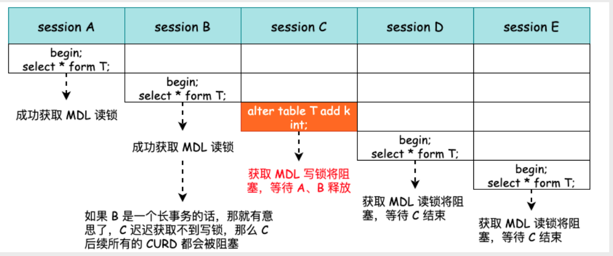
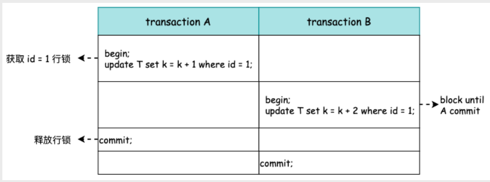

重点学习行锁和表锁，这也是面试中比较容易考的

这里需要说明下，每个层级的锁数量是有限制的，因为锁会占用内存空间，锁空间的大小是有限的。当某个层级的锁数量超过了这个层级的阈值时，就会进行锁升级。锁升级就是用更大粒度的锁替代多个更小粒度的锁，比如 InnoDB 中行锁升级为表锁，这样做的好处是占用的锁空间降低了，但同时数据的并发度也下降了。

## MySQL 为什么需要锁?
1. 数据库的设置主要解决两个问题: 高效的存储和查询数据，以及处理用户的并发请求
2. 当出现并发访问时，数据库需要对访问的资源进行合理的控制，以及制定不同的访问规则，锁就是做这件事情的
3. 另外需要注意的是，MySQL 中的锁和操作系统的互斥量、信号量是有区别的，比如MySQL 中的锁带有死锁检测，并且有读锁和写锁

## 全局锁
全局锁就是对整个数据库实例加锁，数据库将处于只读的状态。以下语句会被阻塞：数据更新语句（数据的增删改）、数据定义语句（包括建表、修改表结构等）和更新类事务的提交语句。

加锁语句
```sql
flush tables with read lock;
// 业务逻辑
unlock tables;
```

**全局锁的典型使用场景是，做全库逻辑备份**。也就是把整库每个表都select出来存成文本。

要是为了导出整个库而导致线上业务停摆，这是无法接受的，那我们该怎么导出数据呢？

官方自带的逻辑备份工具是mysqldump。当mysqldump使用参数–single-transaction的时候，导数据之前就会启动一个事务，来确保拿到一致性视图。而由于MVCC的支持，这个过程中数据是可以正常更新的。需要注意的是，**single-transaction方法只适用于所有的表使用事务引擎的库。**

全局锁主要是提供给不支持事务的存储引擎进行逻辑一致的数据备份的，例如MyISAM，MyISAM 并不支持事务，也就没有MVCC 之说，所以没有办法提供非锁定的一致性读，只
能通过添加全局锁的方式来进行一致性的整库备份。

## 表级锁
MySQL里面表级别的锁有两种：一种是表锁，一种是元数据锁（meta data lock，MDL)。

### 表锁
表锁的语法是 lock tables … read/write。与FTWRL类似，可以用unlock tables主动释放锁，也可以在客户端断开的时候自动释放。需要注意，lock tables语法除了会限制别的线程的读写外，也限定了本线程接下来的操作对象。

举个例子, 如果在某个线程A中执行lock tables t1 read, t2 write; 这个语句，则其他线程写t1、读写t2的语句都会被阻塞。同时，线程A在执行unlock tables之前，也只能执行读t1、读写t2的操作。连写t1都不允许，自然也不能访问其他表。

**可以得出加读锁时，本线程和其它线程可以读，本线程写会报错，其它线程写会等待。加写锁时，本线程可以读写，其它线程读写都会阻塞。**

在还没有出现更细粒度的锁的时候，表锁是最常用的处理并发的方式。而对于InnoDB这种支持行锁的引擎，一般不使用lock tables命令来控制并发，毕竟锁住整个表的影响面还是太大。

但是由于锁定粒度很大，它的实现会简单许多，资源消耗也会很低，不光是 InnoDB ，其他大部分的存储引擎也都支持表级锁，它具有如下特点：
1. 由于开销比较小，加锁会很快
2. 锁定粒度大，所以锁冲突的概率高，并发度低
3. 不会出现死锁

表锁一般是在数据库引擎不支持行锁的时候才会被用到的。尽量升级成InnoDB存储引擎，使用行锁。

### 元数据锁

另一类表级的锁是MDL（metadata lock)。当对一个表做增删改查操作的时候，加MDL读锁；当要对表做结构变更操作的时候，加MDL写锁

- 读锁之间不互斥，因此你可以有多个线程同时对一张表增删改查。
- 读写锁之间、写锁之间是互斥的，用来保证变更表结构操作的安全性。因此，如果有两个线程要同时给一个表加字段，其中一个要等另一个执行完才能开始执行。
- MDL 不需要显示添加，当我们对数据进行CURD 操作时，就会首先去获取MDL 读锁，保证此时没有其它线程在对表结构进行更改
- 当我们对表结构进行更改，例如执行alter table T... 的时候，就会尝试为T添加MDL 写锁，表示开始对T进行元数据的更改

如果我们在表T繁忙时进行DDL 的话，可能可能会导致整个表无法处理任何请求，尽管表T的数据量可能非常少



如上图所示，当我们开始执行alter table T 的时候，由于前面有事务进行，所以session C 获取MDL 写锁将阻塞。但是由于B是长事务，session C 可能阻塞非
常长的时间，同时，如果后续仍有查询、修改、删除等请求时，将获取不到MDL 读锁，同样会阻塞。这样一来，这个库的线程数可能很快就爆满了

**因此，当我们执行DDL 的时候，有两个要素必须要考虑：当前table 是否有长事务的执行，以及当前table 的请求是否繁忙**

## 行锁

行级锁是 MySQL 中锁定粒度最细的一种锁，它锁住的是行记录。行锁由各个存储引擎自行实现，并不由MySQL Server 实现。因此，MyISAM 就不支持行锁，而InnoDB 则支持行锁。行级锁可以大大减少数据库操作的冲突，但是加锁的开销也是非常大的。它具有如下特点：
1. 由于开销比较大，加锁会很慢
2. 锁定粒度小，所以锁冲突的概率低，并发度高
3. 可能会出现死锁
**在InnoDB事务中，行锁是在需要的时候（UPDATE、INSERT 语句执行时开始获取）才加上的，而不是事务开始时获取，但并不是不需要了就立刻释放，而是要等到事务结束时才释放。这个就是两阶段锁协议。**

例子：



也就是说，当事务B开始执行时，若事务A未执行完毕，将会一直阻塞。

知道了这个设定，对我们使用事务有什么帮助呢？那就是，如果你的事务中需要锁多个行，要把最可能造成锁冲突、最可能影响并发度的锁尽量往后放，以减少锁的持有时间，从而提高事务的并发度。

### InnoDB 行锁模式
InnoDB 实现了以下两种类型的行锁：

- 共享锁（S）：允许一个事务去读一行，阻止其它事务获得相同数据集的排他锁；(给某一行数据加共享锁后，其它事务不能给该条数据加排他锁)
- 排他锁（X）：允许获得排他锁的事务更新数据，阻止其它事务取得相同数据集的共享读锁和排他写锁。(给某一行数据加排他锁锁后，其它事务不能给该条数据加排他锁以及共享锁)

对于普通 select 语句，InnoDB 不会加任何锁，事务可以通过以下语句显式给记录集加共享锁或排他锁：

- 共享锁（S）：select * from table_name where … lock in share mode;
- 排他锁（X）：select * from table_name where … for update。

### InnoDB 行锁算法

InnoDB 行锁的三种算法：
- Record Lock：单个记录上的索引加锁。
- Gap Lock：间隙锁，对索引项之间的间隙加锁，但不包括记录本身。
- Next-Key Lock：Gap Lock + Record Lock，锁定一个范围，并且锁定记录本身。
InnoDB 行锁实现特点意味着：如果不通过索引条件检索数据，那么 InnoDB 将对表中所有记录加锁，实际效果跟表锁一样。


## 其它锁
除了上面介绍的锁以外我们还可以在页和区粒度上锁定数据，对应页锁和区锁。只不过两种锁InnoDB都不支持，所以重要性没那么大。

页锁就是在页的粒度上进行锁定，锁定的数据资源比行锁要多，因为一个页中可以有多个行记录。当我们使用页锁的时候，会出现数据浪费的现象，但这样的浪费最多也就是一个页上的数据行。页锁的开销介于表锁和行锁之间，会出现死锁。锁定粒度介于表锁和行锁之间，并发度一般。


## mysql是如何选择表级锁和行级锁的
刚刚说过，InnoDB 存储引擎支持行和表级锁，那么，什么场景下会锁住行、什么场景下又会锁住表呢？把这个问题搞清楚了，也就基本上掌握了这两种锁，在实际的应用中，也就可以把握程序的性能了。
InnoDB 行级锁是通过给索引上的索引项加锁来实现的，所以，只有通过索引条件检索的数据，InnoDB 才会使用行级锁。否则，使用表级锁。总结下来：
- 不通过索引条件查询时，InnoDB 一定会使用表锁，而不是行锁（因为没有索引只能全表扫描）
- 查询时，不论是使用主键索引、唯一索引或者普通的索引，InnoDB 都会使用行锁来对数据加锁
但是，需要注意，对于第二条总结，在有些特殊情况下是不成立的。例如，对于数据量很少的表，MySQL 会认为全表扫描更快，此时，即使使用索引字段查询，InnoDB 也会使用表锁，而不是行锁。因此，如果想确定当前使用的是哪一种锁，检查下 SQL 的执行计划（EXPLAIN），确认是否在查询时使用了索引。

## 参考
- [SmartKeyerror/Psyduck 仓库的博客](https://smartkeyerror.oss-cn-shenzhen.aliyuncs.com/Phyduck/database/InnoDB-WAL.pdf)
