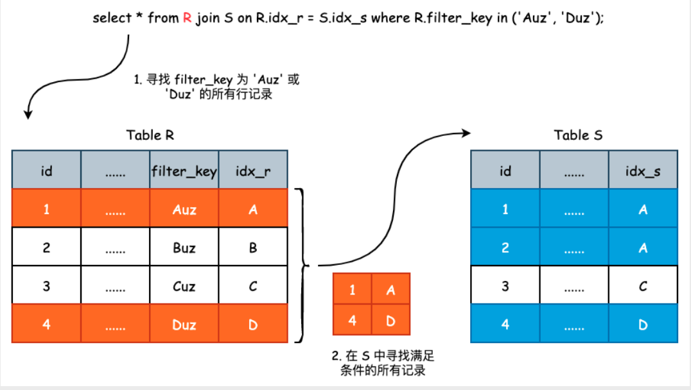

很多开发人员下意识地认为 JOIN 会降低 SQL 的性能效率，所以就将一条多表 SQL 拆成单表的一条条查询，但这样反而会影响 SQL 执行的效率。究其原因，在于开发人员不了解 JOIN 的实现过程。

## Join连接算法
MySQL 8.0 支持两种不同的 JOIN 连接算法，分别为 **Nested Loop Join** 以及 **Hash Join**。粗略地来说，Nested Loop
Join 在查询数据量较小时使用，通常用于 OLTP；Hash Join 则在数据量较大时使用，通常适用于 OLAP。

## Nested Loop Join

Nested Loop Join 之间的表关联是使用索引进行匹配的，假设表 R 和表 S 进行连接，那么算法的伪代码大致如下：

```
for each row r in R with matching condition:
    lookup index idx_s on S where index_key = r
    if (found)
      send to client
```

我们可以将两张 table 看成是两张哈希表，假设为 A、B。如果我们需要对哈希表进行 JOIN  的话，第一层 for 循环的遍历无可避免，因为这是基本依据。那么
当我们在 A 中找到了一些数据以后，就需要去 B 中寻找了，而哈希表的查询时间复杂度为 O(1)，因此整个 JOIN 的时间复杂度其实就是到底有多少条数据需要
去 B 中查询


在上面的 JOIN 图例中，表 R 被称之为驱动表。首先在表 R
中过滤出符合条件的行记录，然后再去表 S 中进行查询

如果表 R 中符合过滤条件的行记录并不是很多的话，那么
JOIN 连接将会非常高效

**不同类型的join，驱动表各是哪张表？**
1. `select * from R left join S on ..... where ...`: 对于左连接而言，驱动表一定是 R
2. `select * from R right join S on ... where ...`: 对于右连接而言，驱动表一定是 S
3. `select * from R inner join S on ... where ...`: 对于内连接而言，驱动表可能是 R，也可能是 S。**谁需要查询的数据量越少，谁就是驱动表**。举一个极端情况，假如表 R 中存在 2000 万条记录，表 S 中只存在 2 行记录，那么在使用 inner join 时，
使用表 S 作为驱动表明显地更有优势，因为此时我们最多会到表 R 中查询两次

**inner join 时间复杂度分析**

我们假设表 R 中存在 M 行记录，表 S 中存在 N 行记录，并且使用表 R 作为驱动表，执行 select * from R inner join S on R.idx_r = S.idx_s;

1. 对于驱动表 R 来说，直接全表扫描，没有什么特殊的地方，所以时间复杂度为 O(M)。对于被驱动表 S 来说，需要首先搜索索引 idx_s，然后再回到聚簇索引中获取完整行记录。也就是说，需要遍历两棵  B+Tree。每一次搜索可近似认为是 logN，那么获取一条完成的行记录就需要 2*logN。如果 idx_s 中没有索引的话，那么就是 2 * N
2. 那么 S 需要执行多少次上面提到的扫描呢？答案是 M 次。因此，表 S 的时间复杂度近似为 N * 2 * logN
3. 所以，总的时间复杂度为 M + M * 2 * logN，M 为驱动表 R 的行数，N 为被驱动表 S 的行数

上面例子中M 更准确的来说
应该是驱动表 R 中满足查询要求
的所有行数，而不是表 R 的行数。因此，Nested Loop Join 的运行效率有两个关键点，第一点就是驱动表在过滤以后还剩余多少数据，第二点就是被驱动表中是否存在索引。如果不存在索引的话，
那么 Nested Loop Join 的时间复杂度将会为 O(M * N)

## Nested Loop Join的一个简单优化

**Multi Range Read**: 假如二级索引中有多行满足查询要求，是进行一次回表还是多次回表呢? 答案是进行多次回表。因为二级索引连续并不代表聚簇索引连
续，所以没有办法在一次回表中取出所有的数据。MySQL 5.6 引入了 Multi Range Read 优化，也就是将二级索引查询得到的主键索引进行排序，然后再去聚簇索引中取出
完整的行记录，以优化物理 I/O

Nested Loop Join 同样可以使用 multi Range Read 进行优化，当我们取出驱动表 R 中满足条件的行记录时，先不着急
去被驱动表 S 中查询数据，而是将其暂存到 join_buffer 中，以进行排序，然后再批量去 S 中进行数据查询

## Hash Join

在前面的 Nested Loop Join 我们提到了如果被驱动表中没有相关的索引的话，那么其时间复杂度为 O(M*N)，假设驱动表 R 过滤后剩余的数据为 2000 行，被驱动
表 S 共有 20000 行，那么一共需扫描 2000 * 20000 = 400 万行，代价非常昂贵。为了解决被驱动表没有索引的情况，MySQL 额外引入了 Hash Join 算法。

有同学会提问，没有连接，那创建索引不就可以了吗？或许可以，但
1. 如果有些列是低选择度的索引，那么创建索引在导入数据时要对数据排序，影响导入性能；
2. 二级索引会有回表问题，若筛选的数据量比较大，则直接全表扫描会更快。

对于 OLAP 业务查询来说，Hash Join 是必不可少的功能，MySQL 8.0 版本开始支持 Hash Join 算法，加强了对于 OLAP 业务的支持。

所以，如果你的查询数据量不是特别大，对于查询的响应时间要求为分钟级别，完全可以使用单个实例 MySQL 8.0 来完成大数据的查询工作。

Hash Join算法的伪代码如下：
```
foreach row r in R with matching condition:
    create hash table ht on r
foreach row s in S with matching condition:
    search s in hash table ht:
    if (found)
        send to client
```
Hash Join 的原理非常简单，直接将驱动表 R 中满足条件的行记录导入内存并创建一张哈
希表，然后遍历被驱动表 S 一次，逐一在哈希表中判断当前记录是否满足条件

Hash Join 选择驱动表和 Nested Loop Join 算法大致一样，都是较小的表作为驱动表。如果驱动表比较大，创建的哈希表超过了内存的大小，MySQL 会自动把结果转储到磁盘。

Hash Join 和 Nested Loop Join 一样，都会选择小表作为驱动表，并创建 hashmap。如果驱动表超过内存限制的话，那么 MySQL 会将结果转存至硬盘。因此使
用 Hash Join 时不管是使用 R 作为驱动表，还是使用 S 作为驱动表，其时间复杂度均为 O(M+N)，那么使用小表作为驱动表将节省更多的内存空间

## OLTP 业务能不能写 JOIN？

OLTP 业务完全可以大胆放心地写 JOIN，但是要确保 JOIN 的索引都已添加。

我们完全不用人工拆分语句，因为你拆分的过程就是优化器的执行结果，而且优化器更可靠，速度更快，而拆成多条 SQL 的方式，本身网络交互的时间开销就大了多倍。


## 参考
- [姜承尧的MySQL实战宝典](https://kaiwu.lagou.com/course/courseInfo.htm?courseId=869)
- [SmartKeyerror/Psyduck 仓库的博客](https://smartkeyerror.oss-cn-shenzhen.aliyuncs.com/Phyduck/database/%E4%B8%BB%E9%94%AE%E7%9A%84%E9%80%89%E6%8B%A9.pdf)
