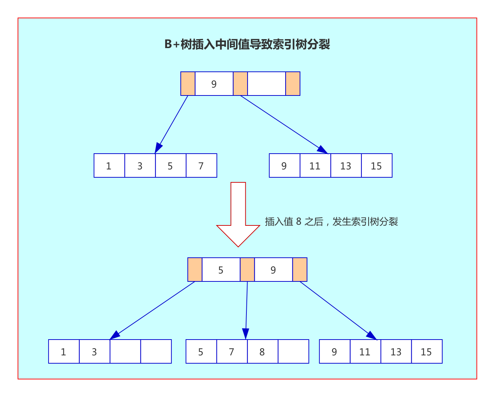
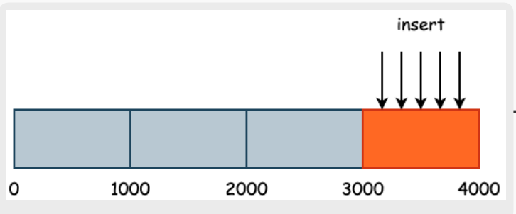

绝大多数表的主键都选择了自增的 int 型字段。为什么这样设计呢？本节就来聊聊这个话题。以及分布式环境下该如何设计主键的问题。

## 主键和聚集索引的关系

很多人会把主键和聚集索引搞混，下面说明他们之间的区别

- 在 InnoDB 中，聚集索引不一定是主键，但是主键一定是聚集索引：原因是如果没有定义主键，聚集索引可能是第一个不允许为 null 的唯一索引，如果也没有这样的唯一索引，InnoDB 会选择内置 6 字节长的 ROWID 作为隐含的聚集索引。
- InnoDB 的数据是按照主键顺序存放的，而聚集索引就是按照每张表的主键构造一颗 B+ 树，它的叶子节点存放的是整行数据。
- 每张 InnoDB 表都有一个聚集索引，但是不一定有主键。

## 自增主键

### 主键是否需要为自增
我们知道了聚集索引是按照每张表的主键构造一颗 B+ 树的，而 B+ 树中，所有记录节点都是按键值的大小顺序存放在同一层叶子节点上。

如果每次插入的数据都是在聚集索引树的后面，聚集索引不需要分裂就可以存入数据。

但是如果插入的数据值在聚集索引树的中间部分，由于要保证插入后叶子节点中的记录依然排序，就可能需要聚集索引树分裂来保证键值的有序性。如下（这里省略了叶子节点之间的指针）：



如上图，Leaf Page（叶子节点数据页）已经满的情况下，如果写入的值是聚集索引树的中间部分，则会进行一次页分裂，以保证叶子节点上的记录有序和 B+ 树的平衡。并且分裂后，有些数据页没被用满，导致页空间浪费。

因此如果业务输入的主键都是随机数字，那么写入数据时很可能会导致数据页频繁分裂，从而影响写入效率。

而如果设置主键是自增，那么每一次都是在聚集索引的最后增加，当一页写满，就会自动开辟一个新页，不会有聚集索引树分裂这一步，效率会比随机主键高很多。这也是很多建表规范要求主键自增的原因。

> 经验分享：
> 
> 除了要求主键自增外，最好主键也要无业务意义，原因是防止主键更新而导致页分裂的情况。

当然也不是所有的情况主键都需要设置为自增，比如可以用程序写入增长的主键值，保证了新写入数据的主键值比之前大，也可以避免聚集索引树频繁分裂。

### 自增ID用完了怎么办
先说现象：表定义的自增值达到上限后的逻辑是：再申请下一个id时，得到的值保持不变。
```
create table t(id int unsigned auto_increment primary key) auto_increment=4294967295;
insert into t values(null);
//成功插入一行 4294967295
show create table t;
/* CREATE TABLE `t` (
  `id` int(10) unsigned NOT NULL AUTO_INCREMENT,
  PRIMARY KEY (`id`)
) ENGINE=InnoDB AUTO_INCREMENT=4294967295;
*/

insert into t values(null);
//Duplicate entry '4294967295' for key 'PRIMARY'
```
可以看到，第一个insert语句插入数据成功后，这个表的AUTO_INCREMENT没有改变（还是4294967295），就导致了第二个insert语句又拿到相同的自增id值，再试图执行插入语句，报主键冲突错误，MySQL 数据库并不会自动将其重置为 1。。

我们可以把字段定义成8个字节的bigint unsigned来提高上限

### 自增主键的回溯问题

MySQL 8.0 版本前，自增不持久化，自增值可能会存在回溯问题。

**问题重现**：假设表中已经插入了三条数据，那么此时的自增值应该是4。接下来我们删除第三条数据，再将数据库重启。此时自增值又变成了3，**即自增值发生回溯**。

解决这个问题，有两个办法
- 升级 MySQL 版本到 8.0 版本，每张表的自增值会持久化；
- 若无法升级数据库版本，则强烈不推荐在核心业务表中使用自增数据类型做主键。

### 基于范围的分区拓展问题
如果我们需要使用自增主键作为分区的key 时，那么此时我们将不能够使用基于范围的分区方式，因为这会产生热点问题



插入、查询都会有热点问题：如上图所示，如果我们的主键是严格自增的，并且使用了基于范围的分区方式，那么数据写入将会按照顺序的方式进行写入，并没有利用到多个分区的优势，并且，在查询数据时，由于最后一个分区总是保存最近插入的数据，那么其查询压力也会大于其它的几个分区

也就是说，当我们选择了基于范围的分区方式时，仅仅一个主键是不够的，我们不能够将主键作为分区key 的高位，此时
我们需要在主键的前面儿再加点儿东西，使其基于范围分区时能够尽量均匀，并且不会破坏数据插入的有序性

### 自增主键的其它问题
- 自增值在服务器端产生，存在并发性能问题
- 自增值做主键，只能在当前实例中保证唯一，不能保证全局唯一；
- 公开数据值，容易引发安全问题，例如知道地址 http://www.example.com/User/10/ 很容猜出 User 有 11、12 依次类推的值，容易引发数据泄露；
- MGR（MySQL Group Replication） 可能引起的性能问题；
- 分布式系统中无法使用

## UUID主键设计
前面讲过主键最好是递增的，由于UUID并非单调递增，所以我们并不会直接使用UUID当表的主键，而是使用二进制UUID，对应MYSQL中的UUID_TO_BIN函数。

相比于UUID，二进制UUID有以下几个优点：
- 通过参数将时间高位放在最前，解决了 UUID 插入时乱序问题；
- 去掉了无用的字符串"-"，精简存储空间；
- 将字符串其转换为二进制值存储，空间最终从之前的 36 个字节缩短为了 16 字节。

关于UUID的性能和存储占用的空间问题，结果如下表所示：

|          | 时间（秒） | 表大小（G) |
| -------- | ---------- | ---------- |
| 自增ID   | 2712       | 240        |
| UUID     | 3396       | 250        |
| 排序UUID | 2624       | 243        |

可以看到，MySQL 8.0 提供的排序 UUID 性能最好，甚至比自增ID还要好。此外，由于UUID_TO_BIN转换为的结果是16 字节，仅比自增 ID 增加 8 个字节，最后存储占用的空间也仅比自增大了 3G。

## 自增ID和UUID的热点问题
基于范围分区时，由于这两种方式最近插入的数据都保存在一个区，所以查询压力大 

可以对主键进行哈希处理

## 业务自定义主键
适用于分布式，分库分表的场景

分布式数据库架构，仅用 UUID 做主键依然是不够的。主键还需要加入一些额外的信息，这样才能保证后续二级索引的查询效率。

比较成熟的算法
- SnowFlake算法

## 总结
如果主键是随机的，那么写入数据时很可能会导致数据页频繁分裂，从而导致写入效率低和页空间浪费。

而如果设置主键是自增，那么每一次都是在聚集索引的最后增加，当一页写满，就会自动开辟一个新页，不会有聚集索引树分裂这一步，效率会比随机主键高很多。

当然也不是所有的表都需要设置为自增，如果通过业务逻辑给到表主键的值是增长的（不一定连续），保证了新写入数据的主键值比之前大，也可以避免聚集索引树频繁分裂。这种方式也是可以选择的。

## 参考
- [姜承尧的MySQL实战宝典](https://kaiwu.lagou.com/course/courseInfo.htm?courseId=869)
- [SmartKeyerror/Psyduck 仓库的博客](https://smartkeyerror.oss-cn-shenzhen.aliyuncs.com/Phyduck/database/%E4%B8%BB%E9%94%AE%E7%9A%84%E9%80%89%E6%8B%A9.pdf)

