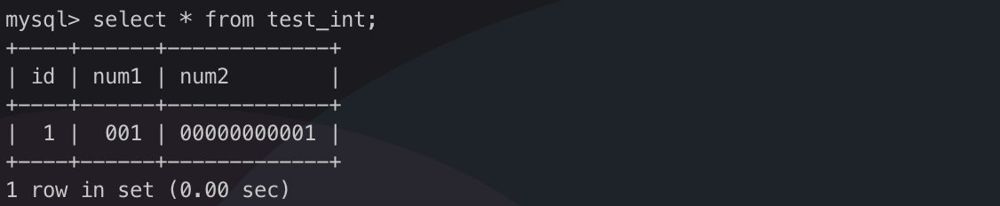

<!-- TOC -->
- [1.说出几种索引失效的情况](#1.说出几种索引失效的情况)
- [2.如何优化数据导入](#2.如何优化数据导入)
- [3.优化分页查询](#3.优化分页查询)
- [4.优化count(*)](#4.优化count(*))
- [5.哪些情况需要添加索引](#5.哪些情况需要添加索引)
- [6.普通索引和唯一索引的区别](#6.普通索引和唯一索引的区别)
- [7.联合索引哪些情况不走索引](#7.联合索引哪些情况不走索引)
- [8.BTree索引和Hash索引的区别](#8.BTree索引和Hash索引的区别)
- [9.如何预防sql注入](#9.如何预防sql注入)
<!-- /TOC -->

## 1.说出几种索引失效的情况
- where条件字段上做运算
- where条件字段上隐式转换
- 用like匹配时，使用左模糊或者全模糊
- 范围查询时，查询获取的数据量过多

## 2.如何优化数据导入
在遇到批量数据导入的场景，而数据量稍微大点，会发现导入非常耗时间。

## 3.优化分页查询
```
select a,b,c from t1 limit 100000,10;
```
当偏移量过大时，执行效率较低。

## 4.优化count(*)
最好的方法：添加一张innoDB表来记录每个表的，

## 5.哪些情况需要添加索引
- 数据检索，select 后面的字段， where后面的字段
- 聚合函数 min max count...
- 避免回表
- 连接查询的字段
- 排序字段

## 6.普通索引和唯一索引的区别

## 7.联合索引哪些情况不走索引
在字段a, b, c字段上建立联合索引，哪些情况不走联合索引

根据最左匹配原则
- 查询(a), (a, b), (a, b, c) 时走索引
- 其它情况不走索引

## 8.BTree索引和Hash索引的区别

## 9.如何预防sql注入

## 10.MyISAM和InnoDB的区别
myisam引擎是5.1版本之前的默认引擎，支持全文检索、压缩、空间函数等，但是不支持事务和行级锁，所以一般用于有大量查询少量插入的场景来使用，而且myisam不支持外键，并且索引和数据是分开存储的。

innodb是基于聚簇索引建立的，和myisam相反它支持事务、外键，并且通过MVCC来支持高并发，索引和数据存储在一起。

## 11.说下mysql的索引有哪些吧，聚簇和非聚簇索引又是什么
索引按照数据结构来说主要包含B+树和Hash索引。

假设我们有张表，结构如下:

```
create table user(
    id int(11) not null,
  age int(11) not null,
  primary key(id),
  key(age)
);
```
B+树是左小右大的顺序存储结构，节点只包含id索引列，而叶子节点包含索引列和数据，这种数据和索引在一起存储的索引方式叫做聚簇索引，一张表只能有一个聚簇索引。假设没有定义主键，InnoDB会选择一个唯一的非空索引代替，如果没有的话则会隐式定义一个主键作为聚簇索引。


这是主键聚簇索引存储的结构，那么非聚簇索引的结构是什么样子呢？非聚簇索引(二级索引)保存的是主键id值，这一点和myisam保存的是数据地址是不同的。


最终，我们一张图看看InnoDB和Myisam聚簇和非聚簇索引的区别


## 12.那你知道什么是覆盖索引和回表吗？
覆盖索引指的是在一次查询中，如果一个索引包含或者说覆盖所有需要查询的字段的值，我们就称之为覆盖索引，而不再需要回表查询。

而要确定一个查询是否是覆盖索引，我们只需要explain sql语句看Extra的结果是否是“Using index”即可。

以上面的user表来举例，我们再增加一个name字段，然后做一些查询试试。

```
explain select * from user where age=1; //查询的name无法从索引数据获取
explain select id,age from user where age=1; //可以直接从索引获取
```
## 13.锁的类型有哪些呢
mysql锁分为共享锁和排他锁，也叫做读锁和写锁。

读锁是共享的，可以通过lock in share mode实现，这时候只能读不能写。

写锁是排他的，它会阻塞其他的写锁和读锁。从颗粒度来区分，可以分为表锁和行锁两种。

表锁会锁定整张表并且阻塞其他用户对该表的所有读写操作，比如alter修改表结构的时候会锁表。

行锁又可以分为乐观锁和悲观锁，悲观锁可以通过for update实现，乐观锁则通过版本号实现。


## 14.你能说下事务的基本特性和隔离级别吗？

[详细文章]()

## 15.ACID靠什么来保证呢
A原子性由undo log日志保证，它记录了需要回滚的日志信息，事务回滚时撤销已经执行成功的sql

C一致性一般由代码层面来保证

I隔离性由MVCC来保证

D持久性由内存+redo log来保证，mysql修改数据同时在内存和redo log记录这次操作，事务提交的时候通过redo log刷盘，宕机的时候可以从redo log恢复

## 16.什么是幻读，什么是MVCC

要说幻读，首先要了解MVCC，MVCC叫做多版本并发控制，实际上就是保存了数据在某个时间节点的快照。

我们每行数实际上隐藏了两列，创建时间版本号，过期(删除)时间版本号，每开始一个新的事务，版本号都会自动递增。

还是拿上面的user表举例子，假设我们插入两条数据，他们实际上应该长这样

## int(3)和int(11)的区别
varchar(m)，m表示字符长度，(注意不是字节长度！varchar(1)可以存储一个中文）。**但是int(m)，m不表示存储数字的长度！**

**int (3) 和 int (11) 占用的硬件存储空间完全相同**
首先，我们在申明某个字段数据类型为 int 的时候，不管是 int(3) 还是 int(11)，在 MySQL 中存储时都占用 4 个字节的长度。

1 个字节（Byte） = 8 个二进制位（bit），所以 1 个 int = 4 Byte = 4 * 8 bit = 32 bit，计算机中使用首个比特位存储数字符号（参考补码的定义），所以可以算出 int(m) 的存储范围在 [-2147483648，2147483647] 之间。

**int (3) 和 int (11) 在 zerofill 关键词修饰时展示不同**
我们可以创建一张测试表，并且插入一条数据
```sql
CREATE TABLE `test_int` (
  `id` int(11) NOT NULL PRIMARY KEY AUTO_INCREMENT,
  `num1` int(3)  zerofill,
  `num2` int(11)  zerofill
) ENGINE=InnoDB DEFAULT CHARSET=utf8;

insert into test_int (num1, num2) values (1,1);
```



如上图所示，存储相同的数字 1，num1 前补全了 2 个 0，num2 前补全了 10 个 0，

所以可以得出结论：int(m) 中的 m 表示在 zerofill 修饰时，数字长度不足 m 时前缀补充的 0 的个数，除此之外，两者使用时没有任何区别。

## 参考资料
- [这是我见过最有用的Mysql面试题，面试了无数公司总结的](https://juejin.im/post/6868270408534720525)