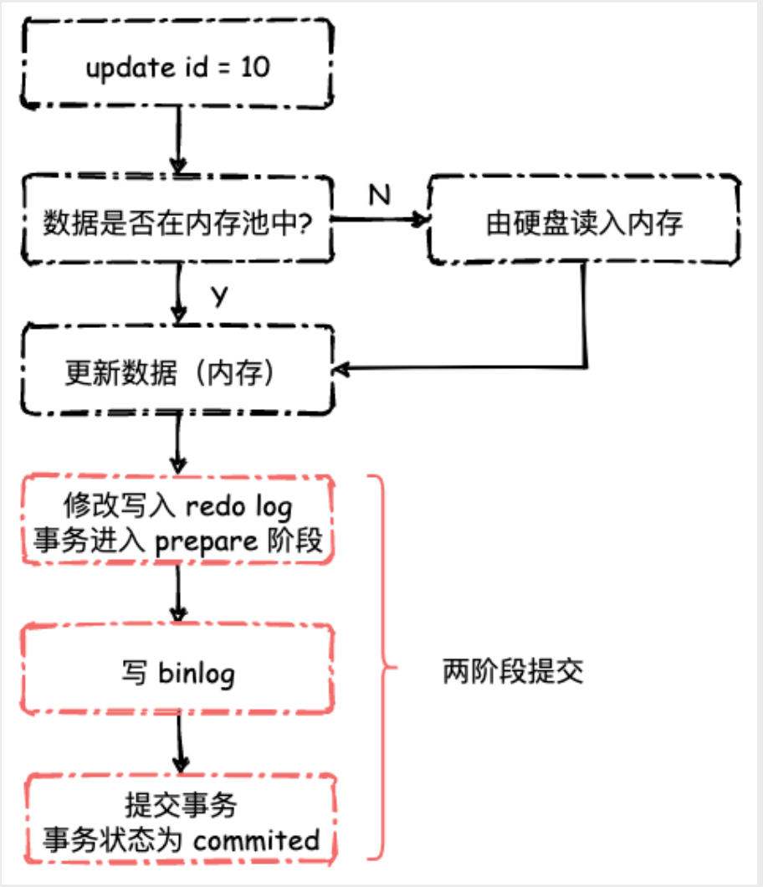
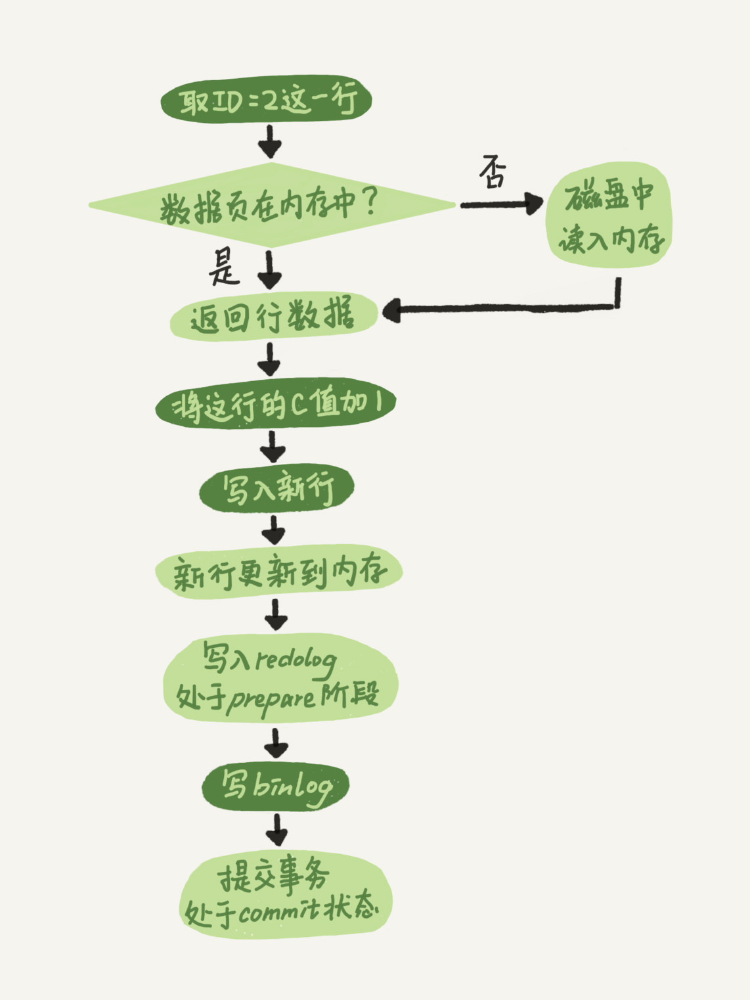

## MySQL 基础架构分析
下面是MySQL的基本架构示意图

大体来说，MySQL可以分为Server层和存储引擎层两部分。

Server层包括连接器、查询缓存、分析器、优化器、执行器等，涵盖MySQL的大多数核心服务功能，以及所有的内置函数（如日期、时间、数学和加密函数等），所有跨存储引擎的功能都在这一层实现，比如存储过程、触发器、视图等。

而存储引擎层负责数据的存储和提取。其架构模式是插件式的，支持InnoDB、MyISAM、Memory等多个存储引擎。

### 连接器
连接器负责跟客户端建立连接、获取权限(之后，这个连接里面的权限判断逻辑，都将依赖于此时读到的权限。)、维持和管理连接。

连接又分长连接和短连接，由于建立连接的过程通常是比较复杂的，所以尽量使用长连接。

### 查询缓存(8.0版本被删除)
查询缓存往往弊大于利。因为查询缓存的失效非常频繁，只要有对一个表的更新，这个表上所有的查询缓存都会被清空。

### 分析器
1. 词法分析：识别出`select`, `update`, `table_name`等信息
2. 语法分析：根据词法分析的结果，语法分析器会根据语法规则，判断你输入的这个SQL语句是否满足MySQL语法。

| 关键字 | 非关键字 | 关键字 | 非关键字 | 关键字 | 非关键字    |
| ------ | -------- | ------ | -------- | ------ | ----------- |
| select | 字段id   | from   | 表名a    | where  | 字段id等于1 |

### 优化器
优化器是在表里面有多个索引的时候，决定使用哪个索引；或者在一个语句有多表关联（join）的时候，决定各个表的连接顺序。比如你执行下面这样的语句，这个语句是执行两个表的join：
```sql
select * from t1 join t2 using(ID)  where t1.c=10 and t2.d=20;
```
- 既可以先从表t1里面取出c=10的记录的ID值，再根据ID值关联到表t2，再判断t2里面d的值是否等于20。
- 也可以先从表t2里面取出d=20的记录的ID值，再根据ID值关联到t1，再判断t1里面c的值是否等于10

这两种执行方法的逻辑结果是一样的，但是执行的效率会有不同，而优化器的作用就是决定选择使用哪一个方案。

**扩展阅读：**
- [MySQL为什么有时候会选错索引？](docs/database/MySQL/MySQL为什么有时候会选错索引.md)


### 执行器
1. 开始执行前，先判断一下你对这个表有没有相应的权限
2. 去使用这个引擎提供的接口获取数据

## 查询语句分析
一条单表查询语句长下面这个样子
```sql
select * from tb_student  A where A.age='18' and A.name=' 张三 ';
```
1. 先检查是否有查询该表的权限，如果没有权限，直接返回错误信息，如果有权限，在 MySQL8.0 版本以前，会先查询缓存，以这条 sql 语句为 key 在内存中查询是否有结果，如果有直接缓存，如果没有，执行下一步。
2. 通过分析器进行词法分析，提取 sql 语句的关键元素，比如提取上面这个语句是查询 select，提取需要查询的表名为 tb_student,需要查询所有的列，查询条件是这个表的 id='1'。然后判断这个 sql 语句是否有语法错误，比如关键词是否正确等等，如果检查没问题就执行下一步。
3. 接下来就是优化器进行确定执行方案，上面的 sql 语句，可以有两种执行方案：
    - a.先查询学生表中姓名为“张三”的学生，然后判断是否年龄是 18。
    - b.先找出学生中年龄 18 岁的学生，然后再查询姓名为“张三”的学生。
4. 进行权限校验，如果没有权限就会返回错误信息，如果有权限就会调用数据库引擎接口，返回引擎的执行结果。

## 更新语句
与查询流程不一样的是，更新流程还涉及两个重要的日志模块：redo log（重做日志）和 binlog（归档日志）。

### redo log
**作用**
- 提高InnoDB 存储引擎写入数据的效率
- 保证crash-safe能力

由于B+Tree 的特性，所有的行数据均保存在其叶子节点中，那么当我们创建、更新一条数据时，就需要从根节点出发，沿着B+Tree 的路径一步一步的到达叶子节点，然后进行插入、更新操作。在最坏情况下，每一层都需要进行一次随机的硬盘I/O。而对于插入新数据而言，还可能会涉及到B+Tree节点的页分裂问题，原因在于InnoDB 的Page大小固定为16KB. 如果每一次的更新操作都需要写进磁盘，然后磁盘也要找到对应的那条记录，然后再更新，整个过程IO成本、查找成本都很高。Mysql的解决办法是先写日志（redo log），再写磁盘。其实就是经常说到的WAL技术，WAL的全称是Write-Ahead Logging。

InnoDB的redo log是固定大小的，比如可以配置为一组4个文件，每个文件的大小是1GB，那么总共可以写4G大小的日志文件。从头开始写，写到末尾就又回到开头循环写（类似用数组实现的循环队列，需要两个指针），由于是顺序IO，速度很快。

innodb_flush_log_at_trx_commit这个参数设置成1的时候（一般情况下都是设置成1），当一个写事务或者更新事务执行时，InnoDB 首先取出对应的Page，然后进行修改。当事务提交时，将位于内存中的redo log buffer 强制刷新至硬盘中，如果不考虑binlog 的话，我们可以认为事务执行可以返回成功了，写入DB的操作由另外的线程异步进行。

有了redo log，即使数据库发生异常重启，之前提交的记录都不会丢失，因为事务提交时，redo log 必须被刷新至硬盘中。

### binlog

redo log是InnoDB引擎特有的日志，而Server层也有自己的日志，称为binlog（归档日志）。

**作用**
1. 记录MySQL Table中的逻辑操作，比如更新了哪条数据，对这条数据做了哪些更新，可用于恢复因误删库导致的数据丢失
2. 用于主从复制，主库和从库之间利用binlog 进行数据复制，主库执行什么语句、进行何种更新，从库跟着执行

因此，当我们执行一个事务时，还需要写入binlog，并且我们需要保证redo log 和 binlog 之间的一致性。

至于如何保证一致性，那就是**两阶段提交**。



有了两阶段提交以后，MySQL 在崩溃重启时可根据redolog 和binlog 之间的差异进行按需恢复/回滚事务。开发运维人员可以根据binlog+ 定时备份将InnoDB 中的数据恢复至任意时刻

为什么需要两阶段提交

没有两阶段提交的情况
- 先写 redo log 直接提交，然后写 binlog，假设写完 redo log 后，机器挂了，binlog 日志没有被写入，那么机器重启后，这台机器会通过 redo log 恢复数据，但是这个时候 bingog 并没有记录该数据，后续进行机器备份的时候，就会丢失这一条数据，同时主从同步也会丢失这一条数据。
- 先写 binlog，然后写 redo log，假设写完了 binlog，机器异常重启了，由于没有 redo log，本机是无法恢复这一条记录的，但是 binlog 又有记录，那么和上面同样的道理，就会产生数据不一致的情况。

有两阶段提交的情况
- 判断 redo log 是否完整，如果判断是完整的，就立即提交。
- 如果 redo log 只是预提交但不是 commit 状态，这个时候就会去判断 binlog 是否完整，如果完整就提交 redo log, 不完整就回滚事务。
这样就解决了数据一致性的问题。

> 为什么会有两份日志
> 
> 因为最开始MySQL里并没有InnoDB引擎。MySQL自带的引擎是MyISAM，但是MyISAM没有crash-safe的能力，binlog日志只能用于归档。而InnoDB是另一个公司以插件形式引入MySQL的，既然只依靠binlog是没有crash-safe能力的，所以InnoDB使用另外一套日志系统——也就是redo log来实现crash-safe能力。

**redo log vs binlog**

1. redo log是InnoDB引擎特有的；binlog是MySQL的Server层实现的，所有引擎都可以使用。

2. redo log是物理日志，记录的是“在某个数据页上做了什么修改”；binlog是逻辑日志，记录的是这个语句的原始逻辑，比如“给ID=2这一行的c字段加1 ”。

3. redo log是循环写的，空间固定会用完；binlog是可以追加写入的。“追加写”是指binlog文件写到一定大小后会切换到下一个，并不会覆盖以前的日志。

### 更新流程
图中浅色框表示是在InnoDB内部执行的，深色框表示是在执行器中执行的.


一条更新语句长下面这样子
```sql
update tb_student A set A.age='19' where A.name=' 张三 ';
```
其实这条语句也基本上会沿着上一个查询的流程走，只不过执行更新的时候肯定要记录日志啦，这就会引入日志模块了，MySQL 自带的日志模块式 binlog（归档日志） ，所有的存储引擎都可以使用，我们常用的 InnoDB 引擎还自带了一个日志模块 redo log（重做日志），我们就以 InnoDB 模式下来探讨这个语句的执行流程。流程如下：
1. 把tb_student上所有的查询缓存都清空
2. 然后拿到查询的语句，把 age 改为 19，然后调用引擎 API 接口，写入这一行数据，InnoDB 引擎把数据保存在内存中，同时记录 redo log，此时 redo log 进入 prepare 状态，然后告诉执行器，执行完成了，随时可以提交。
3. 执行器收到通知后记录 binlog，然后调用引擎接口，提交 redo log 为提交状态。
4. 更新完成。


## 参考
- 《MySQL 实战45讲》

