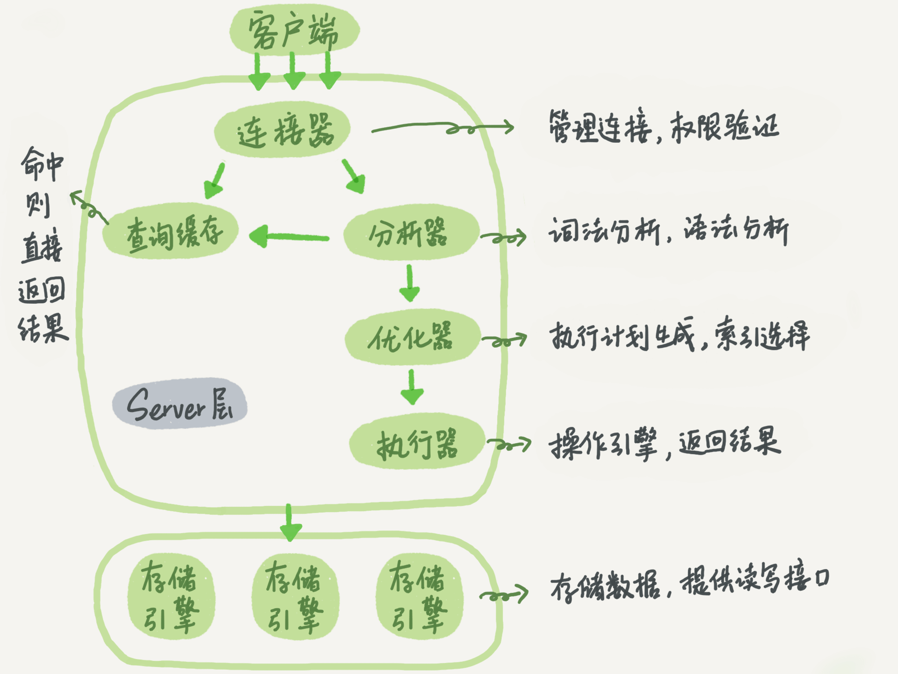

## MySQL 基础架构分析
下面是MySQL的基本架构示意图

大体来说，MySQL可以分为Server层和存储引擎层两部分。

Server层包括连接器、查询缓存、分析器、优化器、执行器等，涵盖MySQL的大多数核心服务功能，以及所有的内置函数（如日期、时间、数学和加密函数等），所有跨存储引擎的功能都在这一层实现，比如存储过程、触发器、视图等。

而存储引擎层负责数据的存储和提取。其架构模式是插件式的，支持InnoDB、MyISAM、Memory等多个存储引擎。

### 连接器
连接器负责跟客户端建立连接、获取权限(之后，这个连接里面的权限判断逻辑，都将依赖于此时读到的权限。)、维持和管理连接。

连接又分长连接和短连接，由于建立连接的过程通常是比较复杂的，所以尽量使用长连接。

### 查询缓存(8.0版本被删除)
查询缓存往往弊大于利。因为查询缓存的失效非常频繁，只要有对一个表的更新，这个表上所有的查询缓存都会被清空。

### 分析器
1. 词法分析：识别出`select`, `update`, `table_name`等信息
2. 语法分析：根据词法分析的结果，语法分析器会根据语法规则，判断你输入的这个SQL语句是否满足MySQL语法。

| 关键字 | 非关键字 | 关键字 | 非关键字 | 关键字 | 非关键字    |
| ------ | -------- | ------ | -------- | ------ | ----------- |
| select | 字段id   | from   | 表名a    | where  | 字段id等于1 |

### 优化器
优化器是在表里面有多个索引的时候，决定使用哪个索引；或者在一个语句有多表关联（join）的时候，决定各个表的连接顺序。比如你执行下面这样的语句，这个语句是执行两个表的join：
```sql
select * from t1 join t2 using(ID)  where t1.c=10 and t2.d=20;
```
- 既可以先从表t1里面取出c=10的记录的ID值，再根据ID值关联到表t2，再判断t2里面d的值是否等于20。
- 也可以先从表t2里面取出d=20的记录的ID值，再根据ID值关联到t1，再判断t1里面c的值是否等于10

这两种执行方法的逻辑结果是一样的，但是执行的效率会有不同，而优化器的作用就是决定选择使用哪一个方案。

**扩展阅读：**
- [MySQL为什么有时候会选错索引？](docs/database/MySQL/MySQL为什么有时候会选错索引.md)
docs/database/MySQL/MySQL为什么有时候会选错索引.md


### 执行器
1. 开始执行前，先判断一下你对这个表有没有相应的权限
2. 去使用这个引擎提供的接口获取数据

### 存储引擎层
比如：InnoDB，MyISAM，Memory...

### 总结

**server层**

Server 层 包括 SQL 解析器、SQL 优化器以及 SQL 执⾏器，⽤于负责 SQL 语句的具体执⾏流程，以及对结果集进⾏过滤、排序以及键值的⽐较等

对于 Server 层⽽⾔，更多的是对内存中的数据进⾏⽐较、筛选以及排序等，因此是⼀个 CPU 密集型的任务

在 Server 层中，SQL 优化器是我们需要重点关注的内容，因为⼀条 SQL 到底该怎么执⾏、选择哪⼀列索引、怎么进⾏⼦查询，都是由 SQL 优化器决定的

**存储引擎层**

Engine 层主负责存储具体的数据，例如 InnoDB、MyISAM 等存储引擎，以及在内存中存储临时结果集的TempTable 等

对于 Engine 层⽽⾔，绝⼤多数时刻都在和硬盘打交道，将索引树上的数据发送给 Server 层，因此是⼀个 I/O密集型的任务


## 查询语句分析
一条单表查询语句长下面这个样子
```sql
select * from tb_student  A where A.age='18' and A.name=' 张三 ';
```
1. 先检查是否有查询该表的权限，如果没有权限，直接返回错误信息，如果有权限，在 MySQL8.0 版本以前，会先查询缓存，以这条 sql 语句为 key 在内存中查询是否有结果，如果有直接缓存，如果没有，执行下一步。
2. 通过分析器进行词法分析，提取 sql 语句的关键元素，比如提取上面这个语句是查询 select，提取需要查询的表名为 tb_student,需要查询所有的列，查询条件是这个表的 id='1'。然后判断这个 sql 语句是否有语法错误，比如关键词是否正确等等，如果检查没问题就执行下一步。
3. 接下来就是优化器进行确定执行方案，上面的 sql 语句，可以有两种执行方案：
    - a.先查询学生表中姓名为“张三”的学生，然后判断是否年龄是 18。
    - b.先找出学生中年龄 18 岁的学生，然后再查询姓名为“张三”的学生。
4. 进行权限校验，如果没有权限就会返回错误信息，如果有权限就会调用数据库引擎接口，返回引擎的执行结果。

## 更新语句

### redo log 和 binlog
与查询流程不一样的是，更新流程还涉及两个重要的日志模块：redo log（重做日志）和 binlog（归档日志）。

关于redo log 和 binlog的详细知识可以看我的这篇文章：[innodb wal](docs/database/MySQL/innodb-wal.md)
### 更新流程
图中浅色框表示是在InnoDB内部执行的，深色框表示是在执行器中执行的.


一条更新语句长下面这样子
```sql
update tb_student A set A.age='19' where A.name=' 张三 ';
```
其实这条语句也基本上会沿着上一个查询的流程走，只不过执行更新的时候肯定要记录日志啦，这就会引入日志模块了，MySQL 自带的日志模块式 binlog（归档日志） ，所有的存储引擎都可以使用，我们常用的 InnoDB 引擎还自带了一个日志模块 redo log（重做日志），我们就以 InnoDB 模式下来探讨这个语句的执行流程。流程如下：
1. 把tb_student上所有的查询缓存都清空
2. 然后拿到查询的语句，把 age 改为 19，然后调用引擎 API 接口，写入这一行数据，InnoDB 引擎把数据保存在内存中，同时记录 redo log，此时 redo log 进入 prepare 状态，然后告诉执行器，执行完成了，随时可以提交。
3. 执行器收到通知后记录 binlog，然后调用引擎接口，提交 redo log 为提交状态。
4. 更新完成。


## 参考
- 《MySQL 实战45讲》

