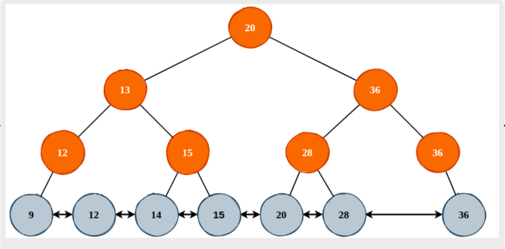

## 需求分析
其实技术选型也就三种：
- 有序数组
- 哈希表
- 树

需求：
- 从成本考虑，我们要将数据存储到硬盘中，而不是内存中
- 需要支持排序和范围查询等操作
- 

所以我们确定使用树这种数据结构来存储数据，但是树又有，二分搜索树，红黑树，B树，B+树等。。我们该如何进一步选择呢？

## 二分搜索树与AVL

我们知道二分搜索树的查询效率是O(n), 也就是说，我们需要logn 次I/O 操作才能把数据从硬盘中找出

二分搜索树实现的DB 存在一个问题: 范围查询会很慢。我们需要不断地从根节点出发，然后往下遍历。所以我们稍微改造下，数据只保存在叶子节点上，并且用双向链表进行连接

这么一来不管是精确查询还是范围查询都能工作了，并且效率不会太差. 这东西看起来其实非常像一个跳跃表

对于二分搜索树实现的DB 而言，其查询效率是与树高有关的。假设我们有2000 万条数据，我们大概需要一棵树高为25 的BST才能装下所有数据和索引。也就是说，我们至少需要25 次硬盘I/O 才能取出一条数据

所以，现在我们的优化方向就是降低树高，使我们的树结构变得更加“矮胖”，其实也就是把二叉搜索树变成“多叉搜索树”

最后，我们得到了一个“多叉搜索树”，其实就是B+树。

B+Tree 的特点就是只有叶子节点会存储数据，并且使用双向链表将所有的叶子节点连接在一起，以优化范围查询

## B-Tree 与B+Tree
B-Tree其实就是一棵多叉平衡搜索树，并且每一个节点都可以保存数据，并不像B+Tree那样，仅在叶子节点保存数据，而在非叶子节点保存索引

B-Tree和B+Tree的最大区别其实在于范围查询时的过程与性能

对于B-Tree 而言，因为节点和节点之间仅通过父、子节点指针连接，那么进行范围查询时，就必须不断的进行“回溯”过程，会带来较多的随机I/O，其范围查询过程可以参考线段树的查询过程

B+Tree就简单很多了，通过叶子几点的prev、next 指针往前或者是往后遍历即可取出所有数据

如图所示，假如我们需要在该棵B-Tree中查询范围在[5,100] 之间的数据的话，我们就需要递归多次，并且需要在左右子树中同时进行。如果数据量很大的话，每一个获取左、右孩子节点都是一个随机I/O

当然，B-Tree在少量数据时的查询性能要优于B+Tree，因为B+Tree必须要走到叶子节点才可取出数据，而B-Tree则在节点中即保存数据，那么不可能每一次查询都遍历到叶子节点。etcd 中的MVCC 就是综合使用IndexTree这棵B-Tree实现的