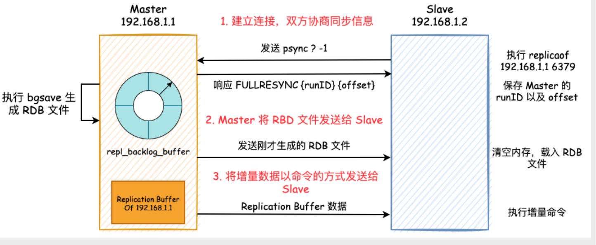
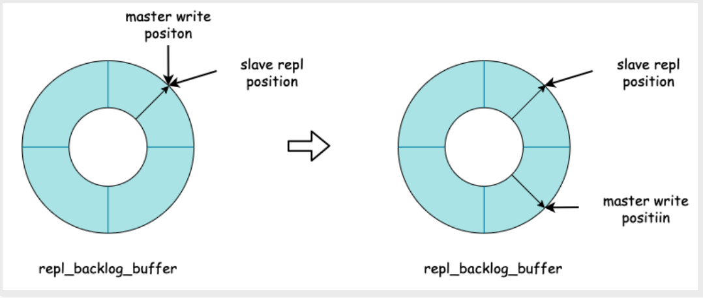
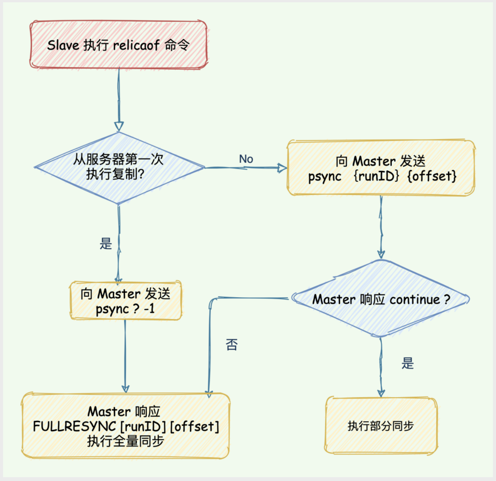

Redis提供了主从库模式，以保证数据副本的一致，主从库之间采用的是读写分离的模式。

## 特点
- Redis 使用异步复制，slave 和 master 之间异步地确认处理的数据量。客户端可以使用 WAIT 命令来请求同步复制某些特定的数据。但是，WAIT 命令只能确保在其他 Redis 实例中有指定数量的已确认的副本：在故障转移期间，由于不同原因的故障转移或是由于 Redis 持久性的实际配置，故障转移期间确认的写入操作可能仍然会丢失
- 一个 master 可以拥有多个 slave
- slave 可以接受其他 slave 的连接。除了多个 slave 可以连接到同一个 master 之外， slave 之间也可以像层叠状的结构（cascading-like structure）连接到其他 slave 。自 Redis 4.0 起，所有的 sub-slave 将会从 master 收到完全一样的复制流。
- Redis 复制在 master 侧是非阻塞的。这意味着 master 在一个或多个 slave 进行初次同步或者是部分重同步时，可以继续处理查询请求。
- 复制在 slave 侧大部分也是非阻塞的。当 slave 进行初次同步时，它可以使用旧数据集处理查询请求，假设你在 redis.conf 中配置了让 Redis 这样做的话。否则，你可以配置如果复制流断开， Redis slave 会返回一个 error 给客户端。但是，在初次同步之后，旧数据集必须被删除，同时加载新的数据集。 slave 在这个短暂的时间窗口内（如果数据集很大，会持续较长时间），会阻塞到来的连接请求。自 Redis 4.0 开始，可以配置 Redis 使删除旧数据集的操作在另一个不同的线程中进行，但是，加载新数据集的操作依然需要在主线程中进行并且会阻塞 slave 。
- 复制既可以被用在可伸缩性，以便只读查询可以有多个 slave 进行（例如 O(N) 复杂度的慢操作可以被下放到 slave ），或者仅用于数据安全。
- 可以使用复制来避免 master 将全部数据集写入磁盘造成的开销：一种典型的技术是配置你的 master Redis.conf 以避免对磁盘进行持久化，然后连接一个 slave ，其配置为不定期保存或是启用 AOF。但是，这个设置必须小心处理，因为重新启动的 master 程序将从一个空数据集开始：如果一个 slave 试图与它同步，那么这个 slave 也会被清空。

## 修改配置文件，开启主动同步
在从库的`redis.conf`里添加如下配置
```
replicaof 127.0.0.1 6379 # 主库ip与端口
masterauth 123456 # 主库密码 有需要的话添加
replica-read-only yes # 从节点只读模式
```

也直接使用`replicaof`命令，Redis5.0以前的版本用`slaveof`命令

还有一些参数用于调节内存中保存的缓冲积压部分（replication backlog），以便执行部分重同步。详见 redis.conf 和 Redis Distribution 了解更多信息。

无磁盘复制可以使用 repl-diskless-sync 配置参数。repl-diskless-sync-delay 参数可以延迟启动数据传输，目的可以在第一个 slave就绪后，等待更多的 slave就绪。可以在 Redis Distribution 例子中的 redis.conf 中看到更多细节信息。

## 总览


## 主从库之间的第一次同步 - 全量同步

**第一阶段：建立连接，为全量复制做准备**。从库给主库发送psync ? -1命令，表示要进行数据同步，主库根据这个命令参数来启动复制。psync命令包含了主库的runID和复制进度(也叫偏移量)offset两个参数。
- runID：runID 是Redis 在启动后所自动生成的一个唯一标识ID，称之为runID。runID 实际上是一个随机生成的、长度为40 的十六进制字符，在Redis 运行期间可能会多次生成runID。在主从建立之初，从节点并不知道主节点的runID，所以只能给一个 「?」
- offset：offset 则是从节点复制的偏移量，表示从节点此时的复制进度。初次建立主从复制时，还没有复制任何东西，也就是没有偏移量，所以使用 「-1」表示

主库在收到psync ? -1命令后，会用FULLRESYNC响应命令带上两个参数：主库runID和主库目前的复制进度offset，返回给从库。FULLRESYNC 表示全量复制，也就是直接把主节点的 RDB 文件丢给从节点。从库收到响应后会记录下这两个参数。

这里的 offset 其实是主节点的 Replication Backlog Buffer 的写入偏移量，该偏移量表示主节点当前写到了哪个地方

**第二阶段：主库将所有的数据同步给从库。从库收到数据后，在本地完成数据加载。**

具体步骤：主库执行bgsave命令，生成RDB文件，然后将文件发送给从库。从库接收到RDB文件后，会先清空当前数据库，然后加载RDB文件。

主库将数据同步给从库的过程中，主库不会被阻塞，仍然可以正常接收请求。但是这段时间的里新写入的数据并没有记录到刚生成的RDB文件中。为了保证主从的数据一致性，主库会在内存中使用专门的`replication buffer`(后续增量复制也是使用`replication buffer`)，记录RDB文件生成后收到的所有写操作，这部分数据将会在第三阶段中同步。

如果ReplicationBuffer 已满，那么Master 会断开与Slave的连接，重新开始全量复制。所以，如果ReplicationBuffer 设置的太小的话将会导致恶性循环

**第三阶段，也是最后一个阶段：主库会把第二步骤中的`replication buffer`发送给从库，从节点加载完成后，第一次同步过程全部完成。**

Replication Buffer 所存放的数据
- Master 在执行 bgsave 期间产生的写入数据
- Master 发送 RDB 文件到 Slave 期间的写入数据
- Slave 将 RDB Load 到内存期间的写入数据

## 增量复制
Master 将Replication Buffer 的数据持续地发送给Slave节点，此时为增量的数据。

当从节点掉线以后，Master 中该 Slave 的 Replication Buffer 将会被释放，那么 Slave 重连以后会进行全量同步吗？从 Redis 2.8 开始，网络断了之后，主从库会
采用增量复制的方式继续同步，Redis 使用 Replication Backlog Buffer 实现增量复制。官方文档是这样说的：每次当 slave 和 master 之间的连接断开时， slave 会自动重连到 master 上，并且无论这期间 master 发生了什么， slave 都将尝试让自身成为 master 的精确副本。

Replication Backlog Buffer 是一个环形数组，其中记录 Master 节点在一段时间以内的全部写入操作。当 buffer 写满了以后，会从头开始覆盖前面的内容，并继
续写入



当 Slave 重新上线以后，向 Master 节点发送 psync {runID} {offset}，此时 offset 就不再是 -1 了，而是 Slave 实际的复制偏移量。如果当前 Slave 的 slave
repl position 还没有被覆盖的话，那么 Master 只需要把 Slave 落后的那一部分数据通过 Replication Buffer 发送给 Slave 即可。如果已经被覆盖，那么此时只
能进行全量同步

这个系统的运行依靠三个主要的机制：

- 当一个 master 实例和一个 slave 实例连接正常时， master 会发送一连串的命令流来保持对 slave 的更新，以便于将自身数据集的改变复制给 slave ， ：包括客户端的写入、key 的过期或被逐出等等。
- 当 master 和 slave 之间的连接断开之后，因为网络问题、或者是主从意识到连接超时， slave 重新连接上 master 并会尝试进行部分重同步：这意味着它会尝试只获取在断开连接期间内丢失的命令流。
- 当无法进行部分重同步时， slave 会请求进行全量重同步。这会涉及到一个更复杂的过程，例如 master 需要创建所有数据的快照，将之发送给 slave ，之后在数据集更改时持续发送命令流到 slave 。

可以通过`info replication`命令，返回的`slave_repl_offset`，`master_repl_offset`字段查看偏移量。




## 一些常见的问题

### Slave重启了，是否会进行全量复制?
Redis 会持久化runID 和offset 这两个关键信息，重启后直接载入，并向Master 节点发送psync{runID}{offset}。若此时Master 中backlogbuffer 中offset 的位置还没有被覆盖的话，那么可以进行增量同步。否则，仍然进行全量同步

### 主从延迟导致的脏数据怎么解决
预警：编写外部程序监听主从节点的复制偏移量，延迟较大时发出报警。

1. 忽略
2. 选择性强制读主库
3. 对于设置了过期时间的，Redis会检查过期时间来判断是否返回数据

### 过期key的处理
Redis 使用三种主要的技术使过期的 key 的复制能够正确工作：
- slave不会让key过期，而是等待master让key过期。当master让key过期时，会发送一个del命令到从库。
- 但是，由于这是 master 驱动的 key 过期行为，master 无法及时提供 DEL 命令，所以有时候 slave 的内存中仍然可能存在在逻辑上已经过期的 key 。为了处理这个问题，slave 使用它的逻辑时钟以报告只有在不违反数据集的一致性的读取操作（从主机的新命令到达）中才存在 key。用这种方法，slave 避免报告逻辑过期的 key 仍然存在。在实际应用中，使用 slave 程序进行缩放的 HTML 碎片缓存，将避免返回已经比期望的时间更早的数据项。
- 在Lua脚本执行期间，不执行任何 key 过期操作。当一个Lua脚本运行时，从概念上讲，master 中的时间是被冻结的，这样脚本运行的时候，一个给定的键要么存在要么不存在。这可以防止 key 在脚本中间过期，保证将相同的脚本发送到 slave ，从而在二者的数据集中产生相同的效果。

一旦一个 slave 被提升为一个 master ，它将开始独立地过期 key，而不需要任何旧 master 的帮助。

## 无磁盘化复制
由于主库执行bgsave是先把数据持久化到磁盘，如果磁盘性能很差，那么会消耗大量时间，在配置文件中找到`repl-diskless-sync`，把值改为yes，开启无磁盘化复制。Redis 2.8.18 是第一个支持无磁盘复制的版本。在此设置中，子进程直接发送 RDB 文件给 slave，无需使用磁盘作为中间储存介质。

但是配置文件中也有说明，无磁盘化复制属于实验功能，生产环境看自己情况要不要开启。

## 参考资料
- [官方文档](http://www.redis.cn/topics/replication.html)
- [SmartKeyerror/Psyduck的博客](https://smartkeyerror.oss-cn-shenzhen.aliyuncs.com/Phyduck/redis/Redis%20%E4%B8%BB%E4%BB%8E%E5%A4%8D%E5%88%B6.pdf)