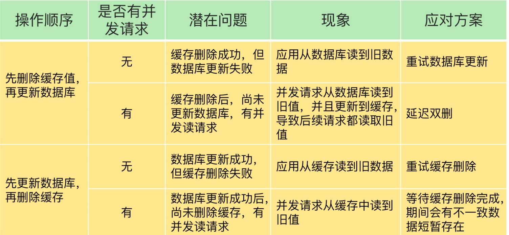
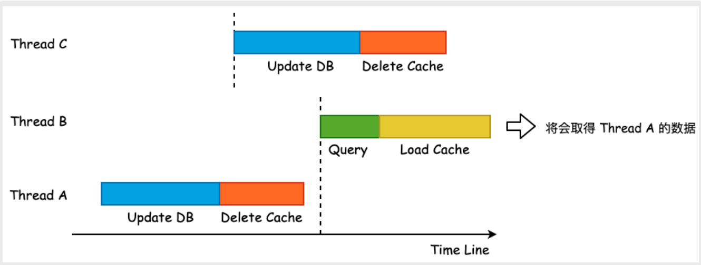
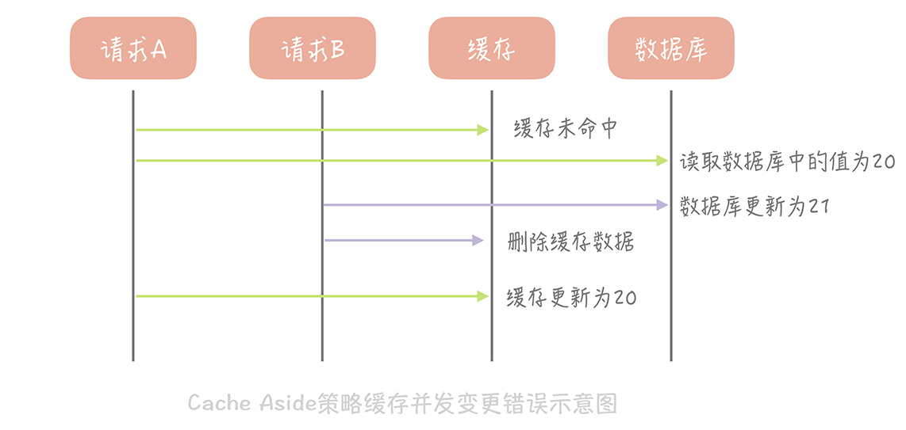
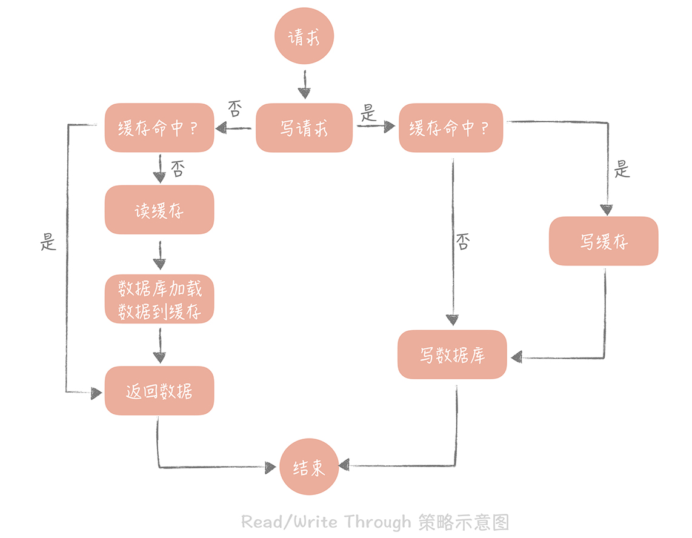
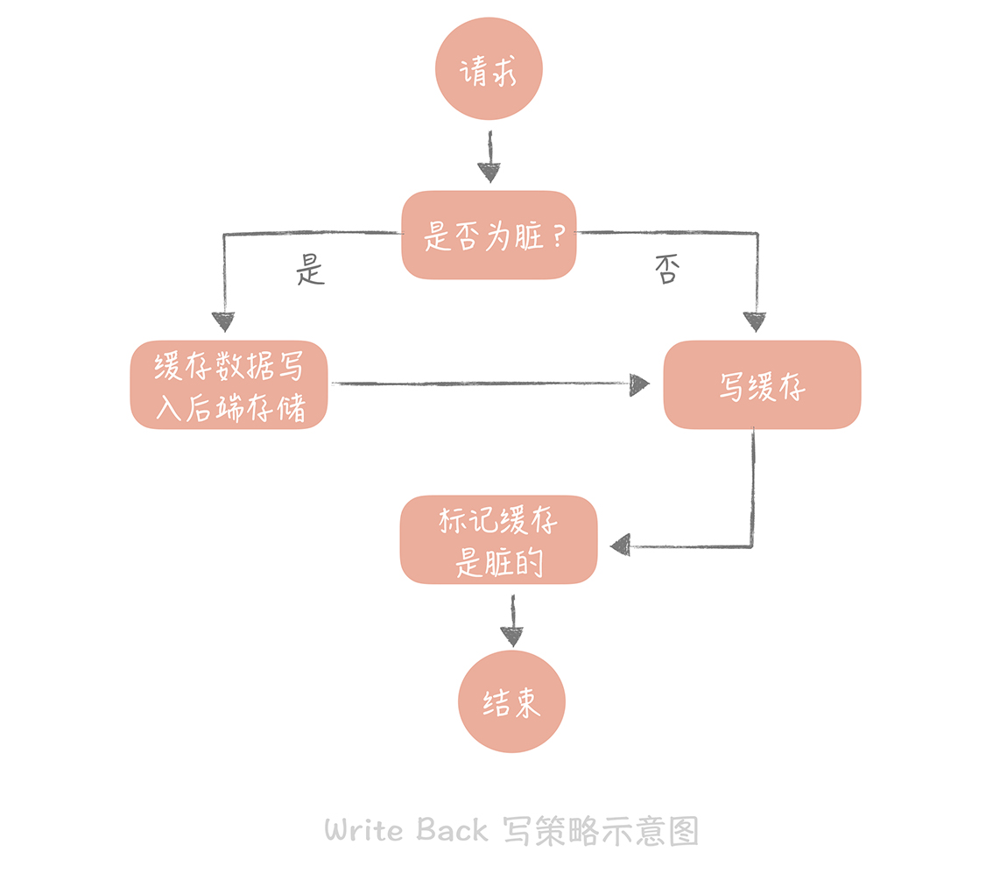
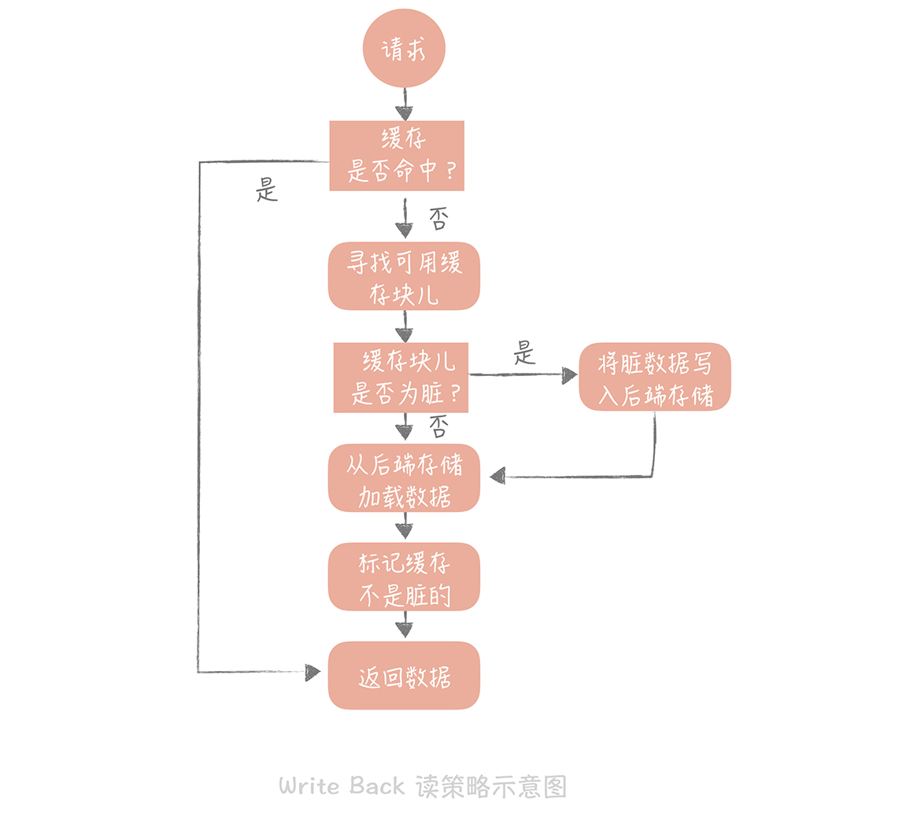
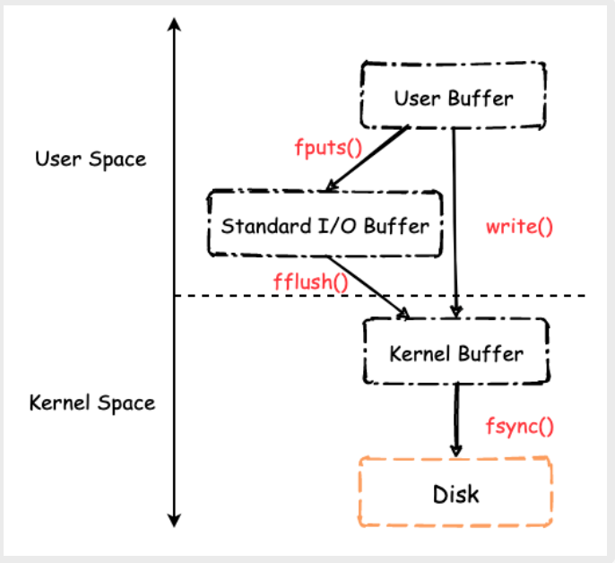
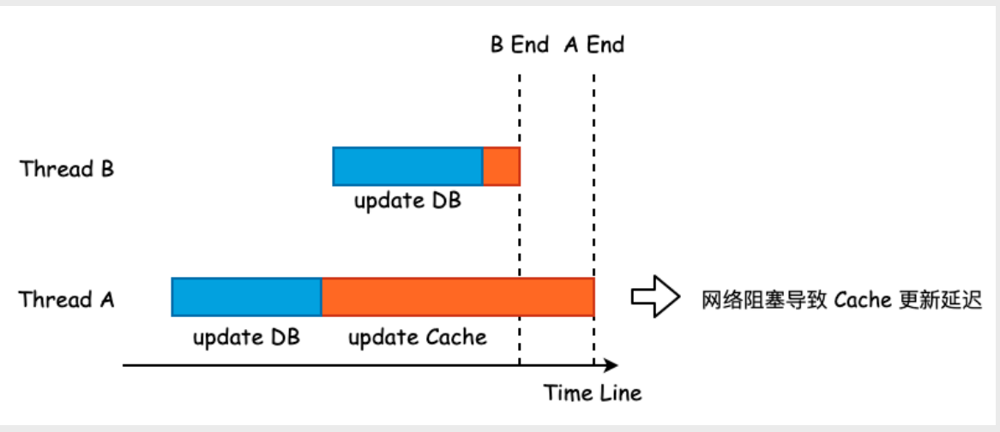
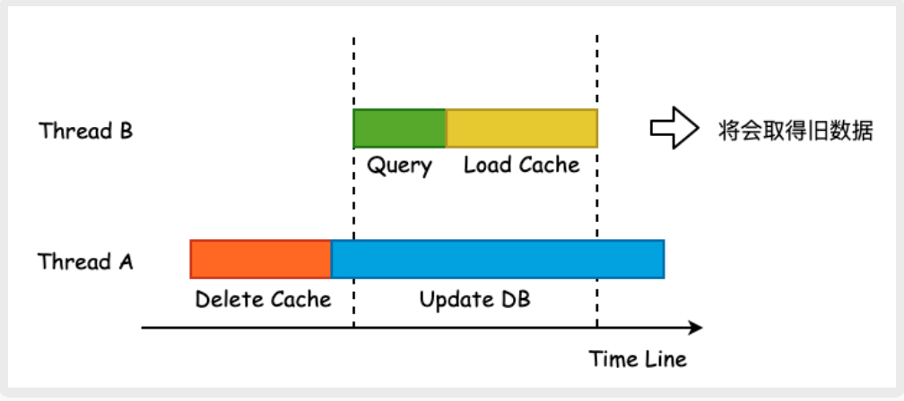
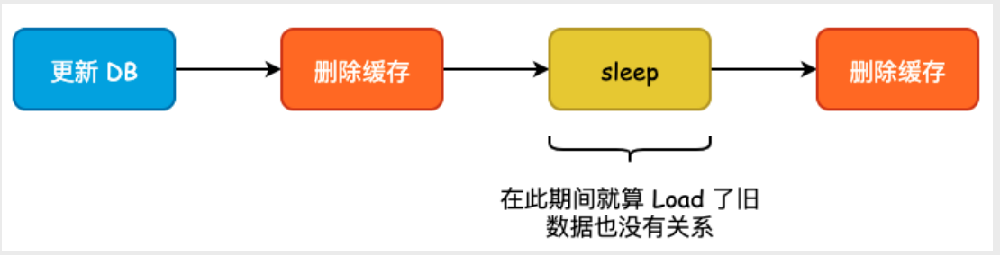

**缓存一致性/缓存读写模式/更新策略**

下面介绍到的三种模式各有优劣，不存在最佳模式，根据具体的业务场景选择适合自己的缓存读写模式。

**简介：**缓存更新是⼀个⾮常有趣的话题，关于如何更新缓存我们有很多种选择⽅式，⽐如先更新缓存，再更新 DB，或者是先更新 DB 再更新缓存，⼜或者是先更新 DB，后删除缓存，等等。每⼀种⽅式都会带来不同的结果，不存在最佳模式，我们需要做的事情就是根据⾃⾝的业务场景和对数据⼀致性的容忍程度，综合性地进⾏考量，选择适合自己的缓存读写模式。

## 缓存更新的常见方式

### 一、先更新DB再删除缓存 / Cache Aside Pattern（旁路缓存模式）

1. 写：更新 DB，然后直接删除 cache 。
2. 读：从 cache 中读取数据，读取到就直接返回，读取不到的话，就从 DB 中取数据返回，然后再把数据放到 cache 中。
Cache Aside Pattern 中服务端需要同时维系 DB 和 cache，并且是以 DB 的结果为准。另外，Cache Aside Pattern 有首次请求数据一定不在 cache 的问题，对于热点数据可以提前放入缓存中。

**Cache Aside Pattern 是我们平时使用比较多的一个缓存读写模式，比较适合读请求比较多的场景。**

建议优先使用先更新数据库再删除缓存的办法，主要原因就有两个。
1. 先删缓存再更新数据库，有可能导致请求因缓存缺失而访问数据，给数据库带来压力。
2. 如果业务应用中读取数据库和写缓存的时间不好估算，那么，延迟双删中的等待时间就不好设置

Cache Aside Pattern 能够解决多数的不⼀致情况，或者说，在绝⼤多数场景下 Cache Aside Pattern 都能够保证良好的数据⼀致性。但是，在某些极端⾼并发的场景下，Cache Aside Pattern 仍然会导致数据不⼀致的情况

如上图所⽰，当 Thread B 读取数据时，由于 Thread A 删除 cache 过程结束，所以会发⽣ cache miss，Thread B 将从 DB 中取出数据，并 Load 进缓存中。若
此时⼜恰好有 Thread C 进⾏数据更新的话，那么就有可能导致 Thread C 在 Thread B 之前完成，Thread C 在 delete cache 时其实是删除了空数据，那么
Thread B Load 进缓存的数据其实是 Thread A 写⼊的旧数据，导致数据再次出现不⼀致

实际上，上述情况出现的条件⾮常苛刻，必须要在某⼀时间区间内同时存在两个或多个写⼊和多个读取。⽽⼀般业务场景下更新 DB + 删除缓存的操作通常能够在
200ms 以内返回，出现上述情况的概率极低

Cache Aside 存在的另一个问题是当写入比较频繁时，缓存中的数据会被频繁地清理，这样会对缓存的命中率有一些影响。如果你的业务对缓存命中率有严格的要求，那么可以考虑两种解决方案：

1. 一种做法是在更新数据时也更新缓存，只是在更新缓存前先加一个分布式锁，因为这样在同一时间只允许一个线程更新缓存，就不会产生并发问题了。当然这么做对于写入的性能会有一些影响；
2. 另一种做法同样也是在更新数据时更新缓存，只是给缓存加一个较短的过期时间，这样即使出现缓存不一致的情况，缓存的数据也会很快地过期，对业务的影响也是可以接受。

### 二、 先更新缓存，再同步更新 DB / Read/Write Through Pattern（读写穿透）

Read/Write Through 套路是：服务端把 cache 视为主要数据存储，从中读取数据并将数据写入其中。cache 服务负责将此数据读取和写入 DB，从而减轻了应用程序的职责。
1. 写（Write Through）：先查 cache，cache 中不存在，直接更新 DB。 cache 中存在，则先更新 cache，然后 cache 服务自己更新 DB（同步更新 cache 和 DB）。
2. 读(Read Through)： 从 cache 中读取数据，读取到就直接返回 。读取不到的话，先从 DB 加载，写入到 cache 后返回响应。

一般来说，我们可以选择两种“Write Miss”方式：一个是“Write Allocate（按写分配）”，做法是写入缓存相应位置，再由缓存组件同步更新到数据库中；另一个是“No-write allocate（不按写分配）”，做法是不写入缓存中，而是直接更新到数据库中。

在 Write Through 策略中，我们一般选择“No-write allocate”方式，原因是无论采用哪种“Write Miss”方式，我们都需要同步将数据更新到数据库中，而“No-write allocate”方式相比“Write Allocate”还减少了一次缓存的写入，能够提升写入的性能。

Read-Through Pattern 实际只是在 Cache-Aside Pattern 之上进行了封装。在 Cache-Aside Pattern 下，发生读请求的时候，如果 cache 中不存在对应的数据，是由客户端自己负责把数据写入 cache，而 Read Through Pattern 则是 cache 服务自己来写入缓存的，这对客户端是透明的。

Read Through/Write Through 策略的特点是由缓存节点而非用户来和数据库打交道，在我们开发过程中相比 Cache Aside 策略要少见一些，原因是我们经常使用的分布式缓存组件，无论是 Memcached 还是 Redis 都不提供写入数据库，或者自动加载数据库中的数据的功能。而我们在使用本地缓存的时候可以考虑使用这种策略，比如本地缓存 Guava Cache 中的 Loading Cache 就有 Read Through 策略的影子。

和 Cache Aside Pattern 一样， Read-Through Pattern 也有首次请求数据一定不再 cache 的问题，对于热点数据可以提前放入缓存中。

### 三、先更新缓存，再异步更新 DB / Write Behind Pattern（异步缓存写入）
Write Behind Pattern 和 Read/Write Through Pattern 很相似，两者都是由 cache 服务来负责 cache 和 DB 的读写。

但是，两个又有很大的不同：Read/Write Through 是同步更新 cache 和 DB，而 Write Behind Caching 则是只更新缓存，不直接更新 DB，而是改为异步批量的方式来更新 DB。这个策略的核心思想是在写入数据时只写入缓存，并且把缓存块儿标记为“脏”的。而脏块儿只有被再次使用时才会将其中的数据写入到后端存储中。

需要注意的是，在“Write Miss”的情况下，我们采用的是“Write Allocate”的方式，也就是在写入后端存储的同时要写入缓存，这样我们在之后的写请求中都只需要更新缓存即可，而无需更新后端存储了：

如果使用 Write Back 策略的话，读的策略也有一些变化了。我们在读取缓存时如果发现缓存命中则直接返回缓存数据。如果缓存不命中则寻找一个可用的缓存块儿，如果这个缓存块儿是“脏”的，就把缓存块儿中之前的数据写入到后端存储中，并且从后端存储加载数据到缓存块儿，如果不是脏的，则由缓存组件将后端存储中的数据加载到缓存中，最后我们将缓存设置为不是脏的，返回数据就好了。

> Linux Page Cache 就是这么⼲的，在写⼊数据时，先将数据写⼊ Page Cache 中，然后再使⽤异步任务集中地将 Cache 数据写⼊硬盘中。它避免了直接写磁盘造成的随机写问题
> 
> 
> Linux 这样的写⼊⽅式能够有效地减轻硬盘的写⼊压⼒，并提⾼写⼊效率
> 
> 此时，缓存更多的是充当缓冲区的⾓⾊，‘cache’ 这⼀语义被弱化

Write Behind Pattern 下 DB 的写性能非常高，尤其适合一些数据经常变化的业务场景比如说一篇文章的点赞数量、阅读数量。 往常一篇文章被点赞 500 次的话，需要重复修改 500 次 DB，但是在 Write Behind Pattern 下可能只需要修改一次 DB 就可以了。

但是，这种模式同样也给 DB 和 Cache 一致性带来了新的考验，很多时候如果数据还没异步更新到 DB 的话，Cache 服务宕机就 gg 了。

最后再讨论下问什么不同步更新 DB。⼀⽅⾯是因为更新的数据可能需要进⾏额外的检查，⽐如唯⼀性检查。另⼀⽅⾯就是当 DB 更新失败以后，我们需要删除已更
新的缓存，避免出现脏数据，相当于做了⼀次 “⽆⽤功”

当然，你依然可以在一些场景下使用这个策略，在使用时，我想给你的落地建议是：你在向低速设备写入数据的时候，可以在内存里先暂存一段时间的数据，甚至做一些统计汇总，然后定时地刷新到低速设备上。比如说，你在统计你的接口响应时间的时候，需要将每次请求的响应时间打印到日志中，然后监控系统收集日志后再做统计。但是如果每次请求都打印日志无疑会增加磁盘 I/O，那么不如把一段时间的响应时间暂存起来，经过简单的统计平均耗时，每个耗时区间的请求数量等等，然后定时地，批量地打印到日志中。

### 四、先更新 DB，再更新缓存

如上图所⽰，这种更新⽅式存在着严重的数据不⼀致问题。Thread A 明明先执⾏，但是却在 Thread B 执⾏完毕后才将缓存写⼊，即旧有的数据覆盖了最新修改的
数据，导致缓存和 DB 两者之间出现不⼀致的情况

### 五、先删除缓存，再更新 DB

先删除缓存，再更新 DB，在 DB 未更新成功之前，读取数据将会 miss cache，故⽽从 DB 中取数据，此时取出的数据为旧值。DB 更新完毕后，那么此时缓存中的
数据就是错误数据，并且会⼀直错到缓存过期或者是下⼀次的数据更新

## 延时双删
对于 Cache Aside Pattern 来说，在并发量较⾼的情况下可能会出现数据不⼀致的问题，如果我们能够保证缓存⼀定会被删除的话，就能够尽可能地缩短数据不⼀致 的窗⼝。最常⽤的⽅式就是延时双删，当删除完缓存以后，休眠⼀段时间，再进⾏删除。定时任务可由 MQ 或者是定时任务系统来完成

此时我们能够将数据不⼀致的窗⼝缩短到⼀个⾮常短的时间，最⻓也就是 sleep 的时间

但是，延时双删虽然能够将数据不⼀致的窗⼝缩短，但是由于多删除了⼀次缓存，也就意味着在极端情况下 DB 的查询压⼒是原来的两倍，会有⼤量的查询直接 落⼊ DB 中，此时系统性能可能还不如双更新策略

## 订阅 binlog
采⽤订阅 binlog 的⽅式是⼀种看起来更美好的⽅式，⽆需在业务端对 Redis 进⾏任何的更新/删除动作，所有的更新都交由 binlog 订阅线程处理。

之所以说看起来很美好的原因在于解析 binlog 以及如何更新缓存会⽐较复杂，并且对业务架构的前期设计要求很⾼，并且订阅 binlog 通常会引⼊额外的 MQ 中间 件，编码更为复杂

## 参考
- https://smartkeyerror.oss-cn-shenzhen.aliyuncs.com/Phyduck/redis/%E7%BC%93%E5%AD%98%E6%9B%B4%E6%96%B0%E7%9A%84%E7%AD%96%E7%95%A5.pdf
