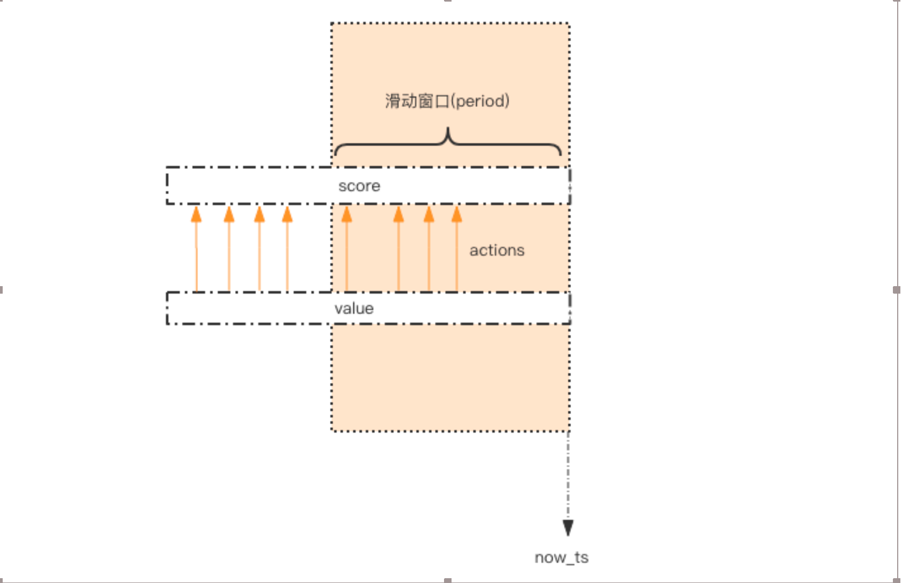
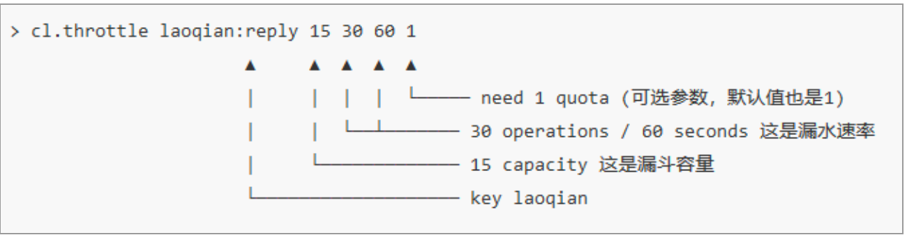

## 简单限流

系统要限定用户的某个行为在指定的时间里只能允许发生 N 次。
这里我们用指定用户 user_id 的某个行为 action_key 在特定的时间内 period 只允许发生一定的次数为例子实现一个简单限流策略。

```javascript
const max_count = 5;
function is_action_allowed(user_id, action_key, period, max_count) {
  return True
}

// 调用这个接口 , 一分钟内只允许最多回复 5 个帖子
const can_reply = is_action_allowed("dayueba", "reply", 60, 5)
if (can_reply) {
  do_reply()
}
else {
  throw new Error()
}
```

我们主要目标就是实现`is_action_allowed`这个方法

这个限流需求中存在一个滑动时间窗口，想想 zset 数据结构的 score 值，是不是可以
通过 score 来圈出这个时间窗口来。而且我们只需要保留这个时间窗口，窗口之外的数据都
可以砍掉。那这个 zset 的 value 填什么比较合适呢？它只需要保证唯一性即可，用 uuid 会
比较浪费空间，那就改用毫秒时间戳吧。



如图所示，用一个 zset 结构记录用户的行为历史，每一个行为都会作为 zset 中的一个
key 保存下来。同一个用户同一种行为用一个 zset 记录。
为节省内存，我们只需要保留时间窗口内的行为记录，同时如果用户是冷用户，滑动时
间窗口内的行为是空记录，那么这个 zset 就可以从内存中移除，不再占用空间。
通过统计滑动窗口内的行为数量与阈值 max_count 进行比较就可以得出当前的行为是否
允许。用代码表示如下：

```javascript
async function is_action_allowed(user_id, action_key, period, max_count) {
  const key = 'hist:%s:%s' % (user_id, action_key)
  const now_ts = new Date()/ 1000 * 1000 // 毫秒时间戳
  const results = await redis
    .pipeline()
    .zadd(key, now_ts, now_ts)
    .zremrangebyscore(key, 0, now_ts - period * 1000) // 移除时间窗口之前的行为记录，剩下的都是时间窗口内的
    .zcard(key) // 获取窗口内的行为数量
    .expire(key, period + 1) // 设置 zset 过期时间，避免冷用户持续占用内存，过期时间应该等于时间窗口的长度，再多宽限 1s
    .exec(); // 批量执行
  return results[2][1] <= max_count
}
```
它的整体思路就是：每一个行为到来时，都维护一次时间窗口。将时间窗口外的记录全部清理掉，只保留窗口内的记录。zset 集合中只有 score 值非常重要，value 值没有特别的意义，只需要保证它是唯一的就可以了。

因为这几个连续的 Redis 操作都是针对同一个 key 的，使用 pipeline 可以显著提升
Redis 存取效率。但这种方案也有缺点，因为它要记录时间窗口内所有的行为记录，如果这
个量很大，比如限定 60s 内操作不得超过 100w 次这样的参数，它是不适合做这样的限流
的，因为会消耗大量的存储空间。

## 漏斗限流
漏斗限流是最常用的限流方法之一，顾名思义，这个算法的灵感源于漏斗（funnel）的结构。


漏洞的容量是有限的，如果将漏嘴堵住，然后一直往里面灌水，它就会变满，直至再也
装不进去。如果将漏嘴放开，水就会往下流，流走一部分之后，就又可以继续往里面灌水。
如果漏嘴流水的速率大于灌水的速率，那么漏斗永远都装不满。如果漏嘴流水速率小于灌水
的速率，那么一旦漏斗满了，灌水就需要暂停并等待漏斗腾空。

所以，漏斗的剩余空间就代表着当前行为可以持续进行的数量，漏嘴的流水速率代表着
系统允许该行为的最大频率。下面我们使用代码来描述单机漏斗算法。

```javascript
class Funnel {
  constructor(capacity, leaking_rate) {
    this.capacity = capacity; // 漏斗容量
    this.leaking_rate = leaking_rate; // 漏嘴流水速率
    this.left_quota = capacity; // 漏斗剩余空间
    this.leaking_ts = new Date() / 1000; // 上一次漏水时间
  }

  make_space() {
    const now_ts = new Date() / 1000;
    const delta_ts = now_ts - this.leaking_ts // 距离上一次漏水过去了多久
    const delta_quota = delta_ts * this.leaking_rate // 又可以腾出不少空间了
    if (delta_quota < 1) return; // 腾的空间太少，那就等下次吧
    this.left_quota += delta_quota // 增加剩余空间
    this.leaking_ts = now_ts // 记录漏水时间
    if (this.left_quota > this.capacity) { // 剩余空间不得高于容量
      this.left_quota = this.capacity
    }
  }

  watering(quota) {
    this.make_space()
    if (this.left_quota >= quota) {
      this.left_quota -= quota
      return true;
    } // 判断剩余空间是否足够
    return false;
  }
}

const funnels = {}; // 所有的漏斗

// capacity 漏斗容量
// leaking_rate 漏嘴流水速率 quota/s
function is_action_allowed(user_id, action_key, capacity, leaking_rate) {
  key = '%s:%s' % (user_id, action_key)
  funnel = funnels[key]
  if (!funnel) {
    funnel = new Funnel(capacity, leaking_rate)
    funnels[key] = funnel
  }
  return funnel.watering(1)
}

for (let i = 0; i < 20; i++) {
  console.log(is_action_allowed('dayueba', 'reply', 15, 0.5))
}
```

Funnel 对象的 make_space 方法是漏斗算法的核心，其在每次灌水前都会被调用以触发
漏水，给漏斗腾出空间来。能腾出多少空间取决于过去了多久以及流水的速率。Funnel 对象
占据的空间大小不再和行为的频率成正比，它的空间占用是一个常量。

问题来了，分布式的漏斗算法该如何实现？能不能使用 Redis 的基础数据结构来搞定？

我们观察 Funnel 对象的几个字段，我们发现可以将 Funnel 对象的内容按字段存储到一
个 hash 结构中，灌水的时候将 hash 结构的字段取出来进行逻辑运算后，再将新值回填到
hash 结构中就完成了一次行为频度的检测。

但是有个问题，我们无法保证整个过程的原子性。从 hash 结构中取值，然后在内存里
运算，再回填到 hash 结构，这三个过程无法原子化，意味着需要进行适当的加锁控制。而
一旦加锁，就意味着会有加锁失败，加锁失败就需要选择重试或者放弃。

如果重试的话，就会导致性能下降。如果放弃的话，就会影响用户体验。同时，代码的
复杂度也跟着升高很多。这真是个艰难的选择，我们该如何解决这个问题呢？Redis-Cell 救
星来了！

### Redis-Cell
Redis 4.0 提供了一个限流 Redis 模块，它叫 redis-cell。该模块也使用了漏斗算法，并
提供了原子的限流指令。有了这个模块，限流问题就非常简单了。

该模块只有 1 条指令 cl.throttle，它的参数和返回值都略显复杂，接下来让我们来看看这
个指令具体该如何使用。



上面这个指令的意思是允许「用户老钱回复行为」的频率为每 60s 最多 30 次(漏水速
率)，漏斗的初始容量为 15，也就是说一开始可以连续回复 15 个帖子，然后才开始受漏水
速率的影响。我们看到这个指令中漏水速率变成了 2 个参数，替代了之前的单个浮点数。用
两个参数相除的结果来表达漏水速率相对单个浮点数要更加直观一些。

```bash
cl.throttle dayueba:reply 15 30 60
1) (integer) 0 # 0 表示允许，1 表示拒绝
2) (integer) 15 # 漏斗容量 capacity
3) (integer) 14 # 漏斗剩余空间 left_quota
4) (integer) -1 # 如果拒绝了，需要多长时间后再试(漏斗有空间了，单位秒)
5) (integer) 2 # 多长时间后，漏斗完全空出来(left_quota==capacity，单位秒)
```

在执行限流指令时，如果被拒绝了，就需要丢弃或重试。cl.throttle 指令考虑的非常周
到，连重试时间都帮你算好了，直接取返回结果数组的第四个值进行 sleep 即可，如果不想
阻塞线程，也可以异步定时任务来重试。