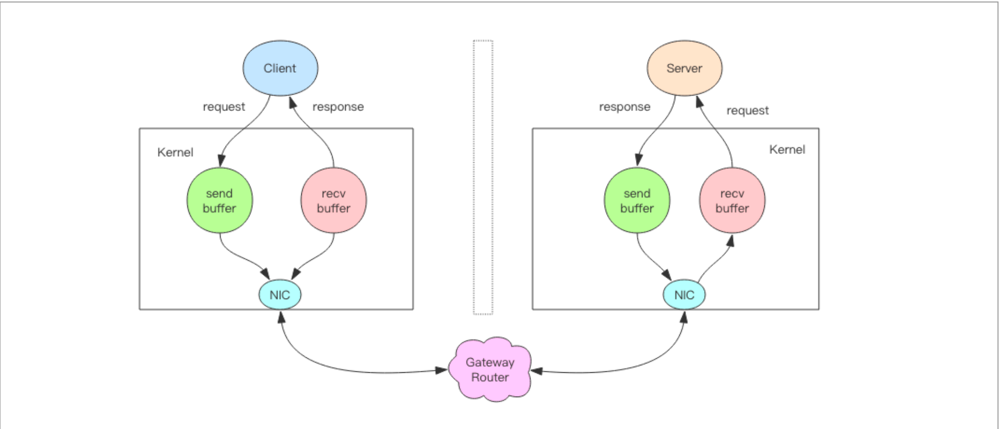

## 慢查询


## scan
在平时线上 Redis 维护工作中，有时候需要从 Redis 实例成千上万的 key 中找出特定
前缀的 key 列表来手动处理数据，可能是修改它的值，也可能是删除 key。这里就有一个问
题，如何从海量的 key 中找出满足特定前缀的 key 列表来？

Redis 提供了一个简单暴力的指令 keys 用来列出所有满足特定正则字符串规则的 key。

```bash
set user:1 a
set user:1 b
set user:1 c
set user:1 d
set user:1 e

keys *
keys user:*
```
这个指令使用非常简单，提供一个简单的正则字符串即可，但是有很明显的两个缺点.
1. 没有 offset、limit 参数，一次性吐出所有满足条件的 key
2. keys 算法是遍历算法，复杂度是 O(n)，如果实例中有千万级以上的 key，这个指令
就会导致 Redis 服务卡顿，所有读写 Redis 的其它的指令都会被延后甚至会超时报错，因为
Redis 是单线程程序，顺序执行所有指令，其它指令必须等到当前的 keys 指令执行完了才
可以继续。

解决办法：我们使用scan来代替keys。
1. 复杂度虽然也是 O(n)，但是它是通过游标分步进行的，不会阻塞线程; 
2. 提供 limit 参数，可以控制每次返回结果的最大条数，limit 只是一个 hint，返回的结果可多可少; 
3. 同 keys 一样，它也提供模式匹配功能; 
4. 服务器不需要为游标保存状态，游标的唯一状态就是 scan 返回给客户端的游标整数; 
5. 返回的结果可能会有重复，需要客户端去重复，这点非常重要; 
6. 遍历的过程中如果有数据修改，改动后的数据能不能遍历到是不确定的; 
7. 单次返回的结果是空的并不意味着遍历结束，而要看返回的游标值是否为零;

scan 参数提供了三个参数，第一个是 cursor 整数值，第二个是 key 的正则模式，第三
个是遍历的 limit hint。第一次遍历时，cursor 值为 0，然后将返回结果中第一个整数值作为
下一次遍历的 cursor。一直遍历到返回的 cursor 值为 0 时结束

```
scan 0 match user:* count 1000
```

**扩展**：scan 遍历顺序，遍历的时候字典扩容了怎么办。

## 管道
Redis 管道(Pipeline) 本身并不是 Redis 服务器直接提供的技术，这个技术本质上是由客户端提供的，跟服务器没有什么直接的关系。

**思想：**一次发送多条消息给服务端。它并不是服务器的什么特性，而是客户端通过改变了读写的顺序带来的性能的巨大提升。

**使用：**
```javascript
```

**深入理解管道本质：**
接下来我们深入分析一个请求交互的流程，真实的情况是它很复杂，因为要经过网络协
议栈，这个就得深入内核了。


上图就是一个完整的请求交互流程图。下面是文字描述：
1. 客户端进程调用 write 将消息写到操作系统内核为套接字分配的发送缓冲 send buffer。
2. 客户端操作系统内核将发送缓冲的内容发送到网卡，网卡硬件将数据通过「网际路由」送到服务器的网卡。 
3. 服务器操作系统内核将网卡的数据放到内核为套接字分配的接收缓冲 recv buffer。
4. 服务器进程调用 read 从接收缓冲中取出消息进行处理。 
5. 服务器进程调用 write 将响应消息写到内核为套接字分配的发送缓冲 send buffer。 
6. 服务器操作系统内核将发送缓冲的内容发送到网卡，网卡硬件将数据通过「网际路由」送到客户端的网卡。 
7. 客户端操作系统内核将网卡的数据放到内核为套接字分配的接收缓冲 recv buffer。 
8. 客户端进程调用 read 从接收缓冲中取出消息返回给上层业务逻辑进行处理。 
9. 结束。

其中步骤 5~8 和 1~4 是一样的，只不过方向是反过来的，一个是请求，一个是响应。

## 事务
Redis 的事务使用非常简单，重要性也没那么大，所以直接放这简单提一下。

mysql里事务的主要操作是，begin/commit/rollback，Redis 在形式上看起来也差不多，分别是 multi/exec/discard。multi 指示事务的开始，
exec 指示事务的执行，discard 指示事务的丢弃。

**ACID**
Redis 的事务不支持原子性，而仅仅是满足了事务的「隔离性」，隔离性中的串行化——当前执行的事务有着不被其它事务打断的权利

**优化**
Redis 事务在发送每个指令到事务缓存队列时都要经过一次网络读写，当一个事
务内部的指令较多时，需要的网络 IO 时间也会线性增长。所以通常 Redis 的客户端在执行
事务时都会结合 pipeline 一起使用，这样可以将多次 IO 操作压缩为单次 IO 操作。

比如：
```javascript
const results = await redis
  .pipeline()
  .multi()
  .incr(key)
  .incr(key)
  .get(key)
  .exec()
  .exec();
```

**Watch**
`incr`命令只能增加或者减少，如果我们需要乘以一个倍数，我们需要先取出余额然后在内存里乘以倍数，再将结果写回 Redis。

这样在并发情况下会出问题。

我们可以通过 Redis 的分布式锁来避免冲突，这是一个很好的解决方案。分布式锁是一种悲观锁，那是不是可以使用乐
观锁的方式来解决冲突呢？

Redis 提供了这种 watch 的机制，它就是一种乐观锁。有了 watch 我们又多了一种可以用来解决并发修改的方法。Watch的使用方法如下：
```javascript
async function double_count() {
  while (true) {
    await redis.watch(key);
    // redis.set(key, 100); // 模拟出错的情况
    let value = Number.parseInt(await redis.get(key));
    value *= 2 // 加倍
    const results = await redis
      .pipeline()
      .multi()
      .set(key, value)
      .exec()
      .exec();
    const res = results.pop().pop();
    if (res && res[0] === 'OK') {
      console.log('double success');
      break;
    } else {
      console.log('double error: ', await redis.get(key));
      continue;
    }
  }

  return await redis.get(key);
}
```

**扩展：** 为什么不支持回滚。