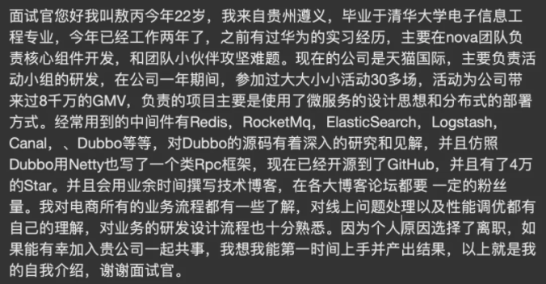

<!-- TOPIC -->

- [面试前](#面试前)
  - [可以提前准备的问题](#可以提前准备的问题)
  - [适当的还是了解一下要面试的公司以及岗位](#适当的还是了解一下要面试的公司以及岗位)
  - [找好渠道推荐](#找好渠道推荐)
- [重点](#重点)
  - [自我介绍](#自我介绍)
  - [简历编写](#简历编写)
  - [项目的复杂度](#项目的复杂度)
  - [基础知识扎实](#基础知识扎实)
- [面试技巧](#面试技巧)
- [其它注意事项](其它注意事项)
- [你还有什么问题想问我的](#你还有什么问题想问我的)
- [回答技巧](#回答技巧)
- [总结](#总结)

<!-- /TOPIC -->

> 下面只是一些面试技巧，重点还是在于平时的积累，

## 面试前

### 可以提前准备的问题

- 自我介绍准备好没

- 项目的难点(除了crud还有什么)，之前刚毕业换工作，我介绍完我的项目后，面试官直接说：所以你的项目大部分都是一些crud喽。我那时候尴尬死了

### 适当的还是了解一下要面试的公司以及岗位

- 对目标公司有一个清晰的认知

知道这家公司大概是做什么业务线的，自己是否感兴趣 以及 企业文化

- 对目标岗位是否足够了解

我之前由于大学不怎么努力以及学历也不怎么好的情况，面试都是去面一些小公司，所以很少在意这些，大部分情况下，都是完全不了解对方公司的情况下就去面试了。不过后面能力提升了，面试都能表现的不错的时候，面试官会主动和你介绍公司。虽然这样说，但是还是面试前尽量要了解一下对方公司，我相信有多位候选者的情况下，你的优先级会高一些的。

### 找好渠道推荐

 内推 > 自己网投

## 重点

### 自我介绍

大家可能都经历过自己介绍都说不流利的阶段，如果没有好好准备，就会有一种自我介绍不知道在说什么的感觉，可以说很多，但是好像又没东西说。

好在自我介绍是可以准备的，写好后很长一段时间内面试都可以用。

大家可以把自我介绍写下来，然后说出来并且自己用手机录音听一下，联系到自己满意为止。

**模板1**

来源：敖丙

**模板2**

面试官，您好！我叫独秀儿。我目前有1年半的工作经验，熟练使用Spring、MyBatis等框架、了解 Java 底层原理比如JVM调优并且有着丰富的分布式开发经验。离开上一家公司是因为我想在技术上得到更多的锻炼。在上一个公司我参与了一个分布式电子交易系统的开发，负责搭建了整个项目的基础架构并且通过分库分表解决了原始数据库以及一些相关表过于庞大的问题，目前这个网站最高支持 10 万人同时访问。工作之余，我利用自己的业余时间写了一个简单的 RPC 框架，这个框架用到了Netty进行网络通信， 目前我已经将这个项目开源，在 Github 上收获了 2k的 Star! 说到业余爱好的话，我比较喜欢通过博客整理分享自己所学知识，现在已经是多个博客平台的认证作者。 生活中我是一个比较积极乐观的人，一般会通过运动打球的方式来放松。我一直都非常想加入贵公司，我觉得贵公司的文化和技术氛围我都非常喜欢，期待能与你共事！

### 简历编写

具体看我的另一篇文章：[简历编写](../.../docs/essential-content-for-interview/简历编写.md)

### 项目的复杂度

至少准备一个复杂度、难度较高的项目，如果公司的项目较为简单，最好空闲时间自己做一个难度较高的。

不然被面试官怼说你做的项目有点粗糙，多尴尬。

一些常见的问题也要提前想好怎么回答，比如：

1. 对项目整体设计的一个感受（面试官可能会让你画系统的架构图）
2. 在这个项目中你负责了什么、做了什么、担任了什么角色
3. 从这个项目中你学会了那些东西，使用到了那些技术，学会了那些新技术的使用
4. 另外项目描述中，最好可以体现自己的综合素质，比如你是如何协调项目组成员协同开发的或者在遇到某一个棘手的问题的时候你是如何解决的又或者说你在这个项目用了什么技术实现了什么功能比如：用redis做缓存提高访问速度和并发量、使用消息队列削峰和降流等等。

###  基础知识扎实

## 面试技巧

首先，你要明确的一点是：**你不会的东西就不要写在简历上**。另外，**你要考虑你该如何才能让你的亮点在简历中凸显出来**，比如：你在某某项目做了什么事情解决了什么问题（只要有项目就一定有要解决的问题）、你的某一个项目里使用了什么技术后整体性能和并发量提升了很多等等。

面试和工作是两回事，聪明的人会把面试官往自己擅长的领域领，其他人则被面试官牵着鼻子走。虽说面试和工作是两回事，但是你要想要获得自己满意的 offer ，你自身的实力必须要强。

## 其它注意事项

### 你还有什么想问我的

> 推荐阅读：[如果面试官问你“你有什么问题问我吗？”时，你该如何回答](https://snailclimb.gitee.io/javaguide/#/docs/essential-content-for-interview/PreparingForInterview/面试官-你有什么问题要问我)

就技术面试而言，回答这个问题的时候，只要你不是触碰到你所面试的公司的雷区，那么我觉得这对你能不能拿到最终offer来说影响确实是不大的。我说这些并不代表你就可以直接对面试官说：“我没问题了。” 面试本身就是一个双向选择的过程，你对这个问题的回答也会侧面反映出你对这次面试的上心程度，你的问题是否有价值，也影响了你最终的选择与公司是否选择你。

加分例子：

- 面试官您好，我想知道您听完我的回答有什么比较好的建议么？（你谦虚好学）

- 进去之后的晋升机制是怎样的？会经常有技术交流的活动么？（积极上进）

减分例子：

- 贵公司的主要业务是什么？（面试之前自己不知道提前网上查一下吗？）
- 贵公司的男女比例如何？（考虑脱单？记住你是来工作的！）
- 贵公司一年搞几次外出旅游？（你是来工作的，这些娱乐活动先别放在心上！）

### 回答技巧

在面试的时候，每个点都多回答一点，把你知道的基本上都抛出来。因为面试的时间一般都是40分钟-1小时出头这样，在有限的时间，你撑得越久，机会越大，如果20分钟面试官就说：今天就这样吧，回去等消息，一般都是凉了。

### 自信一些
大家都说面试就像相亲。其实从本质来看，技术面试就是一次交流和讨论。我们作为候选人一定不可以降低身份，表现出求着对方收留的那种感觉。找工作是双向选择，对方在选择我们的同事，我们也在选择是否愿意和面试官一起工作。

面试通过与否取决于面试官。在面试的过程中，你一直在动态地维护一个你在面试官心中好感度的得分。你在面试的过程中，不断地展现出你的优秀，那么这个好感分就会越来越高；反之，则会越来越低。最终，面试结束之后，面试官会根据心中的好感分来决定候选人的去留。

## 总结

- 准备好自我介绍
- 准备好项目介绍，体现出项目的难度，这样更好的展示自己的水平
- 简历上写的都要会，问你的时候至少有东西可以扯
- 基础部分不能忘
- 书面offer才算offer
