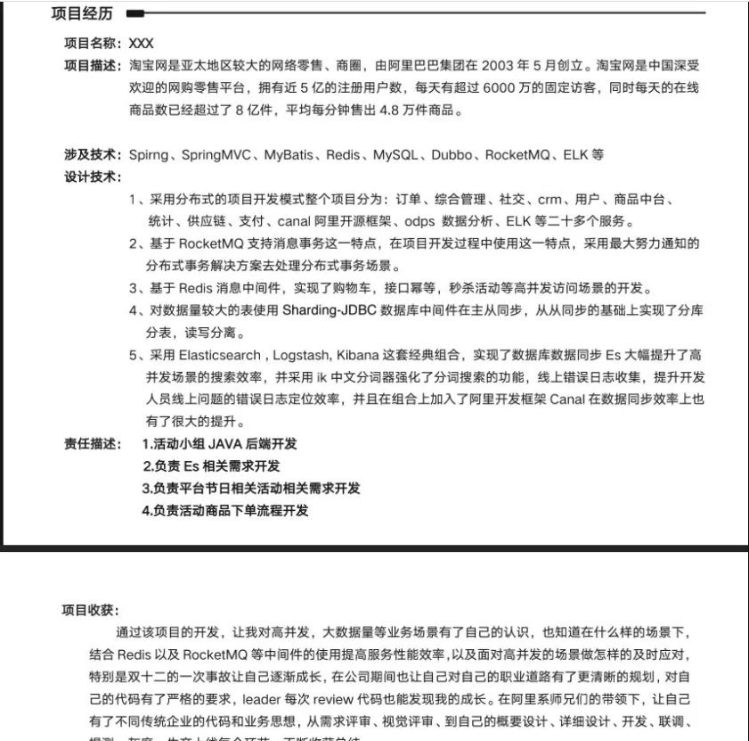

<!-- TOC -->

- [简历的格式](#简历的格式)
- [简历编写注意点](#简历编写注意点)
- [必须了解的两大法则](#必须了解的两大法则)
  - [STAR法则（Situation Task Action Result）](#star法则situation-task-action-result)
  - [FAB 法则（Feature Advantage Benefit）](#fab-法则feature-advantage-benefit)
- [项目经历改怎么写](#项目经历该怎么写)
- [专业技能改怎么写](#专业技能该怎么写)
- [自我评价怎么写](#自我评价怎么写)
- [兴趣爱好怎么写](#兴趣爱好怎么写)
- [获奖情况](#获奖情况)
- [排版注意事项](#排版注意事项)
- [其它的一些小tips](#其它的一些小tips)
- [简历编写推荐的工具和网站](#简历编写推荐的工具/网站)

<!-- /TOC -->

## 简历的格式

推荐使用Markdown语法写简历，然后再将Markdown格式转换为PDF格式后进行简历投递。

如果你对Markdown语法不太了解的话，可以花半个小时简单看一下Markdown语法说明: [http://www.markdown.cn](http://www.markdown.cn/) 。

**不要使用word格式的简历，可能会因为word版本不同而导致格式错误，建议使用文章最后推荐的两个工具和网站编写简历**

## 简历编写注意点

面试官除了一些必备的基础知识，比如数据结构与算法，MySQL等，一般只会问你写在简历上的东西，比如你写了Redis，那就会问一些Redis常见的相关问题，比如：redis是单线程为什么还这么快、 redis 和 memcached 的区别、redis 内存淘汰机制等等。

所以，**你不会的东西就不要写在简历上**。（我有一次把正在学习的Kafka写到了简历上，然后被面试官狂问，结果当然没答好，这样给面试官的印象也太差了）另外，**你要考虑你该如何才能让你的亮点在简历中凸显出来**，比如：你在某某项目做了什么事情解决了什么问题（只要有项目就一定有要解决的问题）、你的某一个项目里使用了什么技术后整体性能和并发量提升了很多等等。

**关于简历能不能适当包装**（适当包装不是指造假）

我的理解是可以，其实面试官也知道大部分人都会这样，都是为了一个面试机会，他们也能理解的。还有一点是，大家都包装了，你不包装，你就亏了。只要不是太过分，比如写了自己完全没了解过的或者熟悉、了解写成了精通。

## 必须了解的两大法则

### STAR法则（Situation Task Action Result）

- **Situation：** 事情是在什么情况下发生；
- **Task:：** 你是如何明确你的任务的；
- **Action：** 针对这样的情况分析，你采用了什么行动方式；
- **Result：** 结果怎样，在这样的情况下你学习到了什么。

简而言之，STAR法则，就是一种讲述自己故事的方式，或者说，是一个清晰、条理的作文模板。不管是什么，合理熟练运用此法则，可以轻松的对面试官描述事物的逻辑方式，表现出自己分析阐述问题的清晰性、条理性和逻辑性。

### FAB 法则（Feature Advantage Benefit）

- **Feature：** 是什么；
- **Advantage：** 比别人好在哪些地方；
- **Benefit：** 如果雇佣你，招聘方会得到什么好处。

简单来说，这个法则主要是让你的面试官知道你的优势、招了你之后对公司有什么帮助。

## 项目经历该怎么写

简历上推荐只写两个项目，但是真正能把项目经历很好的展示给面试官的非常少。对于项目经历大家可以考虑从如下几点来写：

1. 对项目整体设计的一个感受
2. 在这个项目中你负责了什么、做了什么、担任了什么角色
3. 从这个项目中你学会了那些东西，使用到了那些技术，学会了那些新技术的使用
4. 另外项目描述中，最好可以体现自己的综合素质，比如你是如何协调项目组成员协同开发的或者在遇到某一个棘手的问题的时候你是如何解决的又或者说你在这个项目用了什么技术实现了什么功能比如:用redis做缓存提高访问速度和并发量、使用消息队列削峰和降流等等。

常见项目问题：

- 你负责了项目的哪块内容？
- 项目的难点痛点是什么？你们怎么解决的？
- 你使用XX技术栈的时候有没有什么坑，你们怎么解决的？
- 项目中遇到过什么印象比较深的Bug？
- 遇到XX情况么？怎么解决的，怎么优化的？能多说几种方案么？
- 你是根据哪些指标进行针对性优化的？

**模板**

来源：敖丙

## 专业技能该怎么写

先问一下你自己会什么，然后看看你意向的公司需要什么。一般HR可能并不太懂技术，所以他在筛选简历的时候可能就盯着你专业技能的关键词来看。对于公司有要求而你不会的技能，你可以花几天时间学习一下，然后在简历上可以写上自己了解这个技能。

**模板：**

- 计算机网络、数据结构、算法、操作系统等课内基础知识：掌握
- Java 基础知识：掌握
- JVM 虚拟机（Java内存区域、虚拟机垃圾算法、虚拟垃圾收集器、JVM内存管理）：掌握
- 高并发、高可用、高性能系统开发：掌握
- Struts2、Spring、Hibernate、Ajax、Mybatis、JQuery ：掌握
- SSH 整合、SSM 整合、 SOA 架构：掌握
- Dubbo： 掌握
- Zookeeper: 掌握
- 常见消息队列: 掌握
- Linux：掌握
- MySQL常见优化手段：掌握
- Spring Boot +Spring Cloud +Docker:了解
- Hadoop 生态相关技术中的 HDFS、Storm、MapReduce、Hive、Hbase ：了解
- Python 基础、一些常见第三方库比如OpenCV、wxpy、wordcloud、matplotlib：熟悉

## 自我评价怎么写

真实质朴，积极向上，正能量，别吹牛漏风就好。

再写上自己的一些其它优点，比如说持续学习能力，总结能力（github、博客、简书 地址），奖项&专利，参与开源项目、专利等，都是你的亮点

## 兴趣爱好怎么写

不推荐写喜欢打游戏的之类的

可以写写，喜欢看一些书，写写博客，运动之类的，还可以写点性格，喜欢钻研，喜欢阅读源码啥的

## 获奖情况

这一块社招的选填吧，除非你真的有比较香的奖，像我身边就有什么ACM金牌的人，这种就是很加分了，也可能是SSP的加分理由。

校招的同学因为没啥好的项目经历，那面试官可能就会看你的个人奖项是否有含金量了，也可以充实简历，不然简历干巴巴的看上去就那么一点东西，实在尴尬。

英语等级证书是比较加分而且比较硬的，别的证书大家都懂的就没必要怼了，除非是真的拿到的不错的奖，买的写上去面试官也懂的，所以。

不要写以下内容：

- 宿舍小能手
- 杰出的升旗手
- 优秀团支书
- 。。。

**原因：**我们这是技术岗

## 排版注意事项

1. 尽量简洁，不要太花里胡哨；
2. 一些技术名词不要弄错了大小写比如MySQL不要写成mysql，Java不要写成java。这个在我看来还是比较忌讳的，所以一定要注意这个细节；附：[技术名词纠错工具](https://cyc2018.github.io/Text-Typesetting/)
3. 中文和数字英文之间加上空格的话看起来会舒服一点；
4. 不要一会儿使用中文标点，一会儿只用英文标点；
5. 简历文件命名，推荐格式：姓名-求职岗位-联系方式

## 其它的一些小tips

1. 诚信永远是第一位
1. 尽量避免主观表述，少一点语义模糊的形容词，尽量要简洁明了，逻辑结构清晰。
2. 扬长避短：不要写自己的短板和缺点
2. 如果自己有博客或者个人技术栈点的话，写上去会为你加分很多。
3. 如果自己的Github比较活跃的话，写上去也会为你加分很多。（记得加跳转）
4. 注意简历真实性，一定不要写自己不会的东西，或者带有欺骗性的内容
5. 项目经历建议以时间倒序排序，另外项目经历不在于多，而在于有亮点。
6. 如果内容过多的话，不需要非把内容压缩到一页，保持排版干净整洁就可以了，但是不要超过两页。
7. 简历最后最好能加上：“感谢您花时间阅读我的简历，期待能有机会和您共事。”这句话，显的你会很有礼貌。

> 如果长得帅的话 可以在简历上加上自己的照片 毕竟第一关是hr那关

## 简历编写推荐的工具/网站

- 冷熊简历(MarkDown在线简历工具，可在线预览、编辑和生成PDF):http://cv.ftqq.com/
- Guide的Markdown模板：https://github.com/Snailclimb/typora-markdown-resume

