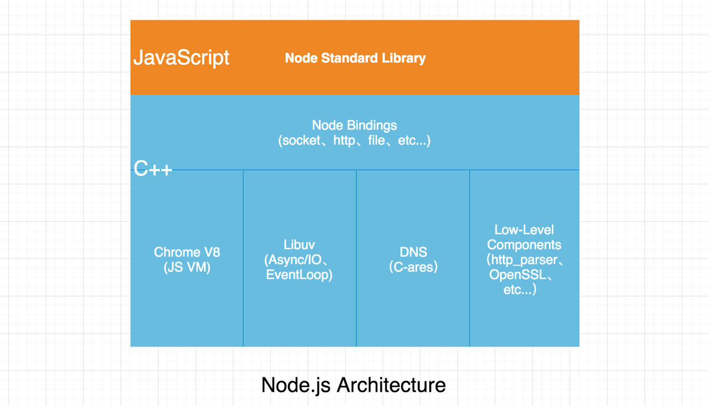

## Nodejs简介
Node.js® is a JavaScript runtime built on Chrome's V8 JavaScript engine. 翻译成中文意为 Node.js 是一个基于 Chrome V8 引擎的 JavaScript 运行环境。

可以看到Nodejs既不是不是一门新的编程语言，也不是一个框架，它是 JavaScript 在服务端的运行环境，

## Nodejs架构
Node.js 由 Libuv、Chrome V8、一些核心 API 构成，如下图所示：

以上展示了 Node.js 的构成，下面做下简单说明：

- Node Standard Library：Node.js 标准库，对外提供的 JavaScript 接口，例如模块 http、buffer、fs、stream 等
- Node bindings：这里就是 JavaScript 与 C++ 连接的桥梁，对下层模块进行封装，向上层提供基础的 API 接口。
- V8：Google 开源的高性能 JavaScript 引擎，使用 C++ 开发，并且应用于谷歌浏览器。
- Libuv：是一个跨平台的支持事件驱动的 I/O 库。它是使用 C 和 C++ 语言为 Node.js 所开发的，同时也是 I/O 操作的核心部分，例如读取文件和 OS 交互。来自[一份 Libuv 的中文教程](https://github.com/luohaha/Chinese-uvbook)
- C-ares：C-ares 是一个异步 DNS 解析库
- Low-Level Components：提供了 http 解析、OpenSSL、数据压缩（zlib）等功能。

## 特点
- **单线程**：Node.js 使用单线程来运行，而不是向 Apache HTTP 之类的其它服务器，每个请求将生产一个线程，这种方法避免了 CPU 上下文切换和内存中的大量执行堆栈

- **非阻塞 I/O**：Node.js 避免了由于需要等待输入或者输出（数据库、文件系统、Web服务器...）响应而造成的 CPU 时间损失，这得益于 Libuv 强大的异步 I/O。

- **事件驱动编程**：事件与回调在 JavaScript 中已是屡见不鲜，同时这种编程对于习惯同步思路的同学来说可能一时很难理解，但是这种编程模式，确是一种高性能的服务模型。Node.js 与 Nginx 均是基于事件驱动的方式实现，不同之处在于 Nginx 采用纯 C 进行编写，仅适用于 Web 服务器，在业务处理方面 Node.js 则是一个可扩展、高性能的平台。