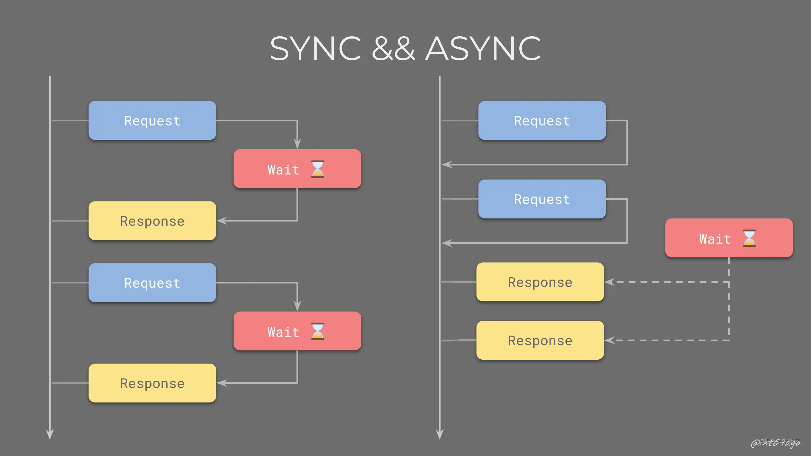

先来一个经典的面试题
```js
console.log(1);

setTimeout(() => console.log(2), 0);

new Promise(resolve => {
  console.log(3);
  resolve();
}).then(() => console.log(4));

console.log(5);
```

对事件循环机制有一些了解的人便可以做对这道题目。

## 宏任务与微任务
- **微任务**：在 Node.js 中微任务包含 2 种——process.nextTick 和 Promise。微任务在事件循环中优先级是最高的，因此在同一个事件循环中有其他任务存在时，优先执行微任务队列。并且process.nextTick 和 Promise 也存在优先级，process.nextTick 高于 Promise。
- **宏任务**：在 Node.js 中宏任务包含 4 种——setTimeout、setInterval、setImmediate 和 I/O。宏任务在微任务执行之后执行，因此在同一个事件循环周期内，如果既存在微任务队列又存在宏任务队列，那么优先将微任务队列清空，再执行宏任务队列。这也解释了我们前面提到的第 3 个问题，事件循环中的事件类型是存在优先级。

## 同步与异步
我们说同步和异步时，大多时候说的是 I/O 操作，而 I/O 操作一般是慢的，因为 I/O 操作会跟外部设备打交道，比如文件读写操作硬盘、网络请求操作网卡等。

所谓同步就是进程进行 I/O 操作时从用户态看是被阻塞了的，要么是一直挂起等待内核（I/O 底层由内核驱动）准备数据，要么一直主动检查数据是否准备好。这里为了便于理解，可以认为一直在检查。



从社会分工经验看，这类无聊重复的轮询工作不应该分散在各个日常工作中（主线程），应该由其它工种（独立线程）批量做。注意，即使轮询工作交出去了，这部分工作也并没有凭空消失，哪有什么岁月静好，不过是有人替你负重前行罢了。

当然，这些操作系统早就提供好整套解决方案了，因为不同操作系统会不一样，为了跨平台，就出现了一些独立的库屏蔽这些差异，比如 NodeJS 重要组成部分的 libuv。

> 实际实践中并不是这么简单的，有时会结合 线程池，而且除了同步和异步，还有 其它维度。

## 浏览器的Event-Loop

在浏览器的事件循环中，首先大家要认清楚 3 个角色：函数调用栈、宏任务（macro-task)队列和微任务(micro-task)队列。

- 函数调用栈：需要被执行的逻辑，首先需要被推入函数调用栈，后续才能被执行。函数调用栈是个干活的地方，它会真刀真枪地给你执行任务。
- 宏任务与微任务队列：存放各自的回调函数

一个完整的 Event Loop 过程，可以概括为以下阶段：
1. 执行并出队一个 macro-task。注意如果是初始状态：调用栈空。micro 队列空，macro 队列里有且只有一个 script 脚本（整体代码）。这时首先执行并出队的就是 script 脚本；
2. 全局上下文（script 标签）被推入调用栈，同步代码执行。在执行的过程中，通过对一些接口的调用，可以产生新的 macro-task 与 micro-task，它们会分别被推入各自的任务队列里。这个过程本质上是队列的 macro-task 的执行和出队的过程；
3. 上一步我们出队的是一个 macro-task，这一步我们处理的是 micro-task。但需要注意的是：当 macro-task 出队时，任务是一个一个执行的；而 micro-task 出队时，任务是一队一队执行的（如下图所示）。因此，我们处理 micro 队列这一步，会逐个执行队列中的任务并把它出队，直到队列被清空；
4. 不断循环

## Node里的事件循环机制
 Node 的 Event-Loop 由 libuv 来实现

 

 我们先来看看这六个阶段各是处理什么任务的：

1. timers阶段：执行 setTimeout 和 setInterval 中定义的回调；
2. pending callbacks：直译过来是“被挂起的回调”，如果网络I/O或者文件I/O的过程中出现了错误，就会在这个阶段处理错误的回调（比较少见，可以略过）；
3. idle, prepare：仅系统内部使用。这个阶段我们开发者不需要操心。（可以略过）；
4. poll （轮询阶段）：重点阶段，这个阶段会执行I/O回调，同时还会检查定时器是否到期；
5. check（检查阶段）：处理 setImmediate 中定义的回调；
6. close callbacks：处理一些“关闭”的回调，比如socket.on('close', ...)就会在这个阶段被触发。

事件循环流程

在这六个阶段中，大家需要重点关注的就是 timers、poll 和 check 这 三个阶段，相关的命题也基本上是围绕它们来做文章。不过在进行考点点拨之前，我们还是要把整个循环的流程给走一遍

1. 执行全局的 Script 代码（与浏览器无差）；
2. 把微任务队列清空：注意，Node 清空微任务队列的手法比较特别。在浏览器中，我们只有一个微任务队列需要接受处理；但在 Node 中，有两类微任务队列：next-tick 队列和其它队列。其中这个 next-tick 队列，专门用来收敛 process.nextTick 派发的异步任务。在清空队列时，优先清空 next-tick 队列中的任务，随后才会清空其它微任务；
3. 开始执行 macro-task（宏任务）。注意，Node 执行宏任务的方式与浏览器不同：在浏览器中，我们每次出队并执行一个宏任务；而在 Node 中，我们每次会尝试清空当前阶段对应宏任务队列里的所有任务（除非达到了系统限制）；
4. 步骤3开始，会进入 3 -> 2 -> 3 -> 2…的循环（整体过程如下所示）:
```
micro-task-queue ----> timers-queue 
                            |
                            |
micro-task-queue ----> pending-queue
                            |
                            |
micro-task-queue ---->  polling-queue
                            |
                            |
micro-task-queue ---->  check-queue
                            |
                            |
micro-task-queue ---->  close-queue
                            |
                            |
micro-task-queue ----> timers-queue 

......
```
整体来看，Node 中每次执行异步任务都是以批量的形式，“一队一队”地执行。循环形式为：宏任务队列 -> 微任务队列 -> 宏任务队列 —> 微任务队列… 这样交替进行

## Node中事件循环面试题
### nextTick 和 Promise.then 的关系
> Node 清空微任务队列的手法比较特别。在浏览器中，我们只有一个微任务队列需要接受处理；但在 Node 中，有两类微任务队列：next-tick 队列和其它队列。其中这个 next-tick 队列，专门用来收敛 process.nextTick 派发的异步任务。在清空队列时，优先清空 next-tick 队列中的任务，随后才会清空其它微任务。

解题要点：不管你整什么微任务过来，只要它不是 process.nextTick 派发的，全部都要排队在 process.nextTick 后面执行


### Node11版本前后的区别

Node11开始，timers 阶段的setTimeout、setInterval等函数派发的任务、包括 setImmediate 派发的任务，都被修改为：一旦执行完当前阶段的一个任务，就立刻执行微任务队列。

## NodeJS 里既然有了 fs.readFile()（异步）为什么还提供 fs.readFileSync()（同步）？
看起来很明显，同步的方式在等待结果返回前会挂起当前线程，也就是期间无法继续执行栈里的指令，也无法响应其它异步任务回调回来的结果。所以通常不推荐同步的方式，但是以下情况还是可以考虑甚至推荐使用同步方式的：
- 响应时间很短且可控；
- 无并发诉求，比如 CLI 工具；
- 通过其它方式开起来多个进程；
- 对结果准确性要求很高（可能有人好奇为什么异步的结果准确性不高，考虑一个极端情况，在 I/O 完成响应，已经在 Task Queue 等待被处理期间文件被删除了，我们期望的是报错，但结果会被当做成功）。

## Nodejs是单线程还是多线程
主线程是单线程执行的，但是 Node.js 存在多线程执行，多线程包括 setTimeout 和异步 I/O 事件。其实 Node.js 还存在其他的线程，包括垃圾回收、内存优化等。

主要还是主线程来循环遍历当前事件。