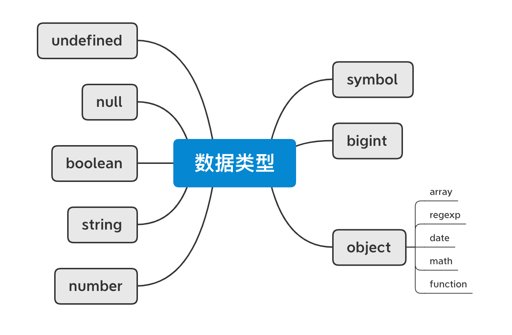
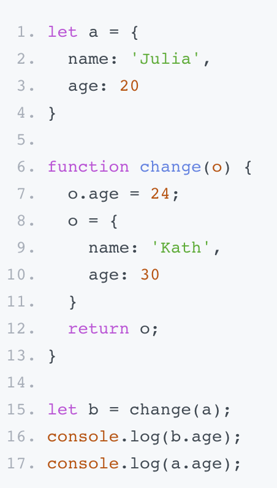
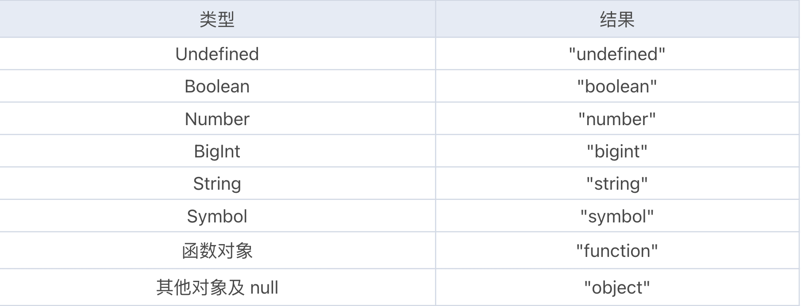
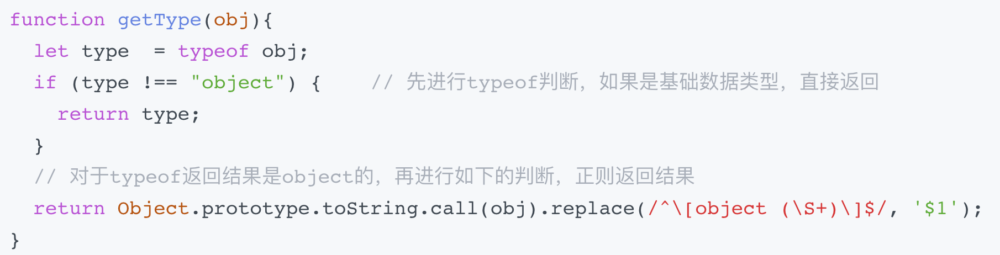

<!-- TOC -->

- [数据类型分类](#数据类型转换)
- [数据类型检测](#数据类型检测)
- [数据类型转换](#数据类型转换)

<!-- /TOC -->

## 数据类型分类

数据类型有下面八种，前 7 种类型为基础类型，最后 1 种（Object）为引用类型



**基础类型与引用类型**
- 基础类型存储在栈内存，被引用或拷贝时，会创建一个完全相等的变量；
- 引用类型存储在堆内存，存储的是地址，多个引用指向同一个地址，这里会涉及一个“共享”的概念

测试题



答案：30, 24

### Undefined
Undefined 是一个很特殊的数据类型，它只有一个值，也就是 undefined。可以通过下面几种方式来得到 undefined：
1. 引用已声明但未初始化的变量； `var a; // undefined`
2. 引用未定义的对象属性； `var o = {}   o.b // undefined`
3. 执行无返回值函数； `(() => {})() // undefined`
4. 执行 void 表达式； `void 0 // undefined`
5. 全局常量 window.undefined 或 undefined。 `window.undefined // undefined`

其中比较推荐的是第三种方法：因为这种方式既简便（window.undefined 或 undefined 常量的字符长度都大于 "void 0" 表达式）又不需要引用额外的变量和属性；同时它作为表达式还可以配合三目运算符使用，代表不执行任何操作

**如何判断一个变量的值是否为 undefined 呢**
1. `!x`: 不可行，因为只要变量 x 的值为 undefined、空字符串、数值 0、null 时都会判断为真
2. `x===undefined`: 虽然通过 “===” 和 undefined 值做比较是可行的，但如果 x 未定义则会抛出错误 “ReferenceError: x is not defined” 导致程序执行终止，这对于代码的健壮性显然是不利的。
3. `typeof x === 'undefined'`: 推荐使用

### Null
Null 数据类型和 Undefined 类似，只有唯一的一个值 null，都可以表示空值，甚至我们通过 “==” 来比较它们是否相等的时候得到的结果都是 true，但 null 是 JavaScript 保留关键字，而 undefined 只是一个常量。

也就是说我们可以声明名称为 undefined 的变量（虽然只能在老版本的 IE 浏览器中给它重新赋值），但将 null 作为变量使用时则会报错。

### boolean
我们常常会将各种表达式和变量转换成 Boolean 数据类型来当作判断条件，这时候就要注意了。可以看 [Boolean() 方法的强制转换规则](#Boolean()%2d方法的强制转换规则)

### Number
**进制转换**

当我们需要将其他进制的整数转换成十进制显示的时候可以使用 parseInt 函数。

而将十进制转换成其他进制时，可以通过 toString 函数来实现。 `(1).toString(2)`

**精度问题**

问题出现的原因：出现这种情况的原因在于计算的时候，JavaScript 引擎会先将十进制数转换为二进制，然后进行加法运算，再将所得结果转换为十进制。在进制转换过程中如果小数位是无限的，就会出现误差

解决办法：对于这个问题的解决方法也很简单，那就是消除无限小数位
1. 一种方式是先转换成整数进行计算，然后再转换回小数，这种方式适合在小数位不是很多的时候。比如一些程序的支付功能 API 以“分”为单位，从而避免使用小数进行计算。
2. 还有另一种方法就是舍弃末尾的小数位。比如对上面的加法就可以先调用 toPrecision 截取 12 位，然后调用 parseFloat 函数转换回浮点数。

### Symbol
简介：Symbol 是 ES6 中引入的新数据类型，它表示一个唯一的常量，通过 Symbol 函数来创建对应的数据类型，创建时可以添加变量描述，该变量描述在传入时会被强行转换成字符串进行存储。

使用场景：
- 避免常量值重复
- 避免对象属性覆盖

### Object
Object 又包括很多子类型，比如 Date、Array、Set、RegExp。

## 数据类型检测
### 第一种判断方法：typeof
用来获取一个值的类型，可能的结果有下面几种


需要注意的是：为什么 null 的 typeof 是 'object' 呢？这里要和你强调一下，虽然 typeof null 会输出 object，但这只是 JS 存在的一个悠久 Bug，不代表 null 就是引用数据类型，并且 null 本身也不是对象。因此，null 在 typeof 之后返回的是有问题的结果，不能作为判断 null 的方法。如果你需要在 if 语句中判断是否为 null，直接通过 ‘===null’来判断就好。

### 第二种判断方法：instanceof

用于检测构造函数的 prototype 属性是否出现在某个实例对象的原型链上。例如，在表达式 left instanceof right 中，会沿着 left 的原型链查找，看看是否存在 right 的 prototype 对象。left.__proto__.__proto__... =?= right.prototype

typeof 和 instanceof 的差异

- instanceof 可以准确地判断复杂引用数据类型，但是不能正确判断基础数据类型；
- 而 typeof 也存在弊端，它虽然可以判断基础数据类型（null 除外），但是引用数据类型中，除了 function 类型以外，其他的也无法判断。

总之，不管单独用 typeof 还是 instanceof，都不能满足所有场景的需求，而只能通过二者混写的方式来判断。但是这种方式判断出来的其实也只是大多数情况，并且写起来也比较难受。

### 第三种判断方法：Object.prototype.toString
toString() 是 Object 的原型方法，调用该方法，可以统一返回格式为 “[object Xxx]” 的字符串，其中 Xxx 就是对象的类型。对于 Object 对象，直接调用 toString() 就能返回 [object Object]；而对于其他对象，则需要通过 call 来调用，才能返回正确的类型信息。

例子：
```js
Object.prototype.toString({})       // "[object Object]"
Object.prototype.toString.call({})  // 同上结果，加上call也ok
Object.prototype.toString.call(1)    // "[object Number]"
Object.prototype.toString.call('1')  // "[object String]"
Object.prototype.toString.call(true)  // "[object Boolean]"
Object.prototype.toString.call(function(){})  // "[object Function]"
Object.prototype.toString.call(null)   //"[object Null]"
Object.prototype.toString.call(undefined) //"[object Undefined]"
Object.prototype.toString.call(/123/g)    //"[object RegExp]"
Object.prototype.toString.call(new Date()) //"[object Date]"
Object.prototype.toString.call([])       //"[object Array]"
Object.prototype.toString.call(document)  //"[object HTMLDocument]"
Object.prototype.toString.call(window)   //"[object Window]"
```
从上面这段代码可以看出，Object.prototype.toString.call() 可以很好地判断引用类型，甚至可以把 document 和 window 都区分开来。

但是在写判断条件的时候一定要注意，使用这个方法最后返回统一字符串格式为 "[object Xxx]" ，而这里字符串里面的 "Xxx" ，第一个首字母要大写（注意：使用 typeof 返回的是小写），这里需要多加留意。

我们也可以自己来实现一个全局通用的数据类型判断方法，来加深理解


## 数据类型转换

### 强制类型转换
强制类型转换方式包括 Number()、parseInt()、parseFloat()、toString()、String()、Boolean()。

#### Number() 方法的强制转换规则
- 如果是布尔值，true 和 false 分别被转换为 1 和 0；
- 如果是数字，返回自身；
- 如果是 null，返回 0；
- 如果是 undefined，返回 NaN；
- 如果是字符串，遵循以下规则：如果字符串中只包含数字（或者是 0X / 0x 开头的十六进制数字字符串，允许包含正负号），则将其转换为十进制；如果字符串中包含有效的浮点格式，将其转换为浮点数值；如果是空字符串，将其转换为 0；如果不是以上格式的字符串，均返回 NaN；
- 如果是 Symbol，抛出错误；
- 如果是对象，并且部署了 [Symbol.toPrimitive] ，那么调用此方法，否则调用对象的 valueOf() 方法，然后依据前面的规则转换返回的值；如果转换的结果是 NaN ，则调用对象的 toString() 方法，再次依照前面的顺序转换返回对应的值（Object 转换规则会在下面细讲）。

#### Boolean() 方法的强制转换规则
这个方法的规则是：除了 undefined、 null、 false、 ''、 0（包括 +0，-0）、 NaN 转换出来是 false，其他都是 true。

### 隐式类型转换

#### '==' 的隐式类型转换规则
- 如果类型相同，无须进行类型转换；
- 如果其中一个操作值是 null 或者 undefined，那么另一个操作符必须为 null 或者 undefined，才会返回 true，否则都返回 false；
- 如果其中一个是 Symbol 类型，那么返回 false；
- 两个操作值如果为 string 和 number 类型，那么就会将字符串转换为 number；
- 如果一个操作值是 boolean，那么转换成 number；
- 如果一个操作值为 object 且另一方为 string、number 或者 symbol，就会把 object 转为原始类型再进行判断（调用 object 的 valueOf/toString 方法进行转换）。

#### '+' 的隐式类型转换规则
'+' 号操作符，不仅可以用作数字相加，还可以用作字符串拼接。仅当 '+' 号两边都是数字时，进行的是加法运算；如果两边都是字符串，则直接拼接，无须进行隐式类型转换。

除了上述比较常规的情况外，还有一些特殊的规则。
- 如果其中有一个是字符串，另外一个是 undefined、null 或布尔型，则调用 toString() 方法进行字符串拼接；如果是纯对象、数组、正则等，则默认调用对象的转换方法会存在优先级（下一讲会专门介绍），然后再进行拼接。
- 如果其中有一个是数字，另外一个是 undefined、null、布尔型或数字，则会将其转换成数字进行加法运算，对象的情况还是参考上一条规则。
- 如果其中一个是字符串、一个是数字，则按照字符串规则进行拼接。

整体来看，如果数据中有字符串，JavaScript 类型转换还是更倾向于转换成字符串，因为第三条规则中可以看到，在字符串和数字相加的过程中最后返回的还是字符串

#### Object 的转换规则
对象转换的规则，会先调用内置的 [ToPrimitive] 函数，其规则逻辑如下：
- 如果部署了 Symbol.toPrimitive 方法，优先调用再返回；
- 调用 valueOf()，如果转换为基础类型，则返回；
- 调用 toString()，如果转换为基础类型，则返回；
- 如果都没有返回基础类型，会报错。