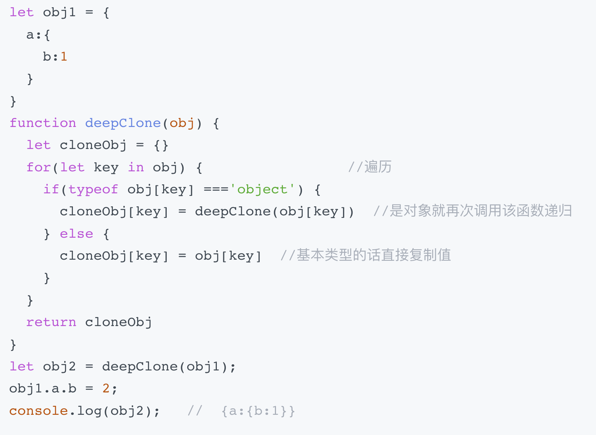

深拷贝与浅拷贝

## 浅拷贝的原理和实现

**原理：** 自己创建一个新的对象，来接受你要重新复制或引用的对象值。如果对象属性是基本的数据类型，复制的就是基本类型的值给新对象；但如果属性是引用数据类型，复制的就是内存中的地址，如果其中一个对象改变了这个内存中的地址，肯定会影响到另一个对象。

### 方法1: object.assign
使用 object.assign 方法有几点需要注意
1. 它不会拷贝对象的继承属性
2. 它不会拷贝对象的不可枚举的属性；
3. 可以拷贝 Symbol 类型的属性。

可以简单理解为：Object.assign 循环遍历原对象的属性，通过复制的方式将其赋值给目标对象的相应属性

### 方法2: 方法二：扩展运算符方式
扩展运算符 和 object.assign 有同样的缺陷，也就是实现的浅拷贝的功能差不多，但是如果属性都是基本类型的值，使用扩展运算符进行浅拷贝会更加方便。

只能拷贝一层

### 数组独有 方法三：concat 拷贝数组 

数组的 concat 方法其实也是浅拷贝，所以连接一个含有引用类型的数组时，需要注意修改原数组中的元素的属性，因为它会影响拷贝之后连接的数组。不过 concat 只能用于数组的浅拷贝，使用场景比较局限。

### 数组独有 方法四：slice 拷贝数组

slice 方法也比较有局限性，因为它仅仅针对数组类型。slice 方法会返回一个新的数组对象，这一对象由该方法的前两个参数来决定原数组截取的开始和结束时间，是不会影响和改变原始数组的。

## 深拷贝的原理和实现
将一个对象从内存中完整地拷贝出来一份给目标对象，并从堆内存中开辟一个全新的空间存放新对象，且新对象的修改并不会改变原对象，二者实现真正的分离。

### 方法一：乞丐版（JSON.stringify）
- 拷贝的对象的值中如果有函数、undefined、symbol 这几种类型，经过 JSON.stringify 序列化之后的字符串中这个键值对会消失；
- 拷贝 Date 引用类型会变成字符串；
- 无法拷贝不可枚举的属性；
- 无法拷贝对象的原型链；
- 拷贝 RegExp 引用类型会变成空对象；
- 对象中含有 NaN、Infinity 以及 -Infinity，JSON 序列化的结果会变成 null；
- 无法拷贝对象的循环应用，即对象成环 (obj[key] = obj)。

### 方法二：基础版（手写递归实现）

- 这个深拷贝函数并不能复制不可枚举的属性以及 Symbol 类型；
- 这种方法只是针对普通的引用类型的值做递归复制，而对于 Array、Date、RegExp、Error、Function 这样的引用类型并不能正确地拷贝；
- 对象的属性里面成环，即循环引用没有解决。

### 方法3:
