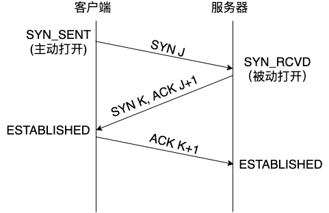
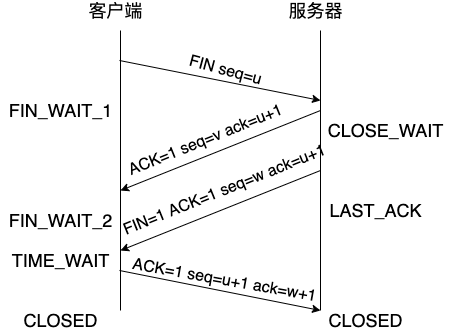

在浏览器输入了一个 URL 后发生了什么

总览
1. DNS域名解析
2. 建立 TCP 连接
3. 发送 HTTP 请求
4. 服务器端解析请求
5. 返回 HTTP 响应
6. TCP四次挥手
7. 浏览器解析 HTML

## 1. DNS域名解析
我们通过分析五层网络模型可以知道数据链路层传输的帧，并不是通过字符串 “http://baidu.com” 寻找到目标主机，而是通过 MAC 地址找到目标主机的硬件地址，要通过 ARP 协议解析获取 MAC 地址，我们需要目标主机的 IP 地址，所以问题是如何通过域名获取对应 IP 地址。

所以第一个步骤，我们需要获取域名对应的IP地址，会经过以下几个步骤：

1. 访问 Hosts 文件

浏览器会首先查看本机的 Hosts 文件，是否已经存在映射关系。Hosts文件是用来存储常用的域名和对应IP地址关系的关联文件，例如在Hosts文件中存储了"www.baidu.com" -> "204.1.17.89"，那么我们不需要访问DNS服务器即可获取百度域名对应的IP地址。

2. 访问本地缓存

如果 Hosts 文件中不存在映射关系，浏览器（例如Chrome）会再查看浏览器本地的缓存，是否存在映射关系。

3. 访问 DNS 服务器

DNS 的全称是 Domain Name System，又称域名系统，它负责把www.qq.com这样的域名地址翻译成一个 IP（比如14.18.180.206），而客户端与服务器建立 TCP 连接需要通过 IP 通信。

让客户端和服务器连接并不是靠域名进行，在网络中每个终端之间实现连接和通信是通过一个唯一的 IP 地址来完成。在建立 TCP 连接前，我们需要找到建立连接的服务器，DNS 的解析过程可以让用户通过域名找到存放文件的服务器。

DNS 解析的过程简单来看，是从"我的电脑"传输域名"www.baidu.com"到 DNS 服务器，解析生成IP后返回给"我的电脑"。但是面试官一般会接着询问 DNS 解析的详细过程，依次考察候选人的知识深度。

1. 浏览器会向本地 DNS 服务器发送域名报文。
2. 本地 DNS 接收报文之后，会将请求转发到根 DNS 服务器。
3. 根 DNS 服务器通过".com"后缀返回 com 顶级域名服务器的IP地址205.0.1.2。
4. 本地 DNS 服务器带着域名访问IP：205.0.1.2顶级域名服务器。
5. com 顶级域名服务器根据后缀"baidu.com"，返回 IP 地址206.0.1.3。
6. 本地 DNS 服务器带着域名访问IP206.0.1.3二级域名服务器。
7. 二级域名服务器通过www.baidu.com查询到了域名对应的实际IP地址210.1.17.89，返回给本地 DNS 服务器。
8. 本地 DNS 服务器透传IP210.1.17.89返回给"我的电脑"。

那为什么需要配置域名 HOST，而不直接使用 IP 地址进行访问呢？这是因为浏览器的同源策略会导致跨域问题。

同源策略要求，只有当请求的协议、域名和端口都相同的情况下，我们才可以访问当前页面的 Cookie/LocalStorage/IndexDB、获取和操作 DOM 节点，以及发送 Ajax 请求。通过同源策略的限制，可以避免恶意的攻击者盗取用户信息，从而可以保证用户信息的安全。

对于非同源的请求，我们常常称为跨域请求，需要进行跨域处理。常见的跨域解决方案有这几种。
- 使用document.domain + iframe：只有在主域相同的时候才能使用该方法。
- 动态创建 script(JSONP)：通过指定回调函数以及函数的传参数据，让页面执行相应的脚本内容。
- 使用location.hash + iframe：利用location.hash来进行传值。
- 使用window.name + iframe：原理是window.name值在不同的页面（甚至不同域名）加载后依旧存在。
- 使用window.postMessage()实现跨域通信。
- 使用跨域资源共享 CORS（Cross-origin resource sharing）。
- 使用 Websockets。

其中，CORS 作为现在的主流解决方案，它允许浏览器向跨源服务器，发出 XMLHttpRequest 请求，从而克服了 Ajax 只能同源使用的限制。实现 CORS 通信的关键是服务器，只要服务端实现了 CORS 接口，就可以进行跨源通信。

## 2. 建立 TCP 连接
在经过 DNS 解析之后，浏览器已经获取了对应网站的 IP 地址，通过三次握手连接到网站服务器，这个步骤中，我们可以给面试官画出简化后的三次握手过程：

1. 客户端发送一个带有 SYN 标记位的数据包（syn=J）到服务器，然后进入 SYN_SENT 状态；
2. 服务器收到 SYN 包，需要确认客户端的 SYN（赋值ack=J+1），然后自己也发送一个 SYN 包（syn=K），服务器进入 SYN_RCVD 状态；
3. 客户端收到服务器的 SYN+ACK 包，向服务器端发送确认包，即ack=K+1，发送完成之后，两边都进入 ESTABLISHED 建立连接状态。

**HTTP 请求与 TCP 协议**

目前大多数 HTTP 请求都是基于 TCP 协议。TCP 协议的目的是提供可靠的数据传输，它用来确保可靠传输的途径主要包括两个：

1. 乱序重建：通过对数据包编号来对其排序，从而使得另一端接收数据时，可以重新根据编号还原顺序。
2. 丢包重试：可通过发送方是否得到响应，来检测出丢失的数据并重传这些数据。

通过以上方式，TCP 在传输过程中不会丢失或破坏任何数据，这也是即使出现网络故障也不会损坏文件下载的原因。

因此，目前大多数 HTTP 连接基于 TCP 协议。不过，在 HTTP/3 中底层支撑是 QUIC 协议，该协议使用的是 UDP 协议。因为 UDP 协议丢弃了 TCP 协议中所有的错误检查内容，因此可以更快地进行通信，更常用于直播和在线游戏的应用。

也就是说，HTTP/3 基于 UDP 协议实现了数据的快速传输，同时通过 QUIC 协议保证了数据的可靠传输，最终实现了又快又可靠的通信。

## 3. 发送 HTTP 请求
TCP 三次握手之后，客户端和服务器端成功建立了连接，之后浏览器会向服务器特定端口发送HTTP请求。

一个 HTTP 报文由请求行（Request Line）、请求头部（Request Headers）、空行（Blank Line）以及请求体（Request Body）构成，请求行中规定了请求方法、URI 以及 HTTP 的版本

## 4. 服务器端解析请求
当一个 HTTP 请求打进服务器之后，一般的流程是：网关层（例如Ngnix）最先获取请求，然后路由转发到具体的Web服务，经过一段业务逻辑之后，可能还会查询数据库，最后将处理的结果返回给浏览器客户端。

## 5. 返回 HTTP 响应

服务器端处理业务结果之后，也要返回 HTTP 响应，HTTP 响应由状态行（Status Line）、响应头部（Response Headers）、空行（Blank Line）以及响应体（Response Body）构成

## 6. TCP四次挥手

当浏览器获取了域名对应的页面信息，为了避免服务器和客户端双方的资源损耗，客户端会请求断开 TCP 连接，和三次握手的过程相似，TCP 四次挥手的过程可以总结为：

1. 第一次请求：客户端请求断开FIN,携带信息seq=u；
2. 第二次请求：服务器确认客户端的断开请求 ACK ,携带信息ack=u+1,seq=v；
3. 第三次请求：服务器请求断开 FIN ,携带信息seq=w,ACK,ack=u+1；
4. 第四次请求：客户端确认服务器的断开 ACK ,携带信息ack=w+1,seq=u+1。

## 7. 浏览器解析 HTML
服务器返回给客户端的是 HTML 以及 CSS、Javascript 代码，要展示为静态页面，还需要经过浏览器的解析行为。

浏览器内核引擎解析 HTML 文档并且将标签转换为 DOM（Document Object Model，文档对象模型）树的 DOM 节点，不同浏览器的渲染解析流程大同小异。

同时，浏览器内核引擎还会解析 CSS 生成 CSS 规则树，按照从右到左的顺序读取选择器。

另外，在浏览器中还有个"JS脚本解析器"，解析 HTML 和 CSS 是多线程同时执行的，CSS 解析失败不会影响 HTML 内容的解析，但是如果 JS 脚本解析过程中触发了异常，会直接终止 HTML 内容的解析。