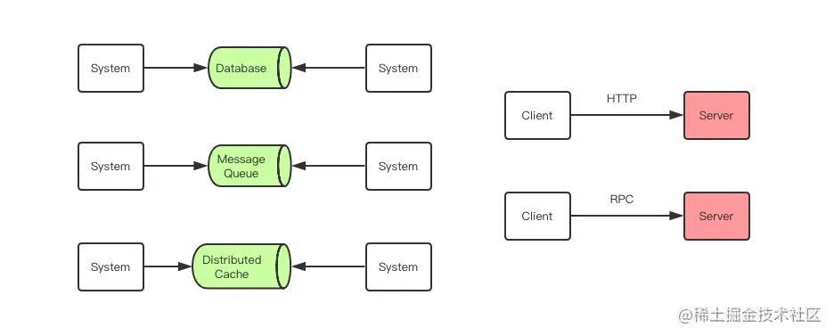
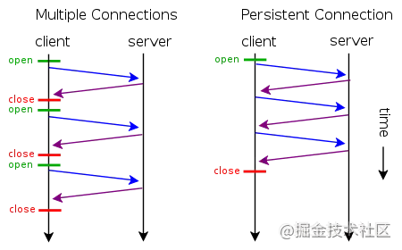
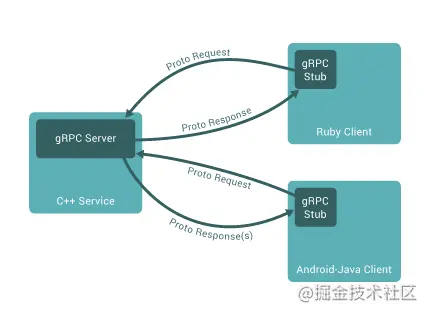

刚接触RPC的的时候，在网上搜索了一下，发现他的概念不是那么好懂。但是其实是一个很简单的东西。

我个人喜欢把RPC称为两个系统之间不需要依赖中间件直接互相调用的方式。

两个系统交互，常用的方案有：RPC，分布式消息队列、HTTP 请求调用、数据库和分布式缓存。

其中 RPC 和 HTTP 调用是没有经过中间件的，它们是端到端系统的直接数据交互。HTTP 调用其实也可以看成是一种特殊的 RPC，只不过传统意义上的 RPC 是指长连接数据交互，而 HTTP 一般是指即用即走的短链接。

RPC在各个中间件里的使用
- nginx: Nginx 和后端服务之间的交互在本质上也可以理解为 RPC 数据交互。
- HTTP 调用其实也是一种特殊的 RPC： HTTP1.0 协议时，HTTP 调用还只能是短链接调用，一个请求来回之后连接就会关闭。HTTP1.1 在 HTTP1.0 协议的基础上进行了改进，引入了 KeepAlive 特性可以保持 HTTP 连接长时间不断开，以便在同一个连接之上进行多次连续的请求，进一步拉近了 HTTP 和 RPC 之间的距离。

当 HTTP 协议进化到 2.0 之后，Google 开源了一个建立在 HTTP2.0 协议之上的通信框架直接取名为 gRPC，也就是 Google RPC，这时 HTTP 和 RPC 之间已经没有非常明显的界限了。所以在后文我们不再明确强调 RPC 和 HTTP 请求调用之间的细微区别了，直接统一称之为 RPC。

**HTTP VS RPC （普通话 VS 方言）**：HTTP 与 RPC 的关系就好比普通话与方言的关系。要进行跨企业服务调用时，往往都是通过 HTTP API，也就是普通话，虽然效率不高，但是通用，没有太多沟通的学习成本。但是在企业内部还是 RPC 更加高效，同一个企业公用一套方言进行高效率的交流，要比通用的 HTTP 协议来交流更加节省资源。
